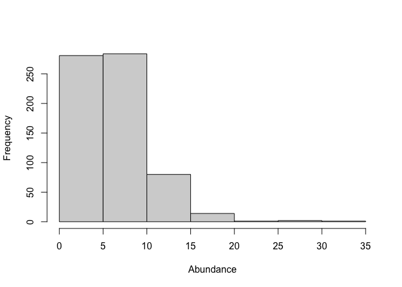
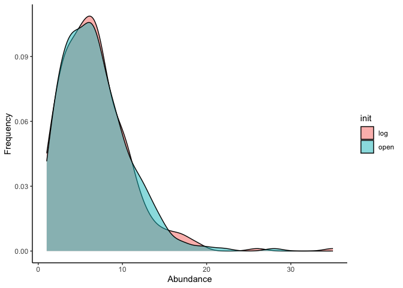
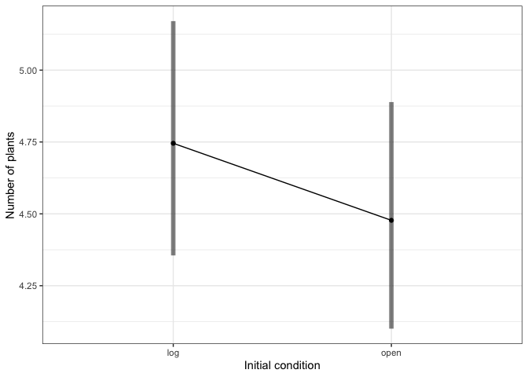
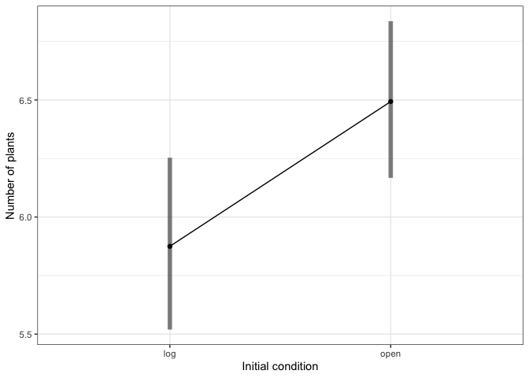
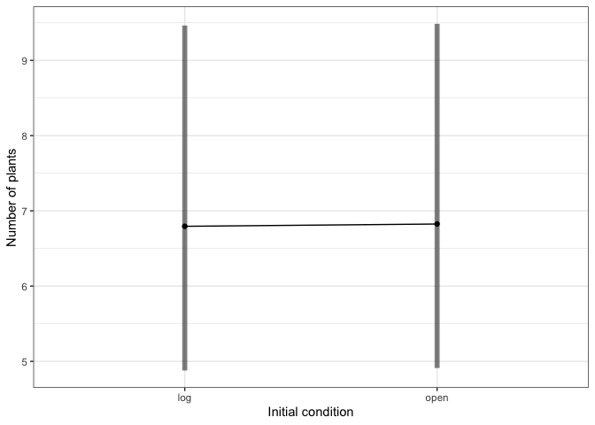
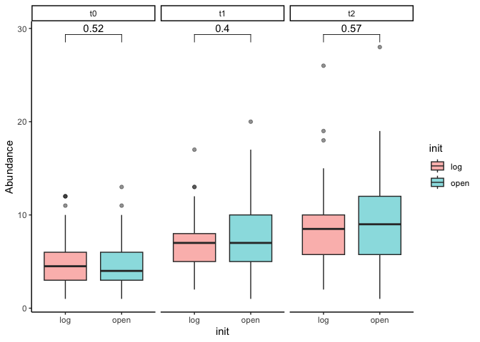

Abundance comparison
================
Winnie Siu
2023-12-07

``` r
   
```


``` r
knitr::include_graphics("docs/Abundance-comparison_files/figure-gfm/Openlog2.png")
```


### Data wrangling

This dataset includes unknown species.

``` r
comm <- read.csv("20-22_species_composition_data_w_unk.csv", header=T)
```

Remove the locations surveyed in 2021 and 2022 that were not surveyed in
2020 - aka, cm=0, cm=21, cm = 22, cm = 29.

``` r
comm<-comm[which(comm$cm_location!=21 & comm$cm_location!=0 & comm$cm_location!=22 & comm$cm_location!=29),]

# make a group name for each row

comm$grp<-apply(comm[c(1,3,5,6,7)], 1, paste, collapse=":") # timepoint, block, transect_name, initial state
```

Need to make each row a community using matrify.

``` r
commsub<-comm[,c(15,10,13)] # group, species_code, and count of each species for each transect. transects are rows.
commsub <-as.data.frame(commsub)
commtry<-matrify(commsub) # make it an expanded species matrix 
```

    ## Warning in matrify(commsub): NAs introduced by coercion

``` r
commtry$x[which(is.na(commtry$x))] <- 1 # "x" means that there were no individuals in the transect, but we are going to keep track of this as if it were a species
ncol(commtry) # how many species are we working with in our community matrix
```

    ## [1] 106

Store grouping row names as a column, then remove rownames.

``` r
commtry$grps<-rownames(commtry)
rownames(commtry)<-NULL
names(commtry)
```

    ##   [1] "#52VUBR?"         "#54PEDU?"         "#55VUBR?"        
    ##   [4] "26"               "32"               "36"              
    ##   [7] "38"               "acul"             "aicu"            
    ##  [10] "arca"             "ardy"             "arsp"            
    ##  [13] "auel"             "bldr"             "blrd"            
    ##  [16] "brdi"             "brdr"             "brpe"            
    ##  [19] "brru"             "buse"             "caer"            
    ##  [22] "cagr"             "cahi"             "casp"            
    ##  [25] "cear"             "chau"             "chei"            
    ##  [28] "chps"             "crcl"             "crco"            
    ##  [31] "cusc"             "cusp"             "dagl"            
    ##  [34] "dosp"             "dusty green fuzz" "ento"            
    ##  [37] "erau"             "ercy"             "erra"            
    ##  [40] "ersp"             "gite"             "gnte"            
    ##  [43] "gobe"             "gocy"             "gono"            
    ##  [46] "goro"             "gosp"             "haod"            
    ##  [49] "hygl"             "hypi"             "hypo"            
    ##  [52] "jubu"             "laro"             "ledu"            
    ##  [55] "lele"             "loef"             "misp"            
    ##  [58] "mite"             "momo"             "mopa"            
    ##  [61] "niro"             "omco"             "orsp"            
    ##  [64] "pala"             "peai"             "pedu"            
    ##  [67] "phsu"             "plde"             "poar"            
    ##  [70] "poca"             "pocap"            "poce"            
    ##  [73] "pogn"             "pole"             "pomu"            
    ##  [76] "pote?#46"         "pter"             "ptga"            
    ##  [79] "ptob"             "ptsp"             "rhla"            
    ##  [82] "rhpy"             "rhsp"             "ry"              
    ##  [85] "scna"             "sino"             "sool"            
    ##  [88] "stfi"             "stpi"             "thma"            
    ##  [91] "trcy"             "tris"             "tror"            
    ##  [94] "trpi"             "trsp"             "unk"             
    ##  [97] "unk 2"            "unk grass"        "unk#30"          
    ## [100] "unk#31"           "unk#41"           "unk#47"          
    ## [103] "unk1"             "waac"             "wagr"            
    ## [106] "x"                "grps"

Split group info into columns for each variable.

``` r
mat<-separate(commtry, 107, c("time","block","transect","init", "treatment"), ":")
names(mat) #check
```

    ##   [1] "#52VUBR?"         "#54PEDU?"         "#55VUBR?"        
    ##   [4] "26"               "32"               "36"              
    ##   [7] "38"               "acul"             "aicu"            
    ##  [10] "arca"             "ardy"             "arsp"            
    ##  [13] "auel"             "bldr"             "blrd"            
    ##  [16] "brdi"             "brdr"             "brpe"            
    ##  [19] "brru"             "buse"             "caer"            
    ##  [22] "cagr"             "cahi"             "casp"            
    ##  [25] "cear"             "chau"             "chei"            
    ##  [28] "chps"             "crcl"             "crco"            
    ##  [31] "cusc"             "cusp"             "dagl"            
    ##  [34] "dosp"             "dusty green fuzz" "ento"            
    ##  [37] "erau"             "ercy"             "erra"            
    ##  [40] "ersp"             "gite"             "gnte"            
    ##  [43] "gobe"             "gocy"             "gono"            
    ##  [46] "goro"             "gosp"             "haod"            
    ##  [49] "hygl"             "hypi"             "hypo"            
    ##  [52] "jubu"             "laro"             "ledu"            
    ##  [55] "lele"             "loef"             "misp"            
    ##  [58] "mite"             "momo"             "mopa"            
    ##  [61] "niro"             "omco"             "orsp"            
    ##  [64] "pala"             "peai"             "pedu"            
    ##  [67] "phsu"             "plde"             "poar"            
    ##  [70] "poca"             "pocap"            "poce"            
    ##  [73] "pogn"             "pole"             "pomu"            
    ##  [76] "pote?#46"         "pter"             "ptga"            
    ##  [79] "ptob"             "ptsp"             "rhla"            
    ##  [82] "rhpy"             "rhsp"             "ry"              
    ##  [85] "scna"             "sino"             "sool"            
    ##  [88] "stfi"             "stpi"             "thma"            
    ##  [91] "trcy"             "tris"             "tror"            
    ##  [94] "trpi"             "trsp"             "unk"             
    ##  [97] "unk 2"            "unk grass"        "unk#30"          
    ## [100] "unk#31"           "unk#41"           "unk#47"          
    ## [103] "unk1"             "waac"             "wagr"            
    ## [106] "x"                "time"             "block"           
    ## [109] "transect"         "init"             "treatment"

Add groupname using time, block, init columns.

``` r
mat$grp1<-apply(mat[c(107:110)], 1, paste, collapse=":")
mat$grp2<-apply(mat[c(107:111)], 1, paste, collapse=":")
names(mat) #check
```

    ##   [1] "#52VUBR?"         "#54PEDU?"         "#55VUBR?"        
    ##   [4] "26"               "32"               "36"              
    ##   [7] "38"               "acul"             "aicu"            
    ##  [10] "arca"             "ardy"             "arsp"            
    ##  [13] "auel"             "bldr"             "blrd"            
    ##  [16] "brdi"             "brdr"             "brpe"            
    ##  [19] "brru"             "buse"             "caer"            
    ##  [22] "cagr"             "cahi"             "casp"            
    ##  [25] "cear"             "chau"             "chei"            
    ##  [28] "chps"             "crcl"             "crco"            
    ##  [31] "cusc"             "cusp"             "dagl"            
    ##  [34] "dosp"             "dusty green fuzz" "ento"            
    ##  [37] "erau"             "ercy"             "erra"            
    ##  [40] "ersp"             "gite"             "gnte"            
    ##  [43] "gobe"             "gocy"             "gono"            
    ##  [46] "goro"             "gosp"             "haod"            
    ##  [49] "hygl"             "hypi"             "hypo"            
    ##  [52] "jubu"             "laro"             "ledu"            
    ##  [55] "lele"             "loef"             "misp"            
    ##  [58] "mite"             "momo"             "mopa"            
    ##  [61] "niro"             "omco"             "orsp"            
    ##  [64] "pala"             "peai"             "pedu"            
    ##  [67] "phsu"             "plde"             "poar"            
    ##  [70] "poca"             "pocap"            "poce"            
    ##  [73] "pogn"             "pole"             "pomu"            
    ##  [76] "pote?#46"         "pter"             "ptga"            
    ##  [79] "ptob"             "ptsp"             "rhla"            
    ##  [82] "rhpy"             "rhsp"             "ry"              
    ##  [85] "scna"             "sino"             "sool"            
    ##  [88] "stfi"             "stpi"             "thma"            
    ##  [91] "trcy"             "tris"             "tror"            
    ##  [94] "trpi"             "trsp"             "unk"             
    ##  [97] "unk 2"            "unk grass"        "unk#30"          
    ## [100] "unk#31"           "unk#41"           "unk#47"          
    ## [103] "unk1"             "waac"             "wagr"            
    ## [106] "x"                "time"             "block"           
    ## [109] "transect"         "init"             "treatment"       
    ## [112] "grp1"             "grp2"

Another df where the grouping variables are time, block, transect and
initial state. Each row is a transect in a certain year.

``` r
df<-mat[,c(1:106,112)]
# df1 = without treatment in the grouping
df1 = df %>% mutate(across(.cols=1:106,.fns=as.numeric)) # make everything numeric
rownames(df1)<-NULL # remove rownames
df<-mat[,c(1:106,113)]
# df2 = with treatment in the grouping
df2 = df %>% mutate(across(.cols=1:106,.fns=as.numeric))
rownames(df2)<-NULL
```

### This is specific to abundance analysis for t0

Sum observations across initial X transect X time X block (group
variable). This gives number of plants in each row observation.

``` r
blocksum<-rowsum(df1[,c(1:106)], group=df1$grp1)
blocksum$grps<-rownames(blocksum)
rownames(blocksum)<-NULL # remove rownames
```

Add in group vars.

``` r
nublock<-separate(blocksum, 107, c("time","block","transect","init"), ":")
nublock$total<-rowSums(nublock[,c(1:106)])
nublock$presence<-ifelse(nublock$total > 0,  1, 0)
```

Subset data where only before treatments installed hence only init is
concerned.

``` r
dat<-nublock[which(nublock$time=="t0"),]

# look at plant abundance in log vs open 
# look at range of data - what family should i use? 
range(dat$total)
```

    ## [1]  1 13

``` r
# visualize data distribution
hist(nublock$total, xlab="Abundance", ylab="Frequency", main="")
```

<!-- -->

``` r
ggplot(nublock, aes(x = total, fill = as.factor(init))) +
  geom_density(position = "identity", alpha = 0.5, bins = 30) +
  labs(x = "Abundance",
       y = "Frequency") +
  scale_fill_discrete(name = 'init') +
  theme_classic()
```

<!-- -->

``` r
## using poisson. including random effects throws is.Singular error: see ?is.Singular for details
abun.mod<-glm(total~init, data=dat, family='poisson') 
summary(abun.mod)
```

    ## 
    ## Call:
    ## glm(formula = total ~ init, family = "poisson", data = dat)
    ## 
    ## Deviance Residuals: 
    ##     Min       1Q   Median       3Q      Max  
    ## -2.0920  -0.8599  -0.2299   0.6836   3.2662  
    ## 
    ## Coefficients:
    ##             Estimate Std. Error z value Pr(>|z|)    
    ## (Intercept)  1.55719    0.04377  35.579   <2e-16 ***
    ## initopen    -0.05813    0.06267  -0.928    0.354    
    ## ---
    ## Signif. codes:  0 '***' 0.001 '**' 0.01 '*' 0.05 '.' 0.1 ' ' 1
    ## 
    ## (Dispersion parameter for poisson family taken to be 1)
    ## 
    ##     Null deviance: 307.61  on 220  degrees of freedom
    ## Residual deviance: 306.75  on 219  degrees of freedom
    ## AIC: 1027.9
    ## 
    ## Number of Fisher Scoring iterations: 4

``` r
# including block as a random effect
summary(glmer(total~init + (1|block), data=dat, family = 'poisson'))
```

    ## Generalized linear mixed model fit by maximum likelihood (Laplace
    ##   Approximation) [glmerMod]
    ##  Family: poisson  ( log )
    ## Formula: total ~ init + (1 | block)
    ##    Data: dat
    ## 
    ##      AIC      BIC   logLik deviance df.resid 
    ##   1029.9   1040.1   -511.9   1023.9      218 
    ## 
    ## Scaled residuals: 
    ##     Min      1Q  Median      3Q     Max 
    ## -1.7364 -0.7975 -0.2070  0.6968  4.0661 
    ## 
    ## Random effects:
    ##  Groups Name        Variance  Std.Dev.
    ##  block  (Intercept) 0.0008686 0.02947 
    ## Number of obs: 221, groups:  block, 7
    ## 
    ## Fixed effects:
    ##             Estimate Std. Error z value Pr(>|z|)    
    ## (Intercept)  1.55663    0.04524  34.409   <2e-16 ***
    ## initopen    -0.05802    0.06267  -0.926    0.355    
    ## ---
    ## Signif. codes:  0 '***' 0.001 '**' 0.01 '*' 0.05 '.' 0.1 ' ' 1
    ## 
    ## Correlation of Fixed Effects:
    ##          (Intr)
    ## initopen -0.676

``` r
# the difference between open and log environments is not significant. it's not a lot though. The model-estimated difference is like half a plant. 
emmeans(abun.mod, ~init, type='response')
```

    ##  init rate    SE  df asymp.LCL asymp.UCL
    ##  log  4.75 0.208 Inf      4.36      5.17
    ##  open 4.48 0.201 Inf      4.10      4.89
    ## 
    ## Confidence level used: 0.95 
    ## Intervals are back-transformed from the log scale

``` r
# here's a quick and dirty plot of model estimated means and CIs for abundance in each kind of plot.
emmip(abun.mod, ~init, type='response', CI=T)+theme_bw()+labs(x="Initial condition", y="Number of plants")
```

<!-- -->

``` r
# can also look at presence absence but it's really only a few zeros - no significant difference here.
abun.mod2<-glm(presence~init, data=dat, family='binomial')
summary(abun.mod2)
```

    ## 
    ## Call:
    ## glm(formula = presence ~ init, family = "binomial", data = dat)
    ## 
    ## Deviance Residuals: 
    ##       Min         1Q     Median         3Q        Max  
    ## 2.409e-06  2.409e-06  2.409e-06  2.409e-06  2.409e-06  
    ## 
    ## Coefficients:
    ##              Estimate Std. Error z value Pr(>|z|)
    ## (Intercept) 2.657e+01  3.396e+04   0.001    0.999
    ## initopen    1.974e-08  4.791e+04   0.000    1.000
    ## 
    ## (Dispersion parameter for binomial family taken to be 1)
    ## 
    ##     Null deviance: 0.0000e+00  on 220  degrees of freedom
    ## Residual deviance: 1.2821e-09  on 219  degrees of freedom
    ## AIC: 4
    ## 
    ## Number of Fisher Scoring iterations: 25

### Abundance analysis for t0 AND in-situ log and in-situ open plots in t1 and t2

Sum observations across initial X transect X time X block X treatment
(group variable). This gives number of plants in each row observation
(transect level).

``` r
blocksum2<-rowsum(df2[,c(1:106)], group=df2$grp2)
blocksum2$grps<-rownames(blocksum2)
rownames(blocksum2)<-NULL # remove rownames
```

Add in group vars.

``` r
nublock2<-separate(blocksum2, 107, c("time","block","transect","init", "treatment"), ":")
nublock2$total<-rowSums(nublock2[,c(1:106)])
nublock2$presence<-ifelse(nublock2$total > 0,  1, 0)
```

Subset data where before treatments installed (t0), in-situ log and
in-situ open from t1 and t2 are included. Hence only absolute log effect
and absolute open effect are concerned

Main takeaways:

- we need to include ‘time’ (which is the year of sampling) as a random
  effect
- without time as random term, plant abundance is statistically higher
  in open plots than log plots
- when including time as random term, the significance is not detected.

``` r
dat_t0_insitu<-nublock2[which(nublock2$time=="t0" |  nublock2$treatment=="open" |  nublock2$treatment=="insitu_log"),]

# look at plant abundance in log vs open 

# look at range of data - what family should i use? 
range(dat_t0_insitu$total)

## using poisson. including random effects throws is.Singular error: see ?is.Singular for details
abun.mod3<-glm(total~init, data=dat_t0_insitu, family='poisson') 
summary(abun.mod3)

# open plot has a significantly higher abundance of plants than log environment
# abundance in open area is higher than log area by 6.45-5.74 plant.
# https://bcdudek.net/anova/beginning-to-explore-the-emmeans-package-for-post-hoc-tests-and-contrasts.html
emmeans(abun.mod3, ~init, type='response')

# here's a quick and dirty plot of model estimated means and CIs for abundance in each kind of plot.
emmip(abun.mod3, ~init, type='response', CI=T)+theme_bw()+labs(x="Initial condition", y="Number of plants")
```

<!-- -->

``` r
# can also look at presence absence but it's really only a few zeros - no significant difference here.
# hence also the warning: glm.fit: algorithm did not converge
abun.mod4<-glm(presence~init, data=dat_t0_insitu, family='binomial')
summary(abun.mod4)

# wait a minute!

# since samples from t1 and t2 from are mainly from the same plots as t0. These are not independent replicates and tend to correlated with each other.
# including year and block as random effects
# (1|year) + (1|block) as we think the effect of init on total is the same (slope) but the intercept differ amongst block and year
# but since we have a greater number of sample from t0, data from t0 will contribute more to the variance in abundance.
# see https://bookdown.org/steve_midway/DAR/random-effects.html#pld-example
abun.mod5<- glmer(total~ init + (1|block) + (1|time), data=dat_t0_insitu, family = 'poisson')
summary(abun.mod5)
coef(abun.mod5)$block

emmeans(abun.mod5, ~init, type='response') # plant abundance in log plots is higher by 0.04 plants - which is no higher

emmip(abun.mod5, ~init, type='response', CI=T)+theme_bw()+labs(x="Initial condition", y="Number of plants")
```

<!-- -->

``` r
# the following is a logical process to explain why we need to include 'time' as random effect
# 1 since samples from t1 and t2 from are successive from the same plots as t0. These are not independent replicates and tend to correlated with each other.
# including year and block as random effects to alleviate the effect of temporal pseudoreplication.

summary(aov(total ~ time, data = dat_t0_insitu)) # general plant abundance differs between years

# 2 we are interest to know if log-open is different in each year. 
# if the effect of log-open (slope) is the same across year, year only affecting the intercept.
# if the relationship between init and total changes, time does not just affect the slope.
# see following graph, abundance within different year does not differ between open and log.
# abun.mod3 signals us the otherwise, which likely to be false positive
# since the slopes are similar, we include time as random intercept effect.
# prove, including time as random effect is more reliable
summary(glm(total ~ init, data = subset(dat_t0_insitu, time == "t0"), family = poisson))
summary(glm(total ~ init, data = subset(dat_t0_insitu, time == "t1"), family = poisson))
summary(glm(total ~ init, data = subset(dat_t0_insitu, time == "t2"), family = poisson))

ggplot(dat_t0_insitu, aes(x = as.factor(init), y = total, fill = as.factor(init))) +
  geom_boxplot(position = "dodge", alpha = 0.5) +
  labs(x = "init",
       y = "Abundance") +
  scale_fill_discrete(name = 'init') +
  theme_classic() +
  facet_grid(. ~ time) +
  stat_compare_means(comparisons = list(c("log", "open")), label = "p.format", method="wilcox.test")
```

<!-- -->
