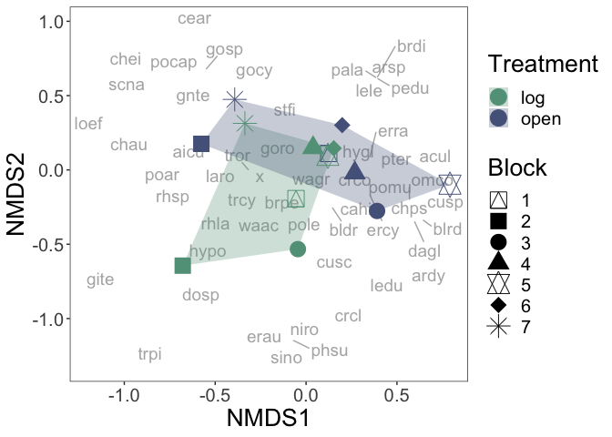
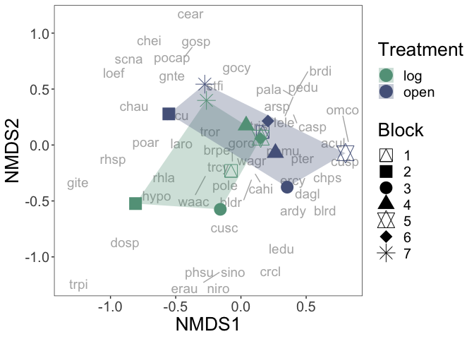

Composition comparison
================
2023-12-17

### Data wrangling

This data set does not include unknown data.

``` r
comm <- read.csv("20-22_species_composition_data_no_unk.csv", header = T)
```

Remove the locations surveyed in 2021 and 2022 that were not surveyed in
2020 - aka, cm=0, cm=21, cm = 22, cm = 29.

``` r
comm<-comm[which(comm$cm_location!=21 & comm$cm_location!=0 & comm$cm_location!=22 & comm$cm_location!=29),]

# make a group name for each row

comm$grp<-apply(comm[c(1,3,5,6,7)], 1, paste, collapse=":") # timepoint, block, transect_name, initial state
```

Need to make each row a community using matrify.

``` r
commsub<-comm[,c(15,10,13)] # group, species_code, and count of each species for each transect. transects are rows.
commsub <-as.data.frame(commsub)
commtry<-matrify(commsub) # make it an expanded species matrix 
```

    ## Warning in matrify(commsub): NAs introduced by coercion

``` r
commtry$x[which(is.na(commtry$x))] <- 1 # "x" means that there were no individuals in the transect, but we are going to keep track of this as if it were a species
ncol(commtry) # how many species are we working with in our community matrix
```

    ## [1] 87

Store grouping row names as a column, then remove rownames.

``` r
commtry$grps<-rownames(commtry)
rownames(commtry)<-NULL
names(commtry)
```

    ##  [1] "acul"  "aicu"  "arca"  "ardy"  "arsp"  "auel"  "bldr"  "blrd"  "brdi" 
    ## [10] "brdr"  "brpe"  "brru"  "buse"  "caer"  "cagr"  "cahi"  "casp"  "cear" 
    ## [19] "chau"  "chei"  "chps"  "crcl"  "crco"  "cusc"  "cusp"  "dagl"  "dosp" 
    ## [28] "ento"  "erau"  "ercy"  "erra"  "ersp"  "gite"  "gnte"  "gobe"  "gocy" 
    ## [37] "gono"  "goro"  "gosp"  "haod"  "hygl"  "hypi"  "hypo"  "jubu"  "laro" 
    ## [46] "ledu"  "lele"  "loef"  "misp"  "mite"  "momo"  "mopa"  "niro"  "omco" 
    ## [55] "orsp"  "pala"  "peai"  "pedu"  "phsu"  "plde"  "poar"  "poca"  "pocap"
    ## [64] "poce"  "pogn"  "pole"  "pomu"  "pter"  "ptga"  "ptob"  "rhla"  "rhpy" 
    ## [73] "rhsp"  "ry"    "scna"  "sino"  "sool"  "stfi"  "stpi"  "thma"  "trcy" 
    ## [82] "tris"  "tror"  "trpi"  "waac"  "wagr"  "x"     "grps"

Split group info into columns for each variable

``` r
mat<-separate(commtry, 88, c("time","block","transect","init","treatment"), ":")
names(mat) #check
```

    ##  [1] "acul"      "aicu"      "arca"      "ardy"      "arsp"      "auel"     
    ##  [7] "bldr"      "blrd"      "brdi"      "brdr"      "brpe"      "brru"     
    ## [13] "buse"      "caer"      "cagr"      "cahi"      "casp"      "cear"     
    ## [19] "chau"      "chei"      "chps"      "crcl"      "crco"      "cusc"     
    ## [25] "cusp"      "dagl"      "dosp"      "ento"      "erau"      "ercy"     
    ## [31] "erra"      "ersp"      "gite"      "gnte"      "gobe"      "gocy"     
    ## [37] "gono"      "goro"      "gosp"      "haod"      "hygl"      "hypi"     
    ## [43] "hypo"      "jubu"      "laro"      "ledu"      "lele"      "loef"     
    ## [49] "misp"      "mite"      "momo"      "mopa"      "niro"      "omco"     
    ## [55] "orsp"      "pala"      "peai"      "pedu"      "phsu"      "plde"     
    ## [61] "poar"      "poca"      "pocap"     "poce"      "pogn"      "pole"     
    ## [67] "pomu"      "pter"      "ptga"      "ptob"      "rhla"      "rhpy"     
    ## [73] "rhsp"      "ry"        "scna"      "sino"      "sool"      "stfi"     
    ## [79] "stpi"      "thma"      "trcy"      "tris"      "tror"      "trpi"     
    ## [85] "waac"      "wagr"      "x"         "time"      "block"     "transect" 
    ## [91] "init"      "treatment"

### 1. rda: composition dissimilarity of all years

**Dissimilarity** <br> Finally, I can look at how communities are
different in the two different initial treatments - i.e. how different
open vs log locations. This include initial condition of all plots at
t0; insitu log and insitu open locations at t1 and t2. This allows us to
compare absolute effect of open and log environments. For this analysis,
I do not include unknown species. I do include cases where there are no
individuals in the community.

In the following analysis, I use nonmetric multidimensional scaling,
variance partitioning, redundancy analysis, and partial redundancy
analysis to understand the relative contributions of the initial
treatment (log or open) and block (1-7) to overall community
composition. First, I look at how well initial treatment and block
jointly describe variation in community composition using an rda
analysis.

<https://r.qcbs.ca/workshop10/book-en/redundancy-analysis.html>

Main takeaways:

- Constrained proportion: variance of community composition explained by
  initial treatment + block is 73.87%.
- Unexplained variance in community composition is 26.13%.
- The overall model of initial treatment+block significantly explains
  variation in the data.

``` r
#### rda model analysis & results #### 
# can look at significance of model where initial treatment and block explain variation in community
trt_tot_2<-rda(ass.rel.t012~init+block) # run model using standardized data 
summary(trt_tot_2)
```

    ## 
    ## Call:
    ## rda(formula = ass.rel.t012 ~ init + block) 
    ## 
    ## Partitioning of variance:
    ##               Inertia Proportion
    ## Total         0.37899     1.0000
    ## Constrained   0.27998     0.7387
    ## Unconstrained 0.09901     0.2613
    ## 
    ## Eigenvalues, and their contribution to the variance 
    ## 
    ## Importance of components:
    ##                         RDA1    RDA2    RDA3    RDA4    RDA5    RDA6    RDA7
    ## Eigenvalue            0.1001 0.06325 0.03773 0.02683 0.02410 0.01717 0.01086
    ## Proportion Explained  0.2640 0.16688 0.09954 0.07080 0.06358 0.04530 0.02865
    ## Cumulative Proportion 0.2640 0.43087 0.53041 0.60122 0.66480 0.71010 0.73875
    ##                           PC1     PC2     PC3     PC4     PC5     PC6
    ## Eigenvalue            0.03305 0.01977 0.01588 0.01300 0.01129 0.00602
    ## Proportion Explained  0.08721 0.05217 0.04190 0.03429 0.02980 0.01588
    ## Cumulative Proportion 0.82596 0.87813 0.92003 0.95432 0.98412 1.00000
    ## 
    ## Accumulated constrained eigenvalues
    ## Importance of components:
    ##                         RDA1    RDA2    RDA3    RDA4    RDA5    RDA6    RDA7
    ## Eigenvalue            0.1001 0.06325 0.03773 0.02683 0.02410 0.01717 0.01086
    ## Proportion Explained  0.3574 0.22590 0.13474 0.09584 0.08607 0.06132 0.03878
    ## Cumulative Proportion 0.3574 0.58325 0.71799 0.81384 0.89991 0.96122 1.00000
    ## 
    ## Scaling 2 for species and site scores
    ## * Species are scaled proportional to eigenvalues
    ## * Sites are unscaled: weighted dispersion equal on all dimensions
    ## * General scaling constant of scores:  1.489851 
    ## 
    ## 
    ## Species scores
    ## 
    ##             RDA1       RDA2       RDA3       RDA4       RDA5       RDA6
    ## acul  -1.440e-01  1.503e-02 -6.185e-02 -3.660e-02 -3.555e-02 -1.439e-01
    ## aicu   6.844e-02 -1.706e-02 -3.346e-02 -5.236e-02 -1.220e-02  8.671e-03
    ## arca  -9.835e-17  7.950e-17  7.036e-17  5.323e-17  5.219e-18 -1.355e-17
    ## ardy  -4.539e-03 -2.283e-02 -3.326e-02  2.919e-02 -5.050e-02 -1.278e-02
    ## arsp  -1.081e-02  8.934e-03 -1.280e-02  6.133e-03  1.090e-02 -1.754e-03
    ## auel   4.662e-19 -3.644e-18 -3.378e-18  1.073e-17  3.925e-18  1.019e-18
    ## bldr  -6.910e-02 -9.754e-02  3.028e-02  6.371e-02  1.818e-01 -1.257e-02
    ## blrd  -2.143e-02 -1.256e-02 -1.194e-02 -1.634e-02  2.679e-02 -6.155e-03
    ## brdi  -1.529e-02  1.264e-02 -1.810e-02  8.674e-03  1.542e-02 -2.481e-03
    ## brdr   1.035e-17  5.917e-18 -1.972e-18 -2.842e-18 -2.661e-18  9.122e-18
    ## brpe  -9.323e-04 -2.098e-03  5.827e-02  6.782e-02 -2.723e-02 -2.306e-02
    ## brru  -2.197e-33 -5.299e-33  2.869e-33 -8.393e-34 -1.627e-33 -2.843e-33
    ## buse  -1.517e-02  2.245e-02  3.665e-02 -2.048e-02  2.789e-03 -1.550e-02
    ## caer  -5.004e-02  3.733e-02  3.492e-02  2.261e-02 -4.791e-02 -3.713e-02
    ## cagr   2.321e-03  5.736e-02  7.803e-02 -4.678e-02 -7.322e-02  2.486e-02
    ## cahi  -2.406e-02 -2.621e-02  1.059e-03  7.785e-02 -4.600e-02 -3.985e-02
    ## casp  -2.515e-02  4.633e-02 -1.639e-03  7.012e-03 -1.293e-02 -1.338e-02
    ## cear   1.790e-02  4.372e-02 -2.423e-02  6.830e-03  1.355e-02  2.369e-02
    ## chau   1.546e-01 -4.243e-02 -1.338e-01  2.528e-03  6.638e-03  2.088e-02
    ## chei   6.900e-02  1.550e-02 -8.709e-02  5.065e-04  1.397e-02  3.646e-02
    ## chps  -1.958e-01 -4.229e-02 -6.076e-02 -5.305e-02  8.767e-02 -2.173e-02
    ## crcl  -1.470e-02 -3.361e-02  2.101e-02  2.079e-02  4.199e-02  7.507e-03
    ## crco  -9.979e-02  1.299e-02 -3.454e-02  6.461e-03 -6.022e-02 -4.328e-02
    ## cusc  -2.231e-02 -2.761e-02  3.290e-02  3.844e-02  6.100e-02 -3.589e-03
    ## cusp  -7.004e-02 -1.753e-02 -1.962e-02  4.659e-02 -1.732e-02 -3.174e-02
    ## dagl  -1.700e-02 -3.495e-03  1.350e-02 -2.748e-03 -3.590e-02  2.120e-02
    ## dosp   8.657e-02 -5.865e-02 -2.559e-02 -5.195e-02 -1.310e-02 -5.768e-02
    ## ento   0.000e+00  0.000e+00  0.000e+00  0.000e+00  0.000e+00  0.000e+00
    ## erau  -3.142e-03 -1.800e-02  2.281e-02  1.331e-02  2.039e-02 -4.957e-04
    ## ercy  -7.481e-02 -2.046e-02  5.808e-02 -6.757e-02  1.612e-02  7.656e-03
    ## erra  -2.584e-02  1.313e-02 -8.166e-03 -9.036e-02  1.383e-02 -7.032e-02
    ## ersp  -1.178e-03  4.002e-03  1.180e-02 -2.264e-02  8.019e-04 -2.520e-02
    ## gite   2.034e-01 -1.447e-01 -8.467e-02 -1.091e-02 -3.688e-02 -2.521e-02
    ## gnte   4.717e-02 -2.485e-03 -8.497e-02  2.434e-03  1.653e-02  2.012e-02
    ## gobe   4.389e-02  2.255e-01  8.552e-03  1.064e-02 -3.122e-02  7.269e-03
    ## gocy   2.658e-02  1.046e-01 -6.653e-03  6.069e-02  3.515e-03  3.147e-03
    ## gono   0.000e+00  0.000e+00  0.000e+00  0.000e+00  0.000e+00  0.000e+00
    ## goro   1.834e-02  6.536e-02 -1.586e-01  5.839e-02  3.878e-02  7.418e-02
    ## gosp   5.007e-02  5.988e-02 -3.791e-02  1.927e-02  2.266e-02  2.287e-02
    ## haod  -3.141e-02  1.020e-01 -2.539e-02 -3.506e-02  5.145e-02 -2.223e-02
    ## hygl  -2.430e-01  6.092e-02  5.590e-02  3.556e-04  5.045e-02 -3.040e-02
    ## hypi  -1.011e-02 -1.749e-03  9.097e-03  2.347e-02 -3.391e-02 -1.527e-02
    ## hypo   7.236e-02 -2.325e-02  6.358e-02 -1.524e-02 -1.950e-02  5.696e-02
    ## jubu   0.000e+00  0.000e+00  0.000e+00  0.000e+00  0.000e+00  0.000e+00
    ## laro   9.081e-02  5.883e-02  9.360e-02  3.987e-02  1.671e-02  1.613e-02
    ## ledu  -1.949e-02 -4.007e-02  2.027e-02  2.389e-02  5.094e-02  1.082e-02
    ## lele  -1.529e-02  1.264e-02 -1.810e-02  8.674e-03  1.542e-02 -2.481e-03
    ## loef   2.616e-02 -2.444e-02 -3.177e-02 -4.924e-03 -2.283e-03  2.957e-03
    ## misp   2.865e-02  1.752e-01  6.004e-02 -1.141e-01 -2.176e-02 -3.487e-02
    ## mite   6.702e-03  1.688e-01  3.443e-02 -3.110e-02 -3.390e-02 -1.569e-02
    ## momo   0.000e+00  0.000e+00  0.000e+00  0.000e+00  0.000e+00  0.000e+00
    ## mopa   0.000e+00  0.000e+00  0.000e+00  0.000e+00  0.000e+00  0.000e+00
    ## niro  -4.443e-03 -2.545e-02  3.226e-02  1.882e-02  2.883e-02 -7.011e-04
    ## omco  -4.715e-02 -6.541e-03 -1.605e-02  3.109e-02 -7.497e-02  5.564e-03
    ## orsp  -2.240e-03  1.125e-02  9.648e-03  1.166e-02  7.585e-03 -1.210e-02
    ## pala  -1.081e-02  8.934e-03 -1.280e-02  6.133e-03  1.090e-02 -1.754e-03
    ## peai   8.884e-02  1.364e-01 -8.706e-02 -1.515e-01  1.270e-01 -5.417e-03
    ## pedu  -1.529e-02  1.264e-02 -1.810e-02  8.674e-03  1.542e-02 -2.481e-03
    ## phsu  -3.142e-03 -1.800e-02  2.281e-02  1.331e-02  2.039e-02 -4.957e-04
    ## plde   0.000e+00  0.000e+00  0.000e+00  0.000e+00  0.000e+00  0.000e+00
    ## poar   3.110e-02 -3.167e-02 -1.091e-02 -2.166e-02 -1.929e-02  2.718e-02
    ## poca  -3.332e-02 -1.438e-02  2.285e-02 -1.149e-01 -6.735e-02  4.111e-02
    ## pocap  1.064e-01  7.378e-02 -4.406e-02  2.028e-02  1.689e-02  3.788e-02
    ## poce  -2.240e-03  1.125e-02  9.648e-03  1.166e-02  7.585e-03 -1.210e-02
    ## pogn   0.000e+00  0.000e+00  0.000e+00  0.000e+00  0.000e+00  0.000e+00
    ## pole  -3.456e-02 -2.818e-01  8.650e-02 -1.313e-01  4.384e-03 -2.760e-02
    ## pomu  -4.363e-01 -3.067e-02  1.964e-02  4.826e-03 -3.764e-02  1.174e-01
    ## pter  -4.150e-02 -6.391e-03 -3.079e-02 -4.564e-03  5.115e-02 -5.321e-03
    ## ptga   2.625e-02  2.979e-02 -3.857e-02 -5.738e-02  1.721e-03 -1.821e-03
    ## ptob   0.000e+00  0.000e+00  0.000e+00  0.000e+00  0.000e+00  0.000e+00
    ## rhla   1.126e-01 -1.231e-01 -2.142e-02 -2.578e-03 -7.891e-02 -1.762e-02
    ## rhpy  -2.475e-02  1.029e-01  1.199e-02  7.483e-02 -6.573e-02 -7.154e-02
    ## rhsp   1.117e-01 -9.487e-02 -2.925e-02 -4.376e-02 -4.911e-02  4.431e-02
    ## ry     0.000e+00  0.000e+00  0.000e+00  0.000e+00  0.000e+00  0.000e+00
    ## scna   2.745e-02  4.578e-03 -3.459e-02 -6.685e-05  5.160e-03  1.394e-02
    ## sino  -3.142e-03 -1.800e-02  2.281e-02  1.331e-02  2.039e-02 -4.957e-04
    ## sool  -2.240e-03  1.125e-02  9.648e-03  1.166e-02  7.585e-03 -1.210e-02
    ## stfi   1.878e-02  3.763e-02  1.990e-02  2.000e-02  1.027e-02 -8.008e-03
    ## stpi   0.000e+00  0.000e+00  0.000e+00  0.000e+00  0.000e+00  0.000e+00
    ## thma   0.000e+00  0.000e+00  0.000e+00  0.000e+00  0.000e+00  0.000e+00
    ## trcy   2.167e-01 -4.721e-02  1.344e-01  9.410e-02  6.115e-02 -8.104e-02
    ## tris  -2.691e-02  3.977e-02 -6.607e-02 -2.605e-02  3.331e-02 -4.707e-02
    ## tror   1.461e-01  1.243e-01  1.438e-01 -3.670e-02  2.741e-02  1.213e-02
    ## trpi   7.368e-02 -6.429e-02  2.075e-02  1.424e-02  2.930e-03 -1.890e-02
    ## waac   9.400e-02 -1.144e-02  1.671e-01 -3.169e-02  3.857e-02  8.663e-02
    ## wagr  -4.301e-03 -1.543e-02  1.357e-02  3.945e-03  5.306e-02 -4.815e-02
    ## x      3.284e-02  1.382e-02  3.077e-02 -7.116e-02 -1.414e-02 -9.627e-03
    ## 
    ## 
    ## Site scores (weighted sums of species scores)
    ## 
    ##           RDA1     RDA2     RDA3     RDA4     RDA5     RDA6
    ## row1  -0.05164 -0.14064  0.67531 -0.35976 -0.57977  0.73883
    ## row2  -0.27695  0.04164 -0.01270 -0.49793 -0.05855  0.64513
    ## row3   0.82270 -0.71554  0.12408  0.21466 -0.06161 -0.37597
    ## row4   0.59304 -0.32533 -0.83424 -0.31096 -0.18085  0.23638
    ## row5   0.03272 -0.51606  0.61762  0.52200  0.84514  0.02166
    ## row6  -0.48374 -0.45941 -0.06718  0.07033  0.38451  0.21947
    ## row7  -0.03903  0.27686  0.15361 -0.71919 -0.01470 -0.43904
    ## row8  -0.31219 -0.06395 -0.14153 -0.69636  0.20440 -0.73930
    ## row9  -0.07706  0.01084  0.17798  0.49690 -0.91388 -0.71292
    ## row10 -0.65975 -0.10595 -0.43479  0.43880 -0.46286  0.29577
    ## row11 -0.16304  0.31951  0.23574  0.16851  0.11010 -0.33330
    ## row12 -0.24032  0.26507 -0.38467  0.33811  0.43908 -0.04573
    ## row13  0.46811  0.82351  0.34209  0.08557  0.11180  0.16436
    ## row14  0.38715  0.58946 -0.45131  0.24933  0.17720  0.32467
    ## 
    ## 
    ## Site constraints (linear combinations of constraining variables)
    ## 
    ##           RDA1     RDA2      RDA3     RDA4     RDA5     RDA6
    ## row1  -0.02248 -0.04115  0.663652 -0.37046 -0.39101  0.55821
    ## row2  -0.30612 -0.05785 -0.001042 -0.48723 -0.24732  0.82575
    ## row3   0.84969 -0.51209 -0.022737  0.01023 -0.19308 -0.20357
    ## row4   0.56605 -0.52879 -0.687430 -0.10654 -0.04939  0.06397
    ## row5  -0.08368 -0.47938  0.607570  0.35455  0.54298 -0.01320
    ## row6  -0.36733 -0.49609 -0.057124  0.23778  0.68667  0.25434
    ## row7  -0.03379  0.11481  0.338385 -0.64939  0.02300 -0.72294
    ## row8  -0.31743  0.09810 -0.326309 -0.76615  0.16670 -0.45540
    ## row9  -0.22658 -0.03920  0.203941  0.52623 -0.76021 -0.34234
    ## row10 -0.51023 -0.05591 -0.460753  0.40947 -0.61652 -0.07481
    ## row11 -0.05986  0.30065  0.257880  0.31169  0.20274 -0.32328
    ## row12 -0.34350  0.28394 -0.406814  0.19492  0.34643 -0.05574
    ## row13  0.56945  0.71484  0.277736  0.22583  0.07265  0.11075
    ## row14  0.28581  0.69813 -0.386957  0.10906  0.21634  0.37829
    ## 
    ## 
    ## Biplot scores for constraining variables
    ## 
    ##             RDA1     RDA2      RDA3     RDA4     RDA5     RDA6
    ## initopen -0.3562 -0.02098 -0.834666 -0.14663  0.18044  0.33595
    ## block2    0.7258 -0.53360 -0.364062 -0.04937 -0.12430 -0.07156
    ## block3   -0.2312 -0.50007  0.282183  0.30365  0.63037  0.12361
    ## block4   -0.1800  0.10914  0.006191 -0.72567  0.09725 -0.60407
    ## block5   -0.3777 -0.04876 -0.131653  0.47968 -0.70577 -0.21385
    ## block6   -0.2068  0.29968 -0.076350  0.25971  0.28153 -0.19431
    ## block7    0.4384  0.72435 -0.055991  0.17168  0.14815  0.25070
    ## 
    ## 
    ## Centroids for factor constraints
    ## 
    ##             RDA1      RDA2      RDA3     RDA4     RDA5    RDA6
    ## initlog   0.1418  0.008354  0.332347  0.05838 -0.07185 -0.1338
    ## initopen -0.1418 -0.008354 -0.332347 -0.05838  0.07185  0.1338
    ## block1   -0.1643 -0.049501  0.331305 -0.42885 -0.31916  0.6920
    ## block2    0.7079 -0.520439 -0.355083 -0.04815 -0.12123 -0.0698
    ## block3   -0.2255 -0.487733  0.275223  0.29616  0.61483  0.1206
    ## block4   -0.1756  0.106452  0.006038 -0.70777  0.09485 -0.5892
    ## block5   -0.3684 -0.047558 -0.128406  0.46785 -0.68837 -0.2086
    ## block6   -0.2017  0.292293 -0.074467  0.25331  0.27459 -0.1895
    ## block7    0.4276  0.706485 -0.054610  0.16745  0.14450  0.2445

``` r
anova.cca(trt_tot_2, step=1000, by="term") ## test for model significance
```

    ## Permutation test for rda under reduced model
    ## Terms added sequentially (first to last)
    ## Permutation: free
    ## Number of permutations: 999
    ## 
    ## Model: rda(formula = ass.rel.t012 ~ init + block)
    ##          Df Variance      F Pr(>F)    
    ## init      1 0.042400 2.5694  0.004 ** 
    ## block     6 0.237577 2.3995  0.001 ***
    ## Residual  6 0.099013                  
    ## ---
    ## Signif. codes:  0 '***' 0.001 '**' 0.01 '*' 0.05 '.' 0.1 ' ' 1

I can then look at how initial treatment and block separately describe
variation in community composition using variance partitioning analyses,
and test the significance of the contribution of initial treatment in
explaining variation.

Main takeaway: from the varpart venn diagram

- From the variance partition analysis:
- Initial treatment across three years contributes about 13% of the
  explained variation in the full model.
- Block explain about 40% of the variance.

``` r
# can model using varpart to look at contributions of initial treatment and block
var.mod2<-varpart(ass.rel.t012, init, block) # run model on standardized data
print(plot(var.mod2, bg=c("hotpink","skyblue")))
```

    ## NULL

``` r
mtext("X1= Treatment; X2=Block", side=3)
```

<!-- -->

Main takeaways:

- Conditioned: variance in plant composition explained by block
  (62.69%).
- Constrained: variance in plant composition explained by initial
  treatment (11.19%).
- Unconstrained: unexplained variance in plant composition is 26.13%.
- This model explains 12.69% of the variation in plant species
  composition. It is also statistically significant (p = 0.024).

We can test if the contribution of initial treatment is significant
using partial redundancy analysis. see `?rda` for details. Despite only
explaining about 11.19% of variation, the contribution of initial
treatment (open / log) is significant (p-value sits around 0.024).
Knowing if the initial plot was log or open therefore significantly
improves model performance in describing variation in plot diversity.

    ## 
    ## Call:
    ## rda(X = ass.rel.t012, Y = init, Z = block) 
    ## 
    ## Partitioning of variance:
    ##               Inertia Proportion
    ## Total         0.37899     1.0000
    ## Conditioned   0.23758     0.6269
    ## Constrained   0.04240     0.1119
    ## Unconstrained 0.09901     0.2613
    ## 
    ## Eigenvalues, and their contribution to the variance 
    ## after removing the contribution of conditiniong variables
    ## 
    ## Importance of components:
    ##                         RDA1     PC1     PC2     PC3    PC4     PC5     PC6
    ## Eigenvalue            0.0424 0.03305 0.01977 0.01588 0.0130 0.01129 0.00602
    ## Proportion Explained  0.2998 0.23373 0.13982 0.11228 0.0919 0.07986 0.04257
    ## Cumulative Proportion 0.2998 0.53357 0.67339 0.78567 0.8776 0.95743 1.00000
    ## 
    ## Accumulated constrained eigenvalues
    ## Importance of components:
    ##                         RDA1
    ## Eigenvalue            0.0424
    ## Proportion Explained  1.0000
    ## Cumulative Proportion 1.0000
    ## 
    ## Scaling 2 for species and site scores
    ## * Species are scaled proportional to eigenvalues
    ## * Sites are unscaled: weighted dispersion equal on all dimensions
    ## * General scaling constant of scores:  1.489851 
    ## 
    ## 
    ## Species scores
    ## 
    ##            RDA1        PC1        PC2        PC3        PC4        PC5
    ## acul   0.056931 -5.310e-02  3.939e-02 -3.302e-02 -4.291e-02  2.373e-02
    ## aicu   0.012612  2.441e-02 -3.604e-02  3.520e-02  4.774e-02  3.687e-02
    ## arca   0.000000  3.624e-17 -1.936e-17 -1.312e-17  5.701e-17  2.039e-17
    ## ardy   0.013320 -7.561e-02  4.679e-04  1.422e-02  2.925e-02  8.283e-04
    ## arsp   0.012529  6.513e-04 -1.402e-02 -7.860e-04  1.877e-03 -1.927e-02
    ## auel   0.000000  5.690e-19  5.182e-18  1.552e-17  5.355e-18 -2.548e-18
    ## bldr   0.015113 -5.651e-02 -7.292e-02  5.734e-02 -2.458e-02 -4.863e-02
    ## blrd   0.024908 -9.463e-03  1.363e-02 -1.726e-02 -2.542e-02  1.479e-02
    ## brdi   0.017719  9.210e-04 -1.983e-02 -1.112e-03  2.655e-03 -2.726e-02
    ## brdr   0.000000  3.430e-18  4.513e-19 -7.133e-18  8.850e-18  1.307e-17
    ## brpe  -0.066602  4.931e-02 -3.537e-02 -4.299e-03 -4.712e-02 -2.889e-02
    ## brru   0.000000 -3.849e-33  4.902e-33  7.786e-33 -1.001e-32 -6.325e-33
    ## buse  -0.033051  4.611e-03  2.460e-02 -7.840e-03  3.495e-02 -7.151e-03
    ## caer  -0.035612  1.138e-02  6.402e-02 -4.687e-02  6.198e-03 -4.458e-02
    ## cagr  -0.062057  6.294e-02 -2.822e-03 -2.364e-04  3.313e-02  1.025e-02
    ## cahi  -0.026180  1.133e-02 -7.418e-02 -1.923e-02 -1.042e-02 -3.124e-02
    ## casp  -0.001214 -2.868e-02  1.271e-02  7.039e-02  9.779e-03 -6.954e-03
    ## cear   0.024937  1.494e-02 -1.903e-02 -3.022e-02  3.883e-02  2.455e-02
    ## chau   0.063059  4.962e-02 -1.597e-02 -3.526e-02  5.353e-02 -3.499e-03
    ## chei   0.064866  7.284e-02  1.702e-02 -2.998e-02  5.188e-02  2.127e-03
    ## chps   0.139337 -8.630e-02  7.725e-03  3.932e-02 -4.475e-02  2.930e-02
    ## crcl  -0.002420  2.232e-04 -2.828e-03 -1.636e-04  9.319e-04 -3.305e-03
    ## crco   0.038769 -1.301e-02 -2.964e-02  3.781e-02  2.423e-02  6.045e-02
    ## cusc  -0.015708  4.004e-03 -5.890e-02 -3.371e-03  1.553e-02 -7.291e-02
    ## cusp   0.023121 -1.827e-02  4.382e-02 -1.305e-02 -2.704e-02  4.838e-02
    ## dagl  -0.004272 -2.745e-02  2.973e-02 -1.987e-02  2.539e-02 -1.929e-02
    ## dosp  -0.023228 -1.033e-01 -6.965e-02 -5.643e-02 -4.687e-02  4.326e-02
    ## ento   0.000000  0.000e+00  0.000e+00  0.000e+00  0.000e+00  0.000e+00
    ## erau  -0.014949  1.379e-03 -1.747e-02 -1.011e-03  5.757e-03 -2.042e-02
    ## ercy  -0.006914 -2.624e-02  3.924e-02  2.310e-03  8.098e-03  2.761e-02
    ## erra   0.010691 -7.174e-03 -8.747e-04 -1.563e-02 -1.779e-02 -2.010e-03
    ## ersp  -0.013881  9.316e-03  1.136e-03  2.030e-02  2.310e-02  2.610e-03
    ## gite  -0.017135 -2.853e-02 -2.268e-02 -5.371e-03 -2.743e-04  1.631e-02
    ## gnte   0.062040  6.430e-02  1.472e-02 -1.216e-02  2.985e-02 -3.226e-02
    ## gobe  -0.033233  1.973e-02  4.587e-02  7.735e-02 -4.923e-02 -7.235e-02
    ## gocy  -0.013034  3.655e-02 -1.539e-02 -2.039e-02 -7.998e-03  1.897e-02
    ## gono   0.000000  0.000e+00  0.000e+00  0.000e+00  0.000e+00  0.000e+00
    ## goro   0.147748  7.139e-02 -4.144e-02 -8.247e-03  7.795e-02  2.585e-03
    ## gosp   0.022393  2.043e-02  5.604e-03  7.111e-03 -2.820e-03 -3.476e-02
    ## haod   0.029955 -3.609e-02 -9.712e-03  1.256e-02 -1.153e-01 -3.326e-02
    ## hygl   0.034373  2.798e-02  4.605e-02 -9.719e-02  8.443e-03 -1.348e-02
    ## hypi  -0.017762  3.243e-02 -1.263e-02 -1.194e-02 -1.869e-02  8.345e-03
    ## hypo  -0.061119 -5.892e-02 -4.548e-02  2.171e-02 -2.999e-02 -9.702e-03
    ## jubu   0.000000  0.000e+00  0.000e+00  0.000e+00  0.000e+00  0.000e+00
    ## laro  -0.113197 -5.366e-02  3.731e-02 -2.073e-02 -1.406e-02  1.158e-02
    ## ledu   0.002770 -2.554e-04  3.237e-03  1.872e-04 -1.067e-03  3.783e-03
    ## lele   0.017719  9.210e-04 -1.983e-02 -1.112e-03  2.655e-03 -2.726e-02
    ## loef   0.018405  3.065e-02  2.436e-02  5.769e-03  2.946e-04 -1.752e-02
    ## misp  -0.064087  7.959e-02  4.655e-02  1.112e-02 -5.343e-04 -5.746e-03
    ## mite  -0.043430  1.486e-01 -1.359e-03  8.328e-02 -4.478e-02  4.666e-02
    ## momo   0.000000  0.000e+00  0.000e+00  0.000e+00  0.000e+00  0.000e+00
    ## mopa   0.000000  0.000e+00  0.000e+00  0.000e+00  0.000e+00  0.000e+00
    ## niro  -0.021141  1.950e-03 -2.471e-02 -1.429e-03  8.141e-03 -2.888e-02
    ## omco   0.015952 -3.915e-03 -1.208e-02  2.287e-02 -4.582e-03  7.733e-03
    ## orsp  -0.014897 -7.744e-04  1.668e-02  9.346e-04 -2.232e-03  2.292e-02
    ## pala   0.012529  6.513e-04 -1.402e-02 -7.860e-04  1.877e-03 -1.927e-02
    ## peai   0.082712  1.012e-01 -2.622e-02  1.228e-01  1.025e-02  4.855e-03
    ## pedu   0.017719  9.210e-04 -1.983e-02 -1.112e-03  2.655e-03 -2.726e-02
    ## phsu  -0.014949  1.379e-03 -1.747e-02 -1.011e-03  5.757e-03 -2.042e-02
    ## plde   0.000000  0.000e+00  0.000e+00  0.000e+00  0.000e+00  0.000e+00
    ## poar   0.005740  3.295e-02  5.065e-02 -2.122e-02  1.257e-02 -3.486e-02
    ## poca   0.004726  8.984e-02  8.123e-03  4.279e-02 -3.360e-03  1.440e-03
    ## pocap  0.014967  3.671e-02  4.289e-02  2.156e-02 -1.681e-02 -3.567e-02
    ## poce  -0.014897 -7.744e-04  1.668e-02  9.346e-04 -2.232e-03  2.292e-02
    ## pogn   0.000000  0.000e+00  0.000e+00  0.000e+00  0.000e+00  0.000e+00
    ## pole  -0.040733  8.437e-02  2.935e-03 -6.734e-02 -7.447e-02  2.481e-02
    ## pomu   0.168422 -1.150e-01  1.062e-01  6.854e-02  5.014e-02  4.227e-02
    ## pter   0.047816 -9.020e-03 -1.409e-04 -1.802e-02 -2.477e-02 -5.383e-03
    ## ptga   0.028959  8.526e-02  5.979e-02  9.523e-03 -5.136e-02 -2.965e-02
    ## ptob   0.000000  0.000e+00  0.000e+00  0.000e+00  0.000e+00  0.000e+00
    ## rhla  -0.044498  4.691e-02  5.158e-02 -8.432e-02 -3.881e-02  2.384e-02
    ## rhpy  -0.056676  1.440e-01 -1.733e-02 -1.676e-02 -6.352e-02  9.256e-02
    ## rhsp  -0.005691  3.731e-02  7.858e-02 -4.783e-02  2.486e-02 -5.338e-02
    ## ry     0.000000  0.000e+00  0.000e+00  0.000e+00  0.000e+00  0.000e+00
    ## scna   0.025482  2.914e-02  7.713e-03 -1.103e-02  1.962e-02 -1.150e-04
    ## sino  -0.014949  1.379e-03 -1.747e-02 -1.011e-03  5.757e-03 -2.042e-02
    ## sool  -0.014897 -7.744e-04  1.668e-02  9.346e-04 -2.232e-03  2.292e-02
    ## stfi  -0.029593 -9.578e-03  2.789e-02  1.874e-02 -2.512e-02  8.450e-03
    ## stpi   0.000000  0.000e+00  0.000e+00  0.000e+00  0.000e+00  0.000e+00
    ## thma   0.000000  0.000e+00  0.000e+00  0.000e+00  0.000e+00  0.000e+00
    ## trcy  -0.218746  5.102e-02 -1.660e-01 -5.001e-02  1.913e-02  9.908e-03
    ## tris   0.059293  7.371e-03  2.863e-02 -3.674e-03  6.339e-02  2.582e-02
    ## tror  -0.157878 -7.404e-02  1.768e-02  2.405e-03 -1.158e-02 -9.705e-03
    ## trpi  -0.050947 -5.856e-02 -6.512e-02 -1.229e-02  5.180e-03  1.385e-02
    ## waac  -0.131306 -8.580e-02  2.080e-03 -5.205e-02  8.492e-03  5.846e-03
    ## wagr  -0.021166 -1.374e-02  1.707e-02  2.610e-02  2.279e-02  6.046e-02
    ## x     -0.034991 -3.920e-02 -2.379e-02  1.305e-02 -5.794e-03 -1.641e-02
    ## 
    ## 
    ## Site scores (weighted sums of species scores)
    ## 
    ##          RDA1      PC1      PC2      PC3       PC4      PC5
    ## sit1  -0.3744 -0.10858  0.49335 -0.67040  0.289282 -0.31767
    ## sit2   0.3744  0.10858 -0.49335  0.67040 -0.289282  0.31767
    ## sit3  -0.5047 -0.66302 -0.52702 -0.12480 -0.006374  0.37906
    ## sit4   0.5047  0.66302  0.52702  0.12480  0.006374 -0.37906
    ## sit5  -0.4796  0.03672 -0.46532 -0.02692  0.153334 -0.54387
    ## sit6   0.4796 -0.03672  0.46532  0.02692 -0.153334  0.54387
    ## sit7  -0.2204  0.26722  0.03258  0.58227  0.662536  0.07486
    ## sit8   0.2204 -0.26722 -0.03258 -0.58227 -0.662536 -0.07486
    ## sit9  -0.5726  0.72689 -0.28311 -0.26763 -0.419069  0.18707
    ## sit10  0.5726 -0.72689  0.28311  0.26763  0.419069 -0.18707
    ## sit11 -0.2927 -0.02070  0.44572  0.02498 -0.059661  0.61253
    ## sit12  0.2927  0.02070 -0.44572 -0.02498  0.059661 -0.61253
    ## sit13 -0.3428 -0.23852  0.30379  0.48250 -0.620048 -0.39198
    ## sit14  0.3428  0.23852 -0.30379 -0.48250  0.620048  0.39198
    ## 
    ## 
    ## Site constraints (linear combinations of constraining variables)
    ## 
    ##          RDA1      PC1      PC2      PC3       PC4      PC5
    ## con1  -0.3982 -0.10858  0.49335 -0.67040  0.289282 -0.31767
    ## con2   0.3982  0.10858 -0.49335  0.67040 -0.289282  0.31767
    ## con3  -0.3982 -0.66302 -0.52702 -0.12480 -0.006374  0.37906
    ## con4   0.3982  0.66302  0.52702  0.12480  0.006374 -0.37906
    ## con5  -0.3982  0.03672 -0.46532 -0.02692  0.153334 -0.54387
    ## con6   0.3982 -0.03672  0.46532  0.02692 -0.153334  0.54387
    ## con7  -0.3982  0.26722  0.03258  0.58227  0.662536  0.07486
    ## con8   0.3982 -0.26722 -0.03258 -0.58227 -0.662536 -0.07486
    ## con9  -0.3982  0.72689 -0.28311 -0.26763 -0.419069  0.18707
    ## con10  0.3982 -0.72689  0.28311  0.26763  0.419069 -0.18707
    ## con11 -0.3982 -0.02070  0.44572  0.02498 -0.059661  0.61253
    ## con12  0.3982  0.02070 -0.44572 -0.02498  0.059661 -0.61253
    ## con13 -0.3982 -0.23852  0.30379  0.48250 -0.620048 -0.39198
    ## con14  0.3982  0.23852 -0.30379 -0.48250  0.620048  0.39198
    ## 
    ## 
    ## Biplot scores for constraining variables
    ## 
    ##       RDA1 PC1 PC2 PC3 PC4 PC5
    ## Yopen    1   0   0   0   0   0

    ## [1] 0.1269083

    ## Permutation test for rda under reduced model
    ## Permutation: free
    ## Number of permutations: 999
    ## 
    ## Model: rda(X = ass.rel.t012, Y = init, Z = block)
    ##          Df Variance      F Pr(>F)  
    ## Model     1 0.042400 2.5694  0.027 *
    ## Residual  6 0.099013                
    ## ---
    ## Signif. codes:  0 '***' 0.001 '**' 0.01 '*' 0.05 '.' 0.1 ' ' 1

Let’s visualize the differences in the communities using an ordination
plot:
<!-- -->

### 2. rda: composition dissimilarity all years (without x)

Composition of transects from all three years affected only by log and
open condition.

<https://r.qcbs.ca/workshop10/book-en/redundancy-analysis.html>

Main takeaways:

- Constrained proportion: variance of community composition explained by
  initial treatment + block is 73.96%.
- Unexplained variance in community composition is 26.04%.
- The overall model of initial treatment+block significantly explains
  variation in the data.

``` r
#### rda model analysis & results #### 
# can look at significance of model where initial treatment and block explain variation in community
trt_tot_2<-rda(ass.rel.t012~init+block) # run model using standardized data 
summary(trt_tot_2)
```

    ## 
    ## Call:
    ## rda(formula = ass.rel.t012 ~ init + block) 
    ## 
    ## Partitioning of variance:
    ##               Inertia Proportion
    ## Total         0.37833     1.0000
    ## Constrained   0.27982     0.7396
    ## Unconstrained 0.09851     0.2604
    ## 
    ## Eigenvalues, and their contribution to the variance 
    ## 
    ## Importance of components:
    ##                         RDA1    RDA2    RDA3    RDA4    RDA5    RDA6    RDA7
    ## Eigenvalue            0.1003 0.06349 0.03770 0.02616 0.02407 0.01725 0.01082
    ## Proportion Explained  0.2652 0.16782 0.09965 0.06915 0.06362 0.04559 0.02859
    ## Cumulative Proportion 0.2652 0.43302 0.53267 0.60182 0.66544 0.71103 0.73962
    ##                           PC1     PC2     PC3     PC4     PC5      PC6
    ## Eigenvalue            0.03283 0.01979 0.01597 0.01303 0.01128 0.005615
    ## Proportion Explained  0.08677 0.05231 0.04220 0.03444 0.02982 0.014840
    ## Cumulative Proportion 0.82639 0.87870 0.92090 0.95534 0.98516 1.000000
    ## 
    ## Accumulated constrained eigenvalues
    ## Importance of components:
    ##                         RDA1    RDA2   RDA3    RDA4    RDA5    RDA6    RDA7
    ## Eigenvalue            0.1003 0.06349 0.0377 0.02616 0.02407 0.01725 0.01082
    ## Proportion Explained  0.3586 0.22690 0.1347 0.09349 0.08602 0.06165 0.03866
    ## Cumulative Proportion 0.3586 0.58546 0.7202 0.81368 0.89970 0.96134 1.00000
    ## 
    ## Scaling 2 for species and site scores
    ## * Species are scaled proportional to eigenvalues
    ## * Sites are unscaled: weighted dispersion equal on all dimensions
    ## * General scaling constant of scores:  1.489205 
    ## 
    ## 
    ## Species scores
    ## 
    ##             RDA1       RDA2       RDA3       RDA4       RDA5       RDA6
    ## acul  -1.445e-01  1.415e-02 -6.355e-02 -3.090e-02  3.680e-02  1.450e-01
    ## aicu   6.852e-02 -1.696e-02 -3.453e-02 -5.114e-02  1.666e-02 -7.991e-03
    ## arca   2.765e-17 -5.022e-17 -7.527e-18 -2.587e-18 -3.144e-17 -2.681e-17
    ## ardy  -3.928e-03 -2.295e-02 -3.268e-02  3.414e-02  4.771e-02  1.298e-02
    ## arsp  -1.084e-02  8.906e-03 -1.276e-02  5.972e-03 -1.159e-02  1.379e-03
    ## auel  -5.788e-18  1.150e-17 -8.569e-18  2.733e-17  1.102e-17 -4.187e-18
    ## bldr  -6.781e-02 -9.757e-02  3.167e-02  4.915e-02 -1.872e-01  1.019e-02
    ## blrd  -2.143e-02 -1.264e-02 -1.233e-02 -1.835e-02 -2.542e-02  6.180e-03
    ## brdi  -1.533e-02  1.259e-02 -1.805e-02  8.446e-03 -1.639e-02  1.951e-03
    ## brdr  -1.077e-17 -1.317e-17  6.546e-19 -1.122e-18  9.628e-19  6.812e-18
    ## brpe  -4.559e-04 -1.834e-03  6.000e-02  6.795e-02  2.171e-02  2.327e-02
    ## brru  -3.153e-33 -4.403e-33 -9.838e-34 -1.092e-33  6.771e-34  9.875e-34
    ## buse  -1.566e-02  2.218e-02  3.604e-02 -2.061e-02 -1.298e-03  1.542e-02
    ## caer  -5.024e-02  3.717e-02  3.553e-02  2.571e-02  4.582e-02  3.765e-02
    ## cagr   1.452e-03  5.718e-02  7.738e-02 -4.372e-02  7.791e-02 -2.319e-02
    ## cahi  -2.324e-02 -2.633e-02  2.568e-03  8.223e-02  3.881e-02  3.954e-02
    ## casp  -2.542e-02  4.627e-02 -1.570e-03  8.573e-03  1.208e-02  1.333e-02
    ## cear   1.779e-02  4.399e-02 -2.378e-02  5.377e-03 -1.367e-02 -2.375e-02
    ## chau   1.557e-01 -4.163e-02 -1.335e-01  4.466e-03 -7.073e-03 -2.153e-02
    ## chei   6.917e-02  1.612e-02 -8.669e-02  2.250e-04 -1.369e-02 -3.674e-02
    ## chps  -1.960e-01 -4.330e-02 -6.246e-02 -5.773e-02 -8.375e-02  2.145e-02
    ## crcl  -1.433e-02 -3.353e-02  2.165e-02  1.649e-02 -4.342e-02 -7.841e-03
    ## crco  -9.961e-02  1.232e-02 -3.462e-02  1.254e-02  5.901e-02  4.406e-02
    ## cusc  -2.194e-02 -2.753e-02  3.381e-02  3.285e-02 -6.410e-02  2.748e-03
    ## cusp  -6.959e-02 -1.779e-02 -1.874e-02  4.878e-02  1.295e-02  3.159e-02
    ## dagl  -1.707e-02 -3.703e-03  1.352e-02 -1.419e-04  3.631e-02 -2.093e-02
    ## dosp   8.729e-02 -5.878e-02 -2.711e-02 -4.999e-02  1.681e-02  5.836e-02
    ## ento   0.000e+00  0.000e+00  0.000e+00  0.000e+00  0.000e+00  0.000e+00
    ## erau  -2.957e-03 -1.794e-02  2.319e-02  1.091e-02 -2.134e-02  3.567e-04
    ## ercy  -7.543e-02 -2.117e-02  5.648e-02 -6.984e-02 -1.020e-02 -7.047e-03
    ## erra  -2.661e-02  1.280e-02 -1.055e-02 -9.108e-02 -6.842e-03  7.150e-02
    ## ersp  -1.400e-03  3.937e-03  1.124e-02 -2.295e-02  9.344e-04  2.565e-02
    ## gite   2.053e-01 -1.442e-01 -8.504e-02 -5.710e-03  3.700e-02  2.516e-02
    ## gnte   4.738e-02 -2.062e-03 -8.480e-02  2.886e-03 -1.687e-02 -2.073e-02
    ## gobe   4.274e-02  2.264e-01  9.446e-03  1.171e-02  3.088e-02 -6.953e-03
    ## gocy   2.649e-02  1.052e-01 -4.937e-03  5.980e-02 -8.305e-03 -3.684e-03
    ## gono   0.000e+00  0.000e+00  0.000e+00  0.000e+00  0.000e+00  0.000e+00
    ## goro   1.924e-02  6.606e-02 -1.565e-01  5.724e-02 -4.308e-02 -7.547e-02
    ## gosp   5.006e-02  6.054e-02 -3.709e-02  1.740e-02 -2.391e-02 -2.331e-02
    ## haod  -3.233e-02  1.020e-01 -2.655e-02 -3.745e-02 -4.897e-02  2.145e-02
    ## hygl  -2.439e-01  5.979e-02  5.582e-02 -3.958e-03 -5.059e-02  3.005e-02
    ## hypi  -9.968e-03 -1.800e-03  9.566e-03  2.606e-02  3.176e-02  1.548e-02
    ## hypo   7.274e-02 -2.312e-02  6.364e-02 -1.600e-02  2.173e-02 -5.657e-02
    ## jubu   0.000e+00  0.000e+00  0.000e+00  0.000e+00  0.000e+00  0.000e+00
    ## laro   9.098e-02  5.940e-02  9.504e-02  3.571e-02 -1.924e-02 -1.664e-02
    ## ledu  -1.905e-02 -3.999e-02  2.101e-02  1.881e-02 -5.257e-02 -1.124e-02
    ## lele  -1.533e-02  1.259e-02 -1.805e-02  8.446e-03 -1.639e-02  1.951e-03
    ## loef   2.635e-02 -2.429e-02 -3.189e-02 -3.977e-03  2.537e-03 -3.069e-03
    ## misp   2.661e-02  1.753e-01  5.777e-02 -1.144e-01  3.161e-02  3.661e-02
    ## mite   5.349e-03  1.691e-01  3.403e-02 -2.976e-02  3.673e-02  1.659e-02
    ## momo   0.000e+00  0.000e+00  0.000e+00  0.000e+00  0.000e+00  0.000e+00
    ## mopa   0.000e+00  0.000e+00  0.000e+00  0.000e+00  0.000e+00  0.000e+00
    ## niro  -4.182e-03 -2.538e-02  3.280e-02  1.544e-02 -3.017e-02  5.044e-04
    ## omco  -4.692e-02 -6.828e-03 -1.544e-02  3.762e-02  7.217e-02 -5.149e-03
    ## orsp  -2.278e-03  1.122e-02  9.809e-03  1.133e-02 -8.752e-03  1.174e-02
    ## pala  -1.084e-02  8.906e-03 -1.276e-02  5.972e-03 -1.159e-02  1.379e-03
    ## peai   8.742e-02  1.372e-01 -8.998e-02 -1.616e-01 -1.139e-01  6.030e-03
    ## pedu  -1.533e-02  1.259e-02 -1.805e-02  8.446e-03 -1.639e-02  1.951e-03
    ## phsu  -2.957e-03 -1.794e-02  2.319e-02  1.091e-02 -2.134e-02  3.567e-04
    ## plde   0.000e+00  0.000e+00  0.000e+00  0.000e+00  0.000e+00  0.000e+00
    ## poar   3.113e-02 -3.163e-02 -1.130e-02 -1.983e-02  2.122e-02 -2.711e-02
    ## poca  -3.442e-02 -1.521e-02  1.998e-02 -1.088e-01  7.694e-02 -4.000e-02
    ## pocap  1.065e-01  7.494e-02 -4.283e-02  1.783e-02 -1.777e-02 -3.801e-02
    ## poce  -2.278e-03  1.122e-02  9.809e-03  1.133e-02 -8.752e-03  1.174e-02
    ## pogn   0.000e+00  0.000e+00  0.000e+00  0.000e+00  0.000e+00  0.000e+00
    ## pole  -3.348e-02 -2.830e-01  8.338e-02 -1.335e-01  6.573e-03  2.946e-02
    ## pomu  -4.367e-01 -3.313e-02  1.970e-02  9.018e-03  3.785e-02 -1.177e-01
    ## pter  -4.147e-02 -6.502e-03 -3.102e-02 -7.591e-03 -5.096e-02  4.735e-03
    ## ptga   2.572e-02  3.001e-02 -3.978e-02 -5.677e-02  2.970e-03  2.154e-03
    ## ptob   0.000e+00  0.000e+00  0.000e+00  0.000e+00  0.000e+00  0.000e+00
    ## rhla   1.139e-01 -1.231e-01 -2.161e-02  4.944e-03  7.849e-02  1.787e-02
    ## rhpy  -2.504e-02  1.029e-01  1.331e-02  8.107e-02  5.847e-02  7.119e-02
    ## rhsp   1.122e-01 -9.472e-02 -3.007e-02 -3.900e-02  5.284e-02 -4.411e-02
    ## ry     0.000e+00  0.000e+00  0.000e+00  0.000e+00  0.000e+00  0.000e+00
    ## scna   2.753e-02  4.818e-03 -3.444e-02 -1.236e-04 -5.043e-03 -1.405e-02
    ## sino  -2.957e-03 -1.794e-02  2.319e-02  1.091e-02 -2.134e-02  3.567e-04
    ## sool  -2.278e-03  1.122e-02  9.809e-03  1.133e-02 -8.752e-03  1.174e-02
    ## stfi   1.871e-02  3.788e-02  2.044e-02  1.870e-02 -1.189e-02  7.692e-03
    ## stpi   0.000e+00  0.000e+00  0.000e+00  0.000e+00  0.000e+00  0.000e+00
    ## thma   0.000e+00  0.000e+00  0.000e+00  0.000e+00  0.000e+00  0.000e+00
    ## trcy   2.190e-01 -4.602e-02  1.374e-01  8.406e-02 -6.851e-02  8.083e-02
    ## tris  -2.724e-02  3.976e-02 -6.675e-02 -2.720e-02 -3.166e-02  4.718e-02
    ## tror   1.455e-01  1.252e-01  1.440e-01 -4.472e-02 -2.269e-02 -1.111e-02
    ## trpi   7.467e-02 -6.418e-02  2.109e-02  1.340e-02 -4.181e-03  1.889e-02
    ## waac   9.424e-02 -1.120e-02  1.675e-01 -4.075e-02 -3.375e-02 -8.614e-02
    ## wagr  -4.056e-03 -1.554e-02  1.347e-02  2.070e-04 -5.390e-02  4.763e-02
    ## 
    ## 
    ## Site scores (weighted sums of species scores)
    ## 
    ##           RDA1     RDA2     RDA3     RDA4     RDA5     RDA6
    ## row1  -0.05621 -0.14419  0.66729 -0.32710  0.61622 -0.73038
    ## row2  -0.28019  0.03796 -0.02481 -0.49141  0.10424 -0.64028
    ## row3   0.82595 -0.71439  0.12060  0.24508  0.02977  0.36877
    ## row4   0.59569 -0.31815 -0.83296 -0.30372  0.21339 -0.23165
    ## row5   0.03850 -0.51211  0.63208  0.42925 -0.88193 -0.02906
    ## row6  -0.47842 -0.46044 -0.06378  0.03841 -0.38718 -0.22176
    ## row7  -0.04685  0.27480  0.13455 -0.71780  0.07120  0.44877
    ## row8  -0.31541 -0.06804 -0.16052 -0.70330 -0.15144  0.74295
    ## row9  -0.07387  0.01122  0.18920  0.55781  0.86775  0.72019
    ## row10 -0.65518 -0.10939 -0.42684  0.49634  0.42171 -0.29660
    ## row11 -0.16146  0.31858  0.24289  0.14365 -0.12062  0.33111
    ## row12 -0.24275  0.26315 -0.38514  0.34795 -0.48028  0.02607
    ## row13  0.46275  0.82743  0.34493  0.06557 -0.11521 -0.16512
    ## row14  0.38745  0.59357 -0.43748  0.21927 -0.18761 -0.32303
    ## 
    ## 
    ## Site constraints (linear combinations of constraining variables)
    ## 
    ##           RDA1     RDA2     RDA3     RDA4     RDA5      RDA6
    ## row1  -0.02694 -0.04436  0.65431 -0.35261  0.42697 -0.550432
    ## row2  -0.30946 -0.06188 -0.01184 -0.46589  0.29349 -0.820229
    ## row3   0.85208 -0.50751 -0.02311  0.02732  0.18832  0.203462
    ## row4   0.56956 -0.52503 -0.68926 -0.08596  0.05484 -0.066335
    ## row5  -0.07870 -0.47751  0.61723  0.29047 -0.56782  0.009492
    ## row6  -0.36122 -0.49504 -0.04892  0.17719 -0.70129 -0.260306
    ## row7  -0.03987  0.11214  0.32009 -0.65391  0.02662  0.730762
    ## row8  -0.32239  0.09462 -0.34606 -0.76719 -0.10686  0.460964
    ## row9  -0.22327 -0.04032  0.21425  0.58371  0.71147  0.346695
    ## row10 -0.50579 -0.05785 -0.45190  0.47043  0.57799  0.076898
    ## row11 -0.06084  0.29963  0.26195  0.30244 -0.23371  0.313487
    ## row12 -0.34336  0.28210 -0.40420  0.18917 -0.36719  0.043689
    ## row13  0.56636  0.71926  0.28680  0.19906 -0.08467 -0.109175
    ## row14  0.28384  0.70174 -0.37935  0.08578 -0.21815 -0.378972
    ## 
    ## 
    ## Biplot scores for constraining variables
    ## 
    ##             RDA1     RDA2     RDA3     RDA4     RDA5     RDA6
    ## initopen -0.3549 -0.02202 -0.83686 -0.14230 -0.16768 -0.33894
    ## block2    0.7291 -0.52955 -0.36535 -0.03008  0.12471  0.07033
    ## block3   -0.2256 -0.49879  0.29146  0.23985 -0.65088 -0.12863
    ## block4   -0.1858  0.10604 -0.01332 -0.72883 -0.04115  0.61120
    ## block5   -0.3739 -0.05035 -0.12188  0.54063  0.66132  0.21725
    ## block6   -0.2073  0.29835 -0.07295  0.25213 -0.30818  0.18318
    ## block7    0.4360  0.72878 -0.04747  0.14608 -0.15531 -0.25035
    ## 
    ## 
    ## Centroids for factor constraints
    ## 
    ##             RDA1      RDA2     RDA3     RDA4     RDA5     RDA6
    ## initlog   0.1413  0.008763  0.33308  0.05664  0.06674  0.13490
    ## initopen -0.1413 -0.008763 -0.33308 -0.05664 -0.06674 -0.13490
    ## block1   -0.1682 -0.053118  0.32124 -0.40925  0.36023 -0.68533
    ## block2    0.7108 -0.516269 -0.35618 -0.02932  0.12158  0.06856
    ## block3   -0.2200 -0.486275  0.28415  0.23383 -0.63456 -0.12541
    ## block4   -0.1811  0.103381 -0.01299 -0.71055 -0.04012  0.59586
    ## block5   -0.3645 -0.049084 -0.11882  0.52707  0.64473  0.21180
    ## block6   -0.2021  0.290866 -0.07112  0.24580 -0.30045  0.17859
    ## block7    0.4251  0.710500 -0.04628  0.14242 -0.15141 -0.24407

``` r
anova.cca(trt_tot_2, step=1000, by="term") ## test for model significance
```

    ## Permutation test for rda under reduced model
    ## Terms added sequentially (first to last)
    ## Permutation: free
    ## Number of permutations: 999
    ## 
    ## Model: rda(formula = ass.rel.t012 ~ init + block)
    ##          Df Variance      F Pr(>F)    
    ## init      1 0.042369 2.5806  0.010 ** 
    ## block     6 0.237455 2.4105  0.001 ***
    ## Residual  6 0.098509                  
    ## ---
    ## Signif. codes:  0 '***' 0.001 '**' 0.01 '*' 0.05 '.' 0.1 ' ' 1

I can then look at how initial treatment and block separately describe
variation in community composition using variance partitioning analyses,
and test the significance of the contribution of initial treatment in
explaining variation.

Main takeaway: from the varpart venn diagram

- From the variance partition analysis:
- Initial treatment across three years contributes about 13% of the
  explained variation in the full model.
- Block explain about 40% of the variance.

``` r
# can model using varpart to look at contributions of initial treatment and block
var.mod2<-varpart(ass.rel.t012, init, block) # run model on standardized data
plot(var.mod2, bg=c("hotpink","skyblue"))
mtext("X1= Treatment; X2=Block", side=3)
```

<!-- -->

Main takeaways:

- Conditioned: variance in plant composition explained by block
  (62.76%).
- Constrained: variance in plant composition explained by initial
  treatment (11.20%).
- Unconstrained: unexplained variance in plant composition is 26.13%.
- This model explains 12.69% of the variation in plant species
  composition. It is also statistically significant (p = 0.024).

We can test if the contribution of initial treatment is significant
using partial redundancy analysis. see `?rda` for details. Despite only
explaining about 11.19% of variation, the contribution of initial
treatment (open / log) is significant (p-value sits around 0.05).
Knowing if the initial plot was log or open therefore significantly
improves model performance in describing variation in plot diversity.

    ## 
    ## Call:
    ## rda(X = ass.rel.t012, Y = init, Z = block) 
    ## 
    ## Partitioning of variance:
    ##               Inertia Proportion
    ## Total         0.37833     1.0000
    ## Conditioned   0.23746     0.6276
    ## Constrained   0.04237     0.1120
    ## Unconstrained 0.09851     0.2604
    ## 
    ## Eigenvalues, and their contribution to the variance 
    ## after removing the contribution of conditiniong variables
    ## 
    ## Importance of components:
    ##                          RDA1     PC1     PC2     PC3     PC4     PC5      PC6
    ## Eigenvalue            0.04237 0.03283 0.01979 0.01597 0.01303 0.01128 0.005615
    ## Proportion Explained  0.30075 0.23302 0.14049 0.11333 0.09249 0.08007 0.039855
    ## Cumulative Proportion 0.30075 0.53376 0.67426 0.78758 0.88008 0.96015 1.000000
    ## 
    ## Accumulated constrained eigenvalues
    ## Importance of components:
    ##                          RDA1
    ## Eigenvalue            0.04237
    ## Proportion Explained  1.00000
    ## Cumulative Proportion 1.00000
    ## 
    ## Scaling 2 for species and site scores
    ## * Species are scaled proportional to eigenvalues
    ## * Sites are unscaled: weighted dispersion equal on all dimensions
    ## * General scaling constant of scores:  1.489205 
    ## 
    ## 
    ## Species scores
    ## 
    ##            RDA1        PC1        PC2        PC3        PC4        PC5
    ## acul   0.056974 -5.411e-02  3.806e-02 -3.279e-02 -4.285e-02  2.364e-02
    ## aicu   0.012396  2.465e-02 -3.627e-02  3.606e-02  4.773e-02  3.643e-02
    ## arca   0.000000 -1.286e-16  5.586e-17  3.055e-17 -8.348e-17  4.516e-17
    ## ardy   0.013226 -7.577e-02 -2.162e-04  1.515e-02  2.912e-02  1.934e-04
    ## arsp   0.012565  1.120e-03 -1.355e-02 -9.445e-04  2.003e-03 -1.901e-02
    ## auel   0.000000  1.852e-17 -4.138e-18  6.549e-18  1.532e-17  8.706e-18
    ## bldr   0.015044 -5.579e-02 -7.274e-02  5.898e-02 -2.537e-02 -5.119e-02
    ## blrd   0.024948 -9.707e-03  1.332e-02 -1.751e-02 -2.529e-02  1.530e-02
    ## brdi   0.017770  1.584e-03 -1.917e-02 -1.336e-03  2.832e-03 -2.688e-02
    ## brdr   0.000000 -3.675e-18  4.426e-18  7.606e-18 -9.912e-18 -7.224e-18
    ## brpe  -0.066680  4.961e-02 -3.463e-02 -4.561e-03 -4.734e-02 -2.929e-02
    ## brru   0.000000 -2.102e-33  2.885e-33  4.310e-33 -5.639e-33 -3.517e-33
    ## buse  -0.033193  4.636e-03  2.486e-02 -8.302e-03  3.539e-02 -6.405e-03
    ## caer  -0.035870  1.074e-02  6.441e-02 -4.820e-02  6.684e-03 -4.344e-02
    ## cagr  -0.062392  6.352e-02 -1.843e-03 -9.589e-04  3.379e-02  1.159e-02
    ## cahi  -0.026238  1.214e-02 -7.369e-02 -1.903e-02 -1.026e-02 -3.127e-02
    ## casp  -0.001291 -2.807e-02  1.340e-02  7.081e-02  9.523e-03 -7.540e-03
    ## cear   0.024947  1.448e-02 -1.988e-02 -2.970e-02  3.885e-02  2.423e-02
    ## chau   0.062895  4.894e-02 -1.656e-02 -3.534e-02  5.361e-02 -3.294e-03
    ## chei   0.064894  7.192e-02  1.657e-02 -3.029e-02  5.179e-02  1.976e-03
    ## chps   0.139546 -8.632e-02  6.918e-03  4.038e-02 -4.510e-02  2.827e-02
    ## crcl  -0.002421  2.131e-04 -2.836e-03 -1.034e-04  8.932e-04 -3.443e-03
    ## crco   0.038477 -1.259e-02 -3.004e-02  3.876e-02  2.451e-02  6.051e-02
    ## cusc  -0.015672  4.527e-03 -5.834e-02 -2.763e-03  1.517e-02 -7.444e-02
    ## cusp   0.023161 -1.905e-02  4.291e-02 -1.328e-02 -2.693e-02  4.896e-02
    ## dagl  -0.004348 -2.777e-02  2.961e-02 -2.015e-02  2.560e-02 -1.894e-02
    ## dosp  -0.023518 -1.041e-01 -7.195e-02 -5.481e-02 -4.684e-02  4.272e-02
    ## ento   0.000000  0.000e+00  0.000e+00  0.000e+00  0.000e+00  0.000e+00
    ## erau  -0.014955  1.316e-03 -1.752e-02 -6.385e-04  5.518e-03 -2.127e-02
    ## ercy  -0.007042 -2.713e-02  3.830e-02  2.672e-03  8.050e-03  2.703e-02
    ## erra   0.010649 -7.381e-03 -1.165e-03 -1.548e-02 -1.773e-02 -2.165e-03
    ## ersp  -0.013971  9.683e-03  1.528e-03  2.031e-02  2.326e-02  2.840e-03
    ## gite  -0.017577 -2.908e-02 -2.362e-02 -4.956e-03 -2.134e-04  1.658e-02
    ## gnte   0.062098  6.412e-02  1.525e-02 -1.295e-02  2.986e-02 -3.195e-02
    ## gobe  -0.033609  2.100e-02  4.877e-02  7.598e-02 -4.932e-02 -7.153e-02
    ## gocy  -0.013079  3.638e-02 -1.555e-02 -2.044e-02 -7.999e-03  1.910e-02
    ## gono   0.000000  0.000e+00  0.000e+00  0.000e+00  0.000e+00  0.000e+00
    ## goro   0.147389  7.116e-02 -4.164e-02 -7.839e-03  7.801e-02  2.286e-03
    ## gosp   0.022363  2.079e-02  6.511e-03  6.562e-03 -2.857e-03 -3.442e-02
    ## haod   0.030072 -3.592e-02 -9.343e-03  1.257e-02 -1.158e-01 -3.414e-02
    ## hygl   0.034131  2.664e-02  4.525e-02 -9.811e-02  9.152e-03 -1.277e-02
    ## hypi  -0.017770  3.251e-02 -1.248e-02 -1.225e-02 -1.857e-02  8.729e-03
    ## hypo  -0.061442 -5.863e-02 -4.559e-02  2.263e-02 -3.028e-02 -1.060e-02
    ## jubu   0.000000  0.000e+00  0.000e+00  0.000e+00  0.000e+00  0.000e+00
    ## laro  -0.113603 -5.504e-02  3.607e-02 -2.033e-02 -1.432e-02  1.089e-02
    ## ledu   0.002771 -2.438e-04  3.245e-03  1.183e-04 -1.022e-03  3.940e-03
    ## lele   0.017770  1.584e-03 -1.917e-02 -1.336e-03  2.832e-03 -2.688e-02
    ## loef   0.018413  3.046e-02  2.475e-02  5.192e-03  2.235e-04 -1.737e-02
    ## misp  -0.064577  7.964e-02  4.780e-02  9.891e-03 -7.266e-05 -4.595e-03
    ## mite  -0.043783  1.498e-01  8.112e-04  8.215e-02 -4.459e-02  4.782e-02
    ## momo   0.000000  0.000e+00  0.000e+00  0.000e+00  0.000e+00  0.000e+00
    ## mopa   0.000000  0.000e+00  0.000e+00  0.000e+00  0.000e+00  0.000e+00
    ## niro  -0.021150  1.861e-03 -2.477e-02 -9.029e-04  7.803e-03 -3.008e-02
    ## omco   0.015985 -3.757e-03 -1.208e-02  2.326e-02 -4.800e-03  7.184e-03
    ## orsp  -0.014904 -1.328e-03  1.608e-02  1.120e-03 -2.375e-03  2.255e-02
    ## pala   0.012565  1.120e-03 -1.355e-02 -9.445e-04  2.003e-03 -1.901e-02
    ## peai   0.082395  1.020e-01 -2.480e-02  1.235e-01  9.482e-03  3.080e-03
    ## pedu   0.017770  1.584e-03 -1.917e-02 -1.336e-03  2.832e-03 -2.688e-02
    ## phsu  -0.014955  1.316e-03 -1.752e-02 -6.385e-04  5.518e-03 -2.127e-02
    ## plde   0.000000  0.000e+00  0.000e+00  0.000e+00  0.000e+00  0.000e+00
    ## poar   0.005668  3.247e-02  5.111e-02 -2.243e-02  1.277e-02 -3.405e-02
    ## poca   0.004589  9.021e-02  9.258e-03  4.203e-02 -3.283e-03  1.604e-03
    ## pocap  0.014852  3.659e-02  4.391e-02  2.066e-02 -1.711e-02 -3.543e-02
    ## poce  -0.014904 -1.328e-03  1.608e-02  1.120e-03 -2.375e-03  2.255e-02
    ## pogn   0.000000  0.000e+00  0.000e+00  0.000e+00  0.000e+00  0.000e+00
    ## pole  -0.041383  8.295e-02  2.113e-03 -6.848e-02 -7.388e-02  2.587e-02
    ## pomu   0.168267 -1.153e-01  1.058e-01  6.878e-02  5.054e-02  4.251e-02
    ## pter   0.047910 -8.580e-03  2.345e-04 -1.863e-02 -2.438e-02 -4.198e-03
    ## ptga   0.028833  8.523e-02  6.129e-02  7.539e-03 -5.119e-02 -2.824e-02
    ## ptob   0.000000  0.000e+00  0.000e+00  0.000e+00  0.000e+00  0.000e+00
    ## rhla  -0.044898  4.530e-02  5.065e-02 -8.604e-02 -3.813e-02  2.604e-02
    ## rhpy  -0.056723  1.430e-01 -1.814e-02 -1.705e-02 -6.372e-02  9.230e-02
    ## rhsp  -0.005983  3.629e-02  7.895e-02 -4.974e-02  2.534e-02 -5.177e-02
    ## ry     0.000000  0.000e+00  0.000e+00  0.000e+00  0.000e+00  0.000e+00
    ## scna   0.025494  2.878e-02  7.560e-03 -1.118e-02  1.959e-02 -1.640e-04
    ## sino  -0.014955  1.316e-03 -1.752e-02 -6.385e-04  5.518e-03 -2.127e-02
    ## sool  -0.014904 -1.328e-03  1.608e-02  1.120e-03 -2.375e-03  2.255e-02
    ## stfi  -0.029656 -9.891e-03  2.783e-02  1.868e-02 -2.535e-02  8.216e-03
    ## stpi   0.000000  0.000e+00  0.000e+00  0.000e+00  0.000e+00  0.000e+00
    ## thma   0.000000  0.000e+00  0.000e+00  0.000e+00  0.000e+00  0.000e+00
    ## trcy  -0.219917  5.075e-02 -1.672e-01 -4.809e-02  1.923e-02  8.492e-03
    ## tris   0.059246  6.883e-03  2.800e-02 -3.436e-03  6.360e-02  2.596e-02
    ## tror  -0.158651 -7.490e-02  1.704e-02  3.241e-03 -1.183e-02 -1.066e-02
    ## trpi  -0.051213 -5.867e-02 -6.624e-02 -1.086e-02  5.078e-03  1.293e-02
    ## waac  -0.132020 -8.700e-02  5.961e-04 -5.133e-02  8.698e-03  5.584e-03
    ## wagr  -0.021362 -1.346e-02  1.688e-02  2.612e-02  2.335e-02  6.173e-02
    ## 
    ## 
    ## Site scores (weighted sums of species scores)
    ## 
    ##          RDA1      PC1      PC2      PC3       PC4      PC5
    ## sit1  -0.3746 -0.11407  0.49051 -0.67866  0.294707 -0.30135
    ## sit2   0.3746  0.11407 -0.49051  0.67866 -0.294707  0.30135
    ## sit3  -0.5000 -0.65850 -0.53491 -0.11223 -0.004832  0.37542
    ## sit4   0.5000  0.65850  0.53491  0.11223  0.004832 -0.37542
    ## sit5  -0.4806  0.03503 -0.46615 -0.01699  0.146843 -0.56598
    ## sit6   0.4806 -0.03503  0.46615  0.01699 -0.146843  0.56598
    ## sit7  -0.2190  0.27585  0.04354  0.57858  0.662625  0.08091
    ## sit8   0.2190 -0.27585 -0.04354 -0.57858 -0.662625 -0.08091
    ## sit9  -0.5743  0.72820 -0.27942 -0.27439 -0.416038  0.19552
    ## sit10  0.5743 -0.72820  0.27942  0.27439  0.416038 -0.19552
    ## sit11 -0.2992 -0.03547  0.42934  0.02992 -0.063431  0.60210
    ## sit12  0.2992  0.03547 -0.42934 -0.02992  0.063431 -0.60210
    ## sit13 -0.3383 -0.23104  0.31709  0.47377 -0.619874 -0.38662
    ## sit14  0.3383  0.23104 -0.31709 -0.47377  0.619874  0.38662
    ## 
    ## 
    ## Site constraints (linear combinations of constraining variables)
    ## 
    ##         RDA1      PC1      PC2      PC3       PC4      PC5
    ## con1  -0.398 -0.11407  0.49051 -0.67866  0.294707 -0.30135
    ## con2   0.398  0.11407 -0.49051  0.67866 -0.294707  0.30135
    ## con3  -0.398 -0.65850 -0.53491 -0.11223 -0.004832  0.37542
    ## con4   0.398  0.65850  0.53491  0.11223  0.004832 -0.37542
    ## con5  -0.398  0.03503 -0.46615 -0.01699  0.146843 -0.56598
    ## con6   0.398 -0.03503  0.46615  0.01699 -0.146843  0.56598
    ## con7  -0.398  0.27585  0.04354  0.57858  0.662625  0.08091
    ## con8   0.398 -0.27585 -0.04354 -0.57858 -0.662625 -0.08091
    ## con9  -0.398  0.72820 -0.27942 -0.27439 -0.416038  0.19552
    ## con10  0.398 -0.72820  0.27942  0.27439  0.416038 -0.19552
    ## con11 -0.398 -0.03547  0.42934  0.02992 -0.063431  0.60210
    ## con12  0.398  0.03547 -0.42934 -0.02992  0.063431 -0.60210
    ## con13 -0.398 -0.23104  0.31709  0.47377 -0.619874 -0.38662
    ## con14  0.398  0.23104 -0.31709 -0.47377  0.619874  0.38662
    ## 
    ## 
    ## Biplot scores for constraining variables
    ## 
    ##       RDA1 PC1 PC2 PC3 PC4 PC5
    ## Yopen    1   0   0   0   0   0

    ## [1] 0.127386

    ## Permutation test for rda under reduced model
    ## Permutation: free
    ## Number of permutations: 999
    ## 
    ## Model: rda(X = ass.rel.t012, Y = init, Z = block)
    ##          Df Variance      F Pr(>F)  
    ## Model     1 0.042369 2.5806  0.027 *
    ## Residual  6 0.098509                
    ## ---
    ## Signif. codes:  0 '***' 0.001 '**' 0.01 '*' 0.05 '.' 0.1 ' ' 1

Let’s visualize the differences in the communities using an ordination
plot:

``` r
### extracting species scores and plotting 
# species scores
species.scores<-as.data.frame(vegan::scores(ass.rel.t012_NMS,"species")) ## some species don't have scores
species.scores$species<-rownames(species.scores) 

### NMDS 1 and 2 
log<-mds_scores_t012[mds_scores_t012$treatment == "log", ][chull(mds_scores_t012[mds_scores_t012$treatment == 
                                                          "log", c("NMDS1", "NMDS2")]), ]

open<-mds_scores_t012[mds_scores_t012$treatment == "open", ][chull(mds_scores_t012[mds_scores_t012$treatment == 
                                                               "open", c("NMDS1", "NMDS2")]), ]

hulldat<-rbind(log,open)
 
ggplot()+
  theme_bw()+
  theme(panel.background = element_blank(),
        panel.grid.major = element_blank(),  #remove major-grid labels
        panel.grid.minor = element_blank(),  #remove minor-grid labels
        plot.background = element_blank(), 
        axis.text = element_text(size = 15),
        axis.title=element_text(size=20),
        legend.title=element_text(size=20), 
        legend.text=element_text(size=15))+
  geom_text_repel(data=species.scores, aes(NMDS1, NMDS2, label=species), alpha=0.9, size=5, col='darkgray')+
  geom_polygon(data=hulldat, aes(NMDS1, NMDS2, fill=treatment, group=treatment), alpha=0.3)+scale_fill_manual(values=c("#63A088","#56638A"), name="Treatment")+
  geom_point(data=mds_scores_t012, aes(NMDS1, NMDS2, shape=block, col=treatment), size=6)+ scale_shape_manual(values = c(14,15,16,17,11,18,8), name='Block')+
  scale_colour_manual(values=c("#63A088","#56638A"), name="Treatment")
```

    ## Warning: Removed 15 rows containing missing values (`geom_text_repel()`).

    ## Warning: ggrepel: 19 unlabeled data points (too many overlaps). Consider
    ## increasing max.overlaps

<!-- -->

### 3. rda: composition dissimilarity all years with controlling effect of time and block

``` r
# subset data where all t0 communities, insitu log and insitu open communities at t1 and t2 are included.
mat3 <- mat[which(mat$time=="t0" |  mat$treatment=="open" | mat$treatment=="insitu_log"),]
mat3$grp<-apply(mat2[c(88,89,91)], 1, paste, collapse=":") # block, init as grouping
names(mat3) #check
```

    ##  [1] "acul"      "aicu"      "arca"      "ardy"      "arsp"      "auel"     
    ##  [7] "bldr"      "blrd"      "brdi"      "brdr"      "brpe"      "brru"     
    ## [13] "buse"      "caer"      "cagr"      "cahi"      "casp"      "cear"     
    ## [19] "chau"      "chei"      "chps"      "crcl"      "crco"      "cusc"     
    ## [25] "cusp"      "dagl"      "dosp"      "ento"      "erau"      "ercy"     
    ## [31] "erra"      "ersp"      "gite"      "gnte"      "gobe"      "gocy"     
    ## [37] "gono"      "goro"      "gosp"      "haod"      "hygl"      "hypi"     
    ## [43] "hypo"      "jubu"      "laro"      "ledu"      "lele"      "loef"     
    ## [49] "misp"      "mite"      "momo"      "mopa"      "niro"      "omco"     
    ## [55] "orsp"      "pala"      "peai"      "pedu"      "phsu"      "plde"     
    ## [61] "poar"      "poca"      "pocap"     "poce"      "pogn"      "pole"     
    ## [67] "pomu"      "pter"      "ptga"      "ptob"      "rhla"      "rhpy"     
    ## [73] "rhsp"      "ry"        "scna"      "sino"      "sool"      "stfi"     
    ## [79] "stpi"      "thma"      "trcy"      "tris"      "tror"      "trpi"     
    ## [85] "waac"      "wagr"      "x"         "time"      "block"     "transect" 
    ## [91] "init"      "treatment" "grp"

``` r
# another df where the grouping variables are time, block and initial state
# each row is a transect in a certain year.
df<-mat3[,c(1:87, 93)]
df2 = df %>% mutate(across(.cols=1:87,.fns=as.numeric)) # make everything numeric
rownames(df2)<-NULL # remove rownames

## new with group vars
nublock<-separate(df2, 88, c("time", "block", "init"), ":") # just looking at time, block & initial treatment

# want to sum across transects in same block X init treatment
nublock$sumgrp<-apply(mat3[c(88,89, 91)], 1, paste, collapse=":")
head(nublock)
```

    ##   acul aicu arca ardy arsp auel bldr blrd brdi brdr brpe brru buse caer cagr
    ## 1    0    0    0    0    0    0    0    0    0    0    0    0    0    0    0
    ## 2    0    0    0    0    0    0    0    0    0    0    0    0    0    1    0
    ## 3    0    0    0    0    0    0    0    0    0    0    0    0    0    1    0
    ## 4    0    0    0    0    0    0    0    0    0    0    0    0    0    0    0
    ## 5    0    0    0    0    0    0    0    0    0    0    0    0    0    0    0
    ## 6    0    0    0    0    0    0    0    0    0    0    0    0    0    0    0
    ##   cahi casp cear chau chei chps crcl crco cusc cusp dagl dosp ento erau ercy
    ## 1    0    0    0    0    0    0    0    0    0    0    0    0    0    0    0
    ## 2    0    0    0    0    0    0    0    1    0    0    0    0    0    0    0
    ## 3    0    0    0    0    0    0    0    0    0    0    0    0    0    0    0
    ## 4    0    0    0    0    0    0    0    0    0    0    0    0    0    0    0
    ## 5    0    0    0    0    0    0    0    0    0    0    0    0    0    0    0
    ## 6    0    0    0    0    0    0    0    0    0    0    0    0    0    0    0
    ##   erra ersp gite gnte gobe gocy gono goro gosp haod hygl hypi hypo jubu laro
    ## 1    0    0    0    0    0    0    0    0    0    0    0    0    0    0    0
    ## 2    0    0    0    0    0    0    0    0    0    0    4    0    0    0    0
    ## 3    0    0    0    0    0    0    0    0    0    0    1    0    0    0    0
    ## 4    0    0    0    0    0    0    0    0    0    0    0    0    0    0    0
    ## 5    0    0    0    0    0    0    0    0    0    0    0    0    0    0    1
    ## 6    0    0    0    0    0    0    0    0    0    0    0    0    0    0    1
    ##   ledu lele loef misp mite momo mopa niro omco orsp pala peai pedu phsu plde
    ## 1    0    0    0    1    0    0    0    0    0    0    0    0    0    0    0
    ## 2    0    0    0    0    0    0    0    0    0    0    0    0    0    0    0
    ## 3    0    0    0    0    0    0    0    0    0    0    0    0    0    0    0
    ## 4    0    0    0    0    0    0    0    0    0    0    0    0    0    0    0
    ## 5    0    0    0    0    0    0    0    0    0    0    0    0    0    0    0
    ## 6    0    0    0    0    0    0    0    0    0    0    0    0    0    0    0
    ##   poar poca pocap poce pogn pole pomu pter ptga ptob rhla rhpy rhsp ry scna
    ## 1    0    0     0    0    0    1    0    0    0    0    0    0    0  0    0
    ## 2    0    1     0    0    0    1    2    0    0    0    0    0    0  0    0
    ## 3    0    0     0    0    0    0    0    0    0    0    0    0    0  0    0
    ## 4    0    0     0    0    0    3    2    0    0    0    0    0    0  0    0
    ## 5    0    0     0    0    0    0    0    0    1    0    0    0    0  0    0
    ## 6    0    0     0    0    0    0    0    0    0    0    0    0    0  0    0
    ##   sino sool stfi stpi thma trcy tris tror trpi waac wagr x time block init
    ## 1    0    0    0    0    0    0    0    0    0    2    0 0   t0     1  log
    ## 2    0    0    0    0    0    0    0    0    0    0    0 0   t0     1  log
    ## 3    0    0    0    0    0    0    0    0    0    0    0 0   t0     1  log
    ## 4    0    0    0    0    0    0    0    0    0    0    0 0   t0     1  log
    ## 5    0    0    0    0    0    1    0    0    0    1    0 0   t0     1  log
    ## 6    0    0    0    0    0    0    0    1    0    2    0 0   t0     1  log
    ##     sumgrp
    ## 1 t0:1:log
    ## 2 t0:1:log
    ## 3 t0:1:log
    ## 4 t0:1:log
    ## 5 t0:1:log
    ## 6 t0:1:log

``` r
# sum observations across initial X  block (group variable)
# this gives number of plants in each transect TYPE for each year in each block. should be 2 types X 3 years X 7 blocks rows 
blocksum<-rowsum(nublock[,c(1:87)], group=nublock$sumgrp)
blocksum$grps<-rownames(blocksum)
rownames(blocksum)<-NULL # remove rownames
nrow(blocksum) # it is 42 rows as expected 
```

    ## [1] 42

``` r
##  expand again
blocksum<-separate(blocksum, 88, c("time", "block", "init"), ":")

# at the moment this includes where there were no plants ("x" column in matrix)
assemblies_t012<-blocksum[,c(1:87)]

# group - these are the treatment variables that need to be separately fed into the MDS analaysis from the community analysis.
group_init<-blocksum$init
group_block<-blocksum$block
group_time<-blocksum$time

# MDS 
ass.rel.t012<-decostand(assemblies_t012, method='hel') #standardize assemblies 
ass.rel.t012_NMS <- metaMDS(ass.rel.t012, distance = 'bray', k = 5) # run MDS 
```

    ## Run 0 stress 0.09244924 
    ## Run 1 stress 0.09245 
    ## ... Procrustes: rmse 0.0008571154  max resid 0.003565469 
    ## ... Similar to previous best
    ## Run 2 stress 0.09245005 
    ## ... Procrustes: rmse 0.0009234277  max resid 0.00386566 
    ## ... Similar to previous best
    ## Run 3 stress 0.09244983 
    ## ... Procrustes: rmse 0.0003658703  max resid 0.001449076 
    ## ... Similar to previous best
    ## Run 4 stress 0.09245027 
    ## ... Procrustes: rmse 0.0004913347  max resid 0.001879946 
    ## ... Similar to previous best
    ## Run 5 stress 0.1000161 
    ## Run 6 stress 0.09634241 
    ## Run 7 stress 0.09855959 
    ## Run 8 stress 0.0927126 
    ## ... Procrustes: rmse 0.01178109  max resid 0.04676429 
    ## Run 9 stress 0.09244988 
    ## ... Procrustes: rmse 0.0009001708  max resid 0.003599119 
    ## ... Similar to previous best
    ## Run 10 stress 0.0924542 
    ## ... Procrustes: rmse 0.001432045  max resid 0.005749117 
    ## ... Similar to previous best
    ## Run 11 stress 0.09244934 
    ## ... Procrustes: rmse 9.385368e-05  max resid 0.0003658337 
    ## ... Similar to previous best
    ## Run 12 stress 0.09244971 
    ## ... Procrustes: rmse 0.0008231452  max resid 0.003202484 
    ## ... Similar to previous best
    ## Run 13 stress 0.09989409 
    ## Run 14 stress 0.09801564 
    ## Run 15 stress 0.09245012 
    ## ... Procrustes: rmse 0.0009571444  max resid 0.003775281 
    ## ... Similar to previous best
    ## Run 16 stress 0.09254453 
    ## ... Procrustes: rmse 0.007458469  max resid 0.02848512 
    ## Run 17 stress 0.09245199 
    ## ... Procrustes: rmse 0.0008112156  max resid 0.003226258 
    ## ... Similar to previous best
    ## Run 18 stress 0.1000547 
    ## Run 19 stress 0.09260682 
    ## ... Procrustes: rmse 0.008203471  max resid 0.02812101 
    ## Run 20 stress 0.09245286 
    ## ... Procrustes: rmse 0.001185523  max resid 0.004724363 
    ## ... Similar to previous best
    ## *** Best solution repeated 11 times

``` r
stressplot(ass.rel.t012_NMS) # check fit
```

<!-- -->

``` r
# scores
mds_scores_t012<-as.data.frame(vegan::scores(ass.rel.t012_NMS)$sites) # extract scores
mds_scores_t012$site<-rownames(vegan::scores(ass.rel.t012_NMS)$sites) # extract names 
mds_scores_t012$treatment<-group_init # grouping factor 1 
mds_scores_t012$block<-group_block # grouping factor 2 
mds_scores_t012$time<-group_time # grouping factor 3

# explaining factors
init<-as.factor(group_init) # grouping factor 1- convert to factor
block<-as.factor(group_block) # grouping factor 2- convert to factor
time<-as.factor(group_time)
```

<https://r.qcbs.ca/workshop10/book-en/redundancy-analysis.html>

Main takeaways:

- Constrained proportion: variance of community composition explained by
  initial treatment + block + time is 50.31%.
- Unexplained variance in community composition is 49.59%.
- The overall model of initial treatment+block+time significantly
  explains variation in the data.

``` r
#### rda model analysis & results #### 
# can look at significance of model where initial treatment and block explain variation in community
trt_tot_2<-rda(ass.rel.t012~init+block+time) # run model using standardized data 
summary(trt_tot_2)
```

    ## 
    ## Call:
    ## rda(formula = ass.rel.t012 ~ init + block + time) 
    ## 
    ## Partitioning of variance:
    ##               Inertia Proportion
    ## Total          0.5618     1.0000
    ## Constrained    0.2832     0.5041
    ## Unconstrained  0.2786     0.4959
    ## 
    ## Eigenvalues, and their contribution to the variance 
    ## 
    ## Importance of components:
    ##                          RDA1    RDA2    RDA3    RDA4    RDA5    RDA6    RDA7
    ## Eigenvalue            0.08458 0.05964 0.04201 0.02374 0.02255 0.01906 0.01374
    ## Proportion Explained  0.15056 0.10617 0.07479 0.04226 0.04015 0.03393 0.02446
    ## Cumulative Proportion 0.15056 0.25673 0.33152 0.37377 0.41392 0.44785 0.47231
    ##                          RDA8     RDA9     PC1     PC2     PC3     PC4     PC5
    ## Eigenvalue            0.01092 0.006918 0.03970 0.02773 0.02383 0.02008 0.01758
    ## Proportion Explained  0.01944 0.012315 0.07067 0.04937 0.04241 0.03574 0.03129
    ## Cumulative Proportion 0.49174 0.504060 0.57473 0.62410 0.66651 0.70225 0.73354
    ##                           PC6     PC7     PC8     PC9    PC10    PC11     PC12
    ## Eigenvalue            0.01589 0.01486 0.01326 0.01138 0.01024 0.01004 0.008831
    ## Proportion Explained  0.02828 0.02646 0.02360 0.02025 0.01822 0.01787 0.015720
    ## Cumulative Proportion 0.76182 0.78828 0.81188 0.83213 0.85035 0.86823 0.883948
    ##                           PC13     PC14     PC15     PC16     PC17     PC18
    ## Eigenvalue            0.008658 0.007353 0.006713 0.005727 0.005255 0.004236
    ## Proportion Explained  0.015413 0.013089 0.011951 0.010196 0.009354 0.007542
    ## Cumulative Proportion 0.899361 0.912451 0.924402 0.934597 0.943951 0.951493
    ##                           PC19     PC20     PC21     PC22     PC23     PC24
    ## Eigenvalue            0.003939 0.003339 0.003025 0.002930 0.002555 0.002392
    ## Proportion Explained  0.007013 0.005944 0.005384 0.005215 0.004548 0.004258
    ## Cumulative Proportion 0.958506 0.964449 0.969833 0.975049 0.979597 0.983855
    ##                          PC25     PC26     PC27     PC28      PC29      PC30
    ## Eigenvalue            0.00227 0.001666 0.001540 0.001124 0.0009868 0.0006454
    ## Proportion Explained  0.00404 0.002965 0.002741 0.002001 0.0017567 0.0011489
    ## Cumulative Proportion 0.98789 0.990860 0.993601 0.995602 0.9973584 0.9985073
    ##                            PC31      PC32
    ## Eigenvalue            0.0005422 0.0002963
    ## Proportion Explained  0.0009651 0.0005275
    ## Cumulative Proportion 0.9994725 1.0000000
    ## 
    ## Accumulated constrained eigenvalues
    ## Importance of components:
    ##                          RDA1    RDA2    RDA3    RDA4    RDA5    RDA6    RDA7
    ## Eigenvalue            0.08458 0.05964 0.04201 0.02374 0.02255 0.01906 0.01374
    ## Proportion Explained  0.29870 0.21062 0.14837 0.08383 0.07965 0.06732 0.04852
    ## Cumulative Proportion 0.29870 0.50932 0.65769 0.74152 0.82117 0.88849 0.93701
    ##                          RDA8     RDA9
    ## Eigenvalue            0.01092 0.006918
    ## Proportion Explained  0.03856 0.024432
    ## Cumulative Proportion 0.97557 1.000000
    ## 
    ## Scaling 2 for species and site scores
    ## * Species are scaled proportional to eigenvalues
    ## * Sites are unscaled: weighted dispersion equal on all dimensions
    ## * General scaling constant of scores:  2.190697 
    ## 
    ## 
    ## Species scores
    ## 
    ##             RDA1       RDA2       RDA3       RDA4       RDA5       RDA6
    ## acul  -1.352e-01  5.332e-02 -1.259e-02  5.023e-02 -6.287e-02 -6.341e-02
    ## aicu  -7.804e-04 -5.802e-02  9.699e-03  6.012e-02  5.474e-03 -4.253e-02
    ## arca  -6.994e-17  1.793e-16 -1.730e-16 -1.081e-16  1.288e-16  1.176e-16
    ## ardy   5.272e-03  1.040e-02  2.181e-02 -1.130e-02 -2.771e-02  2.509e-02
    ## arsp  -9.643e-03 -1.332e-03 -1.163e-02  1.555e-02  8.335e-04  5.776e-03
    ## auel  -8.628e-17 -6.535e-17 -6.116e-17  1.078e-17 -2.675e-17  6.306e-19
    ## bldr  -1.408e-01 -3.901e-02  1.983e-02  1.389e-01  9.836e-02  6.296e-02
    ## blrd  -2.264e-02  6.417e-03  8.458e-03 -7.255e-03 -2.197e-02 -9.062e-03
    ## brdi   3.152e-03  1.948e-02 -1.467e-02  1.369e-02 -1.461e-03  1.076e-02
    ## brdr   7.554e-18  2.232e-17  2.770e-17 -8.872e-18  1.111e-17 -1.167e-17
    ## brpe  -1.602e-02 -3.186e-02  3.804e-03 -8.893e-02 -1.504e-02  5.185e-02
    ## brru   5.105e-18  1.369e-17  8.279e-18 -5.829e-18  3.714e-18 -3.747e-18
    ## buse  -2.259e-02 -2.523e-02 -2.112e-02  1.968e-02  2.990e-02 -1.224e-02
    ## caer  -3.385e-02  2.762e-02 -2.170e-02 -8.946e-02 -3.206e-03  3.380e-02
    ## cagr  -2.505e-02 -5.415e-02 -2.573e-02 -1.043e-01  8.204e-03 -3.671e-02
    ## cahi   1.410e-02  3.252e-02  1.110e-02  2.376e-02  4.086e-02  6.657e-02
    ## casp  -3.535e-02 -2.387e-02 -3.264e-02  6.054e-03  1.350e-03 -5.146e-03
    ## cear   7.452e-03 -8.262e-03 -2.765e-02 -8.841e-03 -2.988e-02 -5.798e-04
    ## chau   4.033e-02 -8.487e-02  2.595e-02  6.152e-02 -1.217e-01  1.286e-02
    ## chei   6.797e-02  3.015e-02  1.177e-03  3.980e-02 -3.057e-02 -1.319e-03
    ## chps  -2.114e-01  1.346e-01  1.206e-02  3.194e-02 -8.714e-02 -4.737e-02
    ## crcl   5.675e-03  2.313e-02  2.127e-02  2.532e-03  2.900e-02  1.526e-02
    ## crco  -9.751e-02  4.977e-02  2.415e-03  9.312e-02  7.276e-04 -2.347e-02
    ## cusc   1.839e-02  4.290e-02  1.769e-02  5.705e-03  5.243e-02  3.533e-02
    ## cusp  -6.425e-02  8.335e-03  5.404e-03 -6.236e-02 -5.843e-02  5.023e-02
    ## dagl  -1.434e-02 -4.253e-03  1.104e-03  2.858e-03  1.531e-02 -2.459e-03
    ## dosp   9.908e-02  2.029e-02  6.549e-02  2.487e-02 -1.511e-02 -2.168e-02
    ## ento  -7.836e-34  3.485e-33  5.727e-33 -5.548e-34  1.958e-33  2.813e-33
    ## erau   6.815e-03  1.048e-02  1.447e-02 -3.571e-03  2.410e-02  1.099e-02
    ## ercy   7.238e-03  8.826e-02  1.439e-02 -9.057e-02  4.129e-02 -4.748e-02
    ## erra  -2.996e-02  1.079e-02 -2.628e-03  1.992e-02 -2.935e-02 -9.026e-02
    ## ersp  -5.503e-03 -9.310e-03 -4.865e-04  1.811e-03  3.647e-03 -1.648e-02
    ## gite   9.198e-02 -1.160e-01  1.446e-01  8.713e-02 -5.955e-02  1.559e-02
    ## gnte   9.128e-03 -1.595e-02  6.640e-03  1.396e-03 -8.172e-02  1.637e-02
    ## gobe   7.151e-02 -8.798e-02 -2.389e-01  4.876e-02  7.212e-02 -3.509e-02
    ## gocy  -5.707e-03 -6.090e-02 -7.598e-02  4.988e-02  2.000e-02  9.361e-03
    ## gono   2.192e-33  2.790e-33 -2.022e-33  6.881e-34 -3.137e-34  1.193e-33
    ## goro   2.038e-01  1.974e-01 -3.493e-02  8.297e-02 -4.879e-02  9.732e-02
    ## gosp   7.403e-03 -4.710e-02 -4.175e-02  5.262e-02 -1.022e-03 -4.045e-03
    ## haod   3.898e-02  5.696e-02 -1.143e-01  4.754e-02  1.887e-02  2.985e-03
    ## hygl  -3.834e-01 -1.102e-01 -1.387e-01  1.659e-01  4.343e-02 -4.491e-02
    ## hypi  -9.794e-03 -2.952e-03  3.739e-03 -2.814e-02 -8.109e-03  2.043e-02
    ## hypo   1.169e-01  5.102e-02  4.109e-02 -2.585e-02  7.716e-02 -1.129e-02
    ## jubu   0.000e+00  0.000e+00  0.000e+00  0.000e+00  0.000e+00  0.000e+00
    ## laro   5.560e-02 -1.039e-01 -7.036e-02  3.383e-03  6.148e-02  3.348e-02
    ## ledu  -2.646e-02 -1.599e-03  2.294e-02 -1.829e-02 -1.181e-03  1.968e-02
    ## lele  -1.784e-02  1.768e-03 -2.167e-02  1.617e-02 -9.759e-03  1.495e-02
    ## loef   2.090e-02  8.347e-03  1.803e-02  1.640e-02 -1.202e-02  1.667e-03
    ## misp  -7.312e-02 -1.752e-01 -1.442e-01 -1.544e-01 -9.022e-02 -1.264e-01
    ## mite   2.426e-01  2.502e-01 -8.879e-02 -1.518e-02  9.716e-02 -2.975e-02
    ## momo   0.000e+00  0.000e+00  0.000e+00  0.000e+00  0.000e+00  0.000e+00
    ## mopa   0.000e+00  0.000e+00  0.000e+00  0.000e+00  0.000e+00  0.000e+00
    ## niro  -1.221e-02 -8.832e-03  1.580e-02 -2.057e-02  7.519e-03  1.444e-02
    ## omco  -3.492e-02  2.675e-03  2.675e-03 -7.803e-04  2.781e-03  1.185e-02
    ## orsp   9.156e-03  7.486e-03 -1.198e-02  1.317e-03  9.096e-03  1.150e-02
    ## pala  -9.643e-03 -1.332e-03 -1.163e-02  1.555e-02  8.335e-04  5.776e-03
    ## peai   1.996e-01  1.408e-01 -9.839e-02  6.276e-02 -1.174e-01 -1.522e-01
    ## pedu  -1.364e-02 -1.883e-03 -1.644e-02  2.199e-02  1.179e-03  8.169e-03
    ## phsu  -8.636e-03 -6.245e-03  1.117e-02 -1.455e-02  5.317e-03  1.021e-02
    ## plde   0.000e+00  0.000e+00  0.000e+00  0.000e+00  0.000e+00  0.000e+00
    ## poar   5.214e-03 -1.209e-02  2.999e-02 -2.594e-02 -2.562e-02 -3.414e-03
    ## poca   4.192e-02  8.124e-02  2.421e-02  2.581e-02  8.822e-02 -8.890e-02
    ## pocap  8.697e-02 -3.209e-02 -5.302e-02  4.155e-02 -4.701e-03 -9.728e-03
    ## poce   9.156e-03  7.486e-03 -1.198e-02  1.317e-03  9.096e-03  1.150e-02
    ## pogn   0.000e+00  0.000e+00  0.000e+00  0.000e+00  0.000e+00  0.000e+00
    ## pole  -1.463e-01 -4.319e-02  3.372e-01 -2.635e-02  5.774e-02 -1.385e-01
    ## pomu  -4.440e-01  2.539e-01 -6.204e-02 -9.485e-02  5.478e-02  6.174e-02
    ## pter   2.655e-03  5.056e-02 -5.263e-03  2.698e-02 -8.523e-04  1.103e-03
    ## ptga  -5.643e-02 -6.544e-02 -1.842e-02  5.964e-02 -3.666e-02 -5.975e-02
    ## ptob   0.000e+00  0.000e+00  0.000e+00  0.000e+00  0.000e+00  0.000e+00
    ## rhla   1.186e-02 -7.171e-02  7.555e-02  8.678e-02  3.446e-02  5.557e-03
    ## rhpy  -4.529e-02 -6.666e-02 -1.228e-01 -3.905e-02 -6.508e-03  9.903e-02
    ## rhsp   1.334e-01  5.970e-02  8.546e-02  3.620e-03  3.938e-02 -2.220e-02
    ## ry     0.000e+00  0.000e+00  0.000e+00  0.000e+00  0.000e+00  0.000e+00
    ## scna   8.647e-03 -9.521e-03  9.665e-04 -1.552e-03 -3.535e-02  2.814e-03
    ## sino   6.815e-03  1.048e-02  1.447e-02 -3.571e-03  2.410e-02  1.099e-02
    ## sool  -5.069e-03 -7.645e-03 -1.504e-02 -1.305e-02 -3.740e-03  1.751e-02
    ## stfi   1.665e-02 -9.154e-03 -2.588e-02  3.378e-03  1.522e-02  9.245e-03
    ## stpi   0.000e+00  0.000e+00  0.000e+00  0.000e+00  0.000e+00  0.000e+00
    ## thma   0.000e+00  0.000e+00  0.000e+00  0.000e+00  0.000e+00  0.000e+00
    ## trcy   7.531e-02 -3.294e-01  4.383e-02 -1.270e-02 -1.299e-02  9.935e-02
    ## tris  -3.720e-02  6.677e-03 -2.576e-02 -5.285e-02 -1.163e-01 -9.491e-04
    ## tror   1.109e-01 -1.595e-01 -1.479e-01 -6.950e-02  7.228e-02 -7.979e-02
    ## trpi   3.280e-02 -6.171e-02  6.544e-02 -2.251e-02 -2.722e-02  2.228e-02
    ## waac   4.608e-02 -9.984e-02  2.809e-02 -4.060e-02  1.915e-01 -5.280e-02
    ## wagr  -3.673e-02 -3.151e-02  1.045e-04  1.517e-02  4.158e-04  8.068e-03
    ## x     -2.098e-02 -5.255e-02 -8.786e-03  2.502e-02  2.387e-02 -5.198e-02
    ## 
    ## 
    ## Site scores (weighted sums of species scores)
    ## 
    ##            RDA1      RDA2      RDA3      RDA4     RDA5      RDA6
    ## row1  -0.257338 -0.313063  0.020105 -0.134844  0.64621 -0.366172
    ## row2  -0.398714  0.123562 -0.048418 -0.128493  0.42943 -0.105014
    ## row3   0.317456 -0.769095  0.672801  0.268812  0.11621 -0.014977
    ## row4   0.272592 -0.226513  0.502008  0.637420 -0.16794 -0.090995
    ## row5  -0.147937 -0.388979  0.366416  0.303362  0.47504  0.281488
    ## row6  -0.446754 -0.052862  0.395907  0.521843  0.26280 -0.017165
    ## row7  -0.210697 -0.395476 -0.215785 -0.030810  0.03097 -0.622618
    ## row8  -0.494843 -0.082658  0.137590  0.415334  0.13999 -0.704501
    ## row9  -0.175615 -0.155737 -0.189747  0.332952  0.12227  0.590741
    ## row10 -0.488579  0.388216 -0.267539  0.204636 -0.02584  0.257674
    ## row11 -0.292306 -0.240244 -0.390268  0.413529  0.02767 -0.055817
    ## row12 -0.394403 -0.171885 -0.332983  0.848938  0.21852  0.087984
    ## row13  0.156068 -0.733320 -0.656816 -0.151352  0.39094 -0.222948
    ## row14  0.135220 -0.608855 -0.459284  0.283059 -0.19786 -0.021358
    ## row15 -0.178952  0.116695  0.064179 -1.189249  0.25669 -0.207551
    ## row16 -0.387875  0.188633  0.008533 -0.008487 -0.16194 -0.304608
    ## row17  0.381340 -0.448629  0.708800  0.057059 -0.19109  0.488855
    ## row18  0.204507 -0.234608  0.324452  0.070379 -1.02230 -0.359593
    ## row19 -0.065217 -0.291501  0.410172 -0.058580  0.21305  0.257654
    ## row20 -0.558097  0.151048  0.261748  0.126193 -0.09271  0.179499
    ## row21 -0.244697 -0.093999 -0.031868 -0.641495 -0.52418 -0.552265
    ## row22 -0.404294 -0.156219 -0.029492 -0.159984 -0.61672 -0.796503
    ## row23 -0.115820 -0.355621  0.334501 -1.190103 -0.21593  0.250267
    ## row24 -0.475941  0.457123 -0.028082 -0.115206 -0.19384  0.422101
    ## row25 -0.241955  0.001675 -0.373074 -0.579241 -0.15920  0.743215
    ## row26 -0.110199  0.174188 -0.375245 -0.036516 -0.47646  0.479780
    ## row27  0.332359 -0.388262 -0.657868 -0.519986 -0.04383  0.074004
    ## row28  0.169196 -0.284788 -0.290525 -0.175023 -0.67333  0.264396
    ## row29  0.561163  0.238126  0.347851 -0.239475  0.88229 -0.454358
    ## row30  0.294810  0.672463  0.013193  0.089305  0.05599 -0.444167
    ## row31  0.520212 -0.117833  0.505750  0.058177 -0.04588  0.506952
    ## row32  0.679617  0.223004  0.372613  0.377652 -0.34348 -0.087277
    ## row33 -0.043987  0.244517  0.149534 -0.326693  0.63019  0.396483
    ## row34 -0.191807  0.631411  0.213954 -0.289012  0.15988  0.169792
    ## row35  0.460770  0.404081  0.006818  0.020909  0.06670 -0.448503
    ## row36  0.009364  0.583820  0.119411  0.239266 -0.27455 -0.575313
    ## row37  0.331998  0.089081  0.449743  0.038214  0.15789  0.071349
    ## row38 -0.279893  0.609199 -0.030333 -0.144736 -0.25980  0.576473
    ## row39  0.261087  0.155062 -0.572465 -0.172904  0.44691  0.319909
    ## row40  0.152359  0.389691 -0.400201  0.537092  0.07334  0.405173
    ## row41  0.779430  0.180476 -0.610367  0.130056  0.18986 -0.375367
    ## row42  0.586373  0.488076 -0.425722  0.318004 -0.30596  0.003282
    ## 
    ## 
    ## Site constraints (linear combinations of constraining variables)
    ## 
    ##            RDA1     RDA2      RDA3     RDA4      RDA5     RDA6
    ## row1  -0.133123 -0.24333  0.050402 -0.17021  0.693128 -0.35389
    ## row2  -0.335729  0.06734  0.018173  0.17376  0.362387 -0.41678
    ## row3   0.323982 -0.67668  0.497232  0.34325  0.065938  0.03358
    ## row4   0.121376 -0.36601  0.465002  0.68721 -0.264802 -0.02931
    ## row5  -0.314272 -0.36546  0.282450  0.14451  0.616393  0.17105
    ## row6  -0.516878 -0.05479  0.250220  0.48848  0.285652  0.10816
    ## row7  -0.219372 -0.37114 -0.019393  0.07220  0.145386 -0.65686
    ## row8  -0.421978 -0.06047 -0.051622  0.41617 -0.185355 -0.71975
    ## row9  -0.272614 -0.24236  0.027586 -0.04738  0.272477  0.32119
    ## row10 -0.475220  0.06831 -0.004644  0.29659 -0.058264  0.25830
    ## row11 -0.176208 -0.36299 -0.424544  0.26681  0.363482  0.28979
    ## row12 -0.378814 -0.05231 -0.456774  0.61078  0.032741  0.22690
    ## row13  0.287802 -0.63885 -0.533935  0.07912  0.234988 -0.08658
    ## row14  0.085196 -0.32817 -0.566165  0.42309 -0.095753 -0.14947
    ## row15 -0.080966 -0.06743  0.106991 -0.75626  0.238115 -0.21511
    ## row16 -0.283571  0.24324  0.074761 -0.41229 -0.092626 -0.27800
    ## row17  0.376139 -0.50078  0.553821 -0.24280 -0.389075  0.17236
    ## row18  0.173533 -0.19011  0.521591  0.10117 -0.719815  0.10947
    ## row19 -0.262114 -0.18956  0.339039 -0.44153  0.161380  0.30983
    ## row20 -0.464720  0.12111  0.306809 -0.09756 -0.169361  0.24694
    ## row21 -0.167214 -0.19524  0.037196 -0.51385 -0.309627 -0.51808
    ## row22 -0.369820  0.11543  0.004967 -0.16988 -0.640368 -0.58097
    ## row23 -0.220456 -0.06645  0.084175 -0.63342 -0.182536  0.45997
    ## row24 -0.423062  0.24422  0.051945 -0.28945 -0.513277  0.39708
    ## row25 -0.124051 -0.18708 -0.367955 -0.31923 -0.091531  0.42857
    ## row26 -0.326657  0.12359 -0.400185  0.02474 -0.422272  0.36569
    ## row27  0.339960 -0.46294 -0.477346 -0.50692 -0.220025  0.05220
    ## row28  0.137354 -0.15227 -0.509576 -0.16295 -0.550766 -0.01069
    ## row29  0.334545  0.35796  0.093673 -0.39511  0.619198 -0.27760
    ## row30  0.131939  0.66863  0.061443 -0.05114  0.288458 -0.34049
    ## row31  0.791649 -0.07539  0.540503  0.11835 -0.007991  0.10987
    ## row32  0.589044  0.23528  0.508273  0.46232 -0.338732  0.04698
    ## row33  0.153396  0.23583  0.325721 -0.08038  0.542463  0.24734
    ## row34 -0.049210  0.54650  0.293491  0.26359  0.211722  0.18445
    ## row35  0.248296  0.23015  0.023878 -0.15270  0.071456 -0.58057
    ## row36  0.045690  0.54082 -0.008352  0.19127 -0.259284 -0.64346
    ## row37  0.195054  0.35893  0.070856 -0.27227  0.198548  0.39748
    ## row38 -0.007552  0.66961  0.038627  0.07170 -0.132193  0.33459
    ## row39  0.291459  0.23831 -0.381274  0.04192  0.289552  0.36609
    ## row40  0.088853  0.54898 -0.413503  0.38589 -0.041189  0.30320
    ## row41  0.755470 -0.03755 -0.490664 -0.14577  0.161058 -0.01028
    ## row42  0.552864  0.27312 -0.522894  0.19820 -0.169683 -0.07317
    ## 
    ## 
    ## Biplot scores for constraining variables
    ## 
    ##             RDA1     RDA2      RDA3     RDA4     RDA5      RDA6
    ## initopen -0.2997  0.45953 -0.047673  0.50878 -0.48922 -0.093023
    ## block2    0.4782 -0.31676  0.621256  0.29579 -0.33302  0.089163
    ## block3   -0.2926  0.05910  0.361860  0.05578  0.33177  0.255182
    ## block4   -0.1780  0.05224 -0.002682 -0.03156 -0.23707 -0.744702
    ## block5   -0.2423  0.20778  0.054054 -0.17597 -0.08358  0.436512
    ## block6   -0.1259  0.06209 -0.491993  0.20348  0.02633  0.398597
    ## block7    0.4345 -0.27107 -0.624106 -0.02320 -0.12886 -0.055956
    ## timet1   -0.2534 -0.17396  0.048745 -0.66046 -0.58299  0.140340
    ## timet2    0.6158  0.71588  0.020885  0.09501  0.21417  0.009627
    ## 
    ## 
    ## Centroids for factor constraints
    ## 
    ##              RDA1     RDA2      RDA3     RDA4     RDA5      RDA6
    ## initlog   0.10130 -0.15534  0.016115 -0.17198  0.16537  0.031445
    ## initopen -0.10130  0.15534 -0.016115  0.17198 -0.16537 -0.031445
    ## block1   -0.06115  0.17107  0.067574 -0.26854  0.35144 -0.313645
    ## block2    0.39595 -0.26228  0.514404  0.24492 -0.27575  0.073827
    ## block3   -0.24230  0.04894  0.299622  0.04619  0.27471  0.211292
    ## block4   -0.14740  0.04326 -0.002221 -0.02613 -0.19630 -0.616617
    ## block5   -0.20064  0.17204  0.044757 -0.14571 -0.06921  0.361434
    ## block6   -0.10424  0.05141 -0.407373  0.16848  0.02180  0.330041
    ## block7    0.35977 -0.22445 -0.516763 -0.01921 -0.10670 -0.046332
    ## timet0   -0.17328 -0.25906 -0.033287  0.27031  0.17631 -0.071691
    ## timet1   -0.12112 -0.08316  0.023302 -0.31573 -0.27870  0.067089
    ## timet2    0.29439  0.34223  0.009984  0.04542  0.10238  0.004602

``` r
anova.cca(trt_tot_2, step=1000, by="term") ## test for model significance
```

    ## Permutation test for rda under reduced model
    ## Terms added sequentially (first to last)
    ## Permutation: free
    ## Number of permutations: 999
    ## 
    ## Model: rda(formula = ass.rel.t012 ~ init + block + time)
    ##          Df Variance      F Pr(>F)    
    ## init      1 0.034157 3.9233  0.001 ***
    ## block     6 0.160594 3.0743  0.001 ***
    ## time      2 0.088406 5.0773  0.001 ***
    ## Residual 32 0.278596                  
    ## ---
    ## Signif. codes:  0 '***' 0.001 '**' 0.01 '*' 0.05 '.' 0.1 ' ' 1

``` r
# can model using varpart to look at contributions of initial treatment and block
var.mod2<-varpart(ass.rel.t012, init, block, time) # run model on standardized data
plot(var.mod2, bg=c("hotpink","skyblue","lightyellow"))
mtext("X1= Treatment; X2=Block; X3=time", side=3)
```

<!-- -->

Main takeaways:

- time and block explains 44.33% of variations in plant compositions
- initial treatment explains 6.08% of variations in plant compositions
- 49.59% of variations are not explained

<!-- -->

    ## 
    ## Call:
    ## rda(formula = ass.rel.t012 ~ init + Condition(block + time)) 
    ## 
    ## Partitioning of variance:
    ##               Inertia Proportion
    ## Total         0.56175     1.0000
    ## Conditioned   0.24900     0.4433
    ## Constrained   0.03416     0.0608
    ## Unconstrained 0.27860     0.4959
    ## 
    ## Eigenvalues, and their contribution to the variance 
    ## after removing the contribution of conditiniong variables
    ## 
    ## Importance of components:
    ##                          RDA1    PC1     PC2     PC3     PC4     PC5     PC6
    ## Eigenvalue            0.03416 0.0397 0.02773 0.02383 0.02008 0.01758 0.01589
    ## Proportion Explained  0.10921 0.1269 0.08867 0.07618 0.06419 0.05620 0.05080
    ## Cumulative Proportion 0.10921 0.2362 0.32482 0.40101 0.46520 0.52139 0.57219
    ##                           PC7     PC8     PC9    PC10    PC11     PC12     PC13
    ## Eigenvalue            0.01486 0.01326 0.01138 0.01024 0.01004 0.008831 0.008658
    ## Proportion Explained  0.04752 0.04240 0.03637 0.03273 0.03211 0.028235 0.027685
    ## Cumulative Proportion 0.61971 0.66211 0.69848 0.73121 0.76332 0.791553 0.819237
    ##                           PC14     PC15     PC16     PC17     PC18     PC19
    ## Eigenvalue            0.007353 0.006713 0.005727 0.005255 0.004236 0.003939
    ## Proportion Explained  0.023511 0.021466 0.018313 0.016802 0.013546 0.012596
    ## Cumulative Proportion 0.842748 0.864213 0.882526 0.899328 0.912874 0.925469
    ##                           PC20     PC21     PC22     PC23     PC24     PC25
    ## Eigenvalue            0.003339 0.003025 0.002930 0.002555 0.002392 0.002270
    ## Proportion Explained  0.010676 0.009671 0.009367 0.008169 0.007648 0.007257
    ## Cumulative Proportion 0.936145 0.945816 0.955183 0.963353 0.971001 0.978257
    ##                           PC26     PC27     PC28      PC29      PC30      PC31
    ## Eigenvalue            0.001666 0.001540 0.001124 0.0009868 0.0006454 0.0005422
    ## Proportion Explained  0.005326 0.004923 0.003594 0.0031552 0.0020636 0.0017336
    ## Cumulative Proportion 0.983583 0.988506 0.992100 0.9952553 0.9973189 0.9990524
    ##                            PC32
    ## Eigenvalue            0.0002963
    ## Proportion Explained  0.0009476
    ## Cumulative Proportion 1.0000000
    ## 
    ## Accumulated constrained eigenvalues
    ## Importance of components:
    ##                          RDA1
    ## Eigenvalue            0.03416
    ## Proportion Explained  1.00000
    ## Cumulative Proportion 1.00000
    ## 
    ## Scaling 2 for species and site scores
    ## * Species are scaled proportional to eigenvalues
    ## * Sites are unscaled: weighted dispersion equal on all dimensions
    ## * General scaling constant of scores:  2.190697 
    ## 
    ## 
    ## Species scores
    ## 
    ##             RDA1        PC1        PC2        PC3        PC4        PC5
    ## acul   0.0755447  1.434e-02 -7.884e-02  1.593e-03 -8.467e-02 -2.948e-02
    ## aicu   0.0138510  5.744e-03  2.254e-02  3.823e-02  1.389e-02  2.313e-02
    ## arca   0.0000000 -4.671e-17 -9.068e-18  6.539e-17 -5.059e-17  3.099e-18
    ## ardy   0.0061606  3.600e-02 -2.215e-02 -4.187e-02 -7.286e-03  9.784e-05
    ## arsp   0.0086051 -7.583e-03 -1.074e-02 -5.817e-03 -9.230e-03 -2.952e-03
    ## auel   0.0000000  3.517e-17  5.905e-18  1.449e-17  4.196e-18  3.474e-18
    ## bldr   0.0415582 -1.024e-01  5.538e-02 -3.641e-02 -6.442e-02  6.221e-03
    ## blrd   0.0183399 -5.422e-03 -2.508e-02 -2.563e-03 -1.299e-02 -1.353e-02
    ## brdi   0.0119918 -9.759e-03 -2.022e-03  2.539e-03 -2.480e-03  4.325e-03
    ## brdr   0.0000000  3.529e-17  2.214e-17 -4.370e-17 -5.398e-18 -2.520e-17
    ## brpe  -0.0548396 -5.401e-02  1.678e-02  2.939e-02  2.420e-02  8.146e-03
    ## brru   0.0000000 -1.343e-17  1.004e-19 -1.814e-18  3.625e-17  4.110e-17
    ## buse  -0.0161408  3.475e-03 -1.721e-02  2.478e-04  3.937e-03 -9.186e-03
    ## caer  -0.0452451  6.696e-02 -9.202e-02  1.616e-01 -4.003e-02  3.100e-02
    ## cagr  -0.0551717  3.321e-02  1.867e-02  6.880e-02  7.224e-02  3.597e-02
    ## cahi  -0.0257702  1.225e-02 -5.902e-02 -2.155e-02  1.343e-02  6.753e-03
    ## casp   0.0015456  1.514e-02 -8.747e-03 -2.929e-02 -6.102e-02 -1.539e-02
    ## cear   0.0183399 -9.032e-03 -3.008e-03 -7.984e-03  3.408e-02  4.754e-02
    ## chau   0.0711459 -2.373e-02 -4.398e-02  1.230e-01  5.926e-02  5.960e-02
    ## chei   0.0401993 -7.383e-03  2.523e-02 -6.336e-03  3.648e-02 -4.773e-02
    ## chps   0.1934722  2.173e-02 -3.508e-02 -7.579e-02 -1.279e-01 -3.187e-02
    ## crcl  -0.0071908  4.839e-02 -6.939e-03  3.034e-02  3.984e-03 -1.194e-03
    ## crco   0.0909945 -1.388e-02 -3.934e-02 -1.367e-01 -3.854e-02  7.024e-02
    ## cusc  -0.0215871  7.383e-02 -3.359e-02  5.510e-02  1.432e-02 -1.409e-02
    ## cusp   0.0102164  1.830e-03 -2.398e-02  2.390e-03 -8.359e-03 -1.051e-02
    ## dagl  -0.0002086  1.267e-02  3.465e-03 -4.740e-03 -5.809e-03 -5.524e-03
    ## dosp  -0.0228091  7.269e-02 -7.834e-02 -1.285e-01  1.337e-02  7.897e-02
    ## ento   0.0000000  2.957e-18 -1.446e-18  6.616e-18  4.627e-18 -8.918e-18
    ## erau  -0.0150169  3.738e-02 -1.412e-02  2.351e-02  7.513e-03 -8.236e-03
    ## ercy  -0.0354798  1.267e-02  4.291e-02 -1.901e-02  9.685e-03  3.599e-02
    ## erra   0.0227357  1.122e-02 -2.726e-02 -2.923e-03  1.143e-02 -7.106e-03
    ## ersp  -0.0084795  7.754e-03 -3.923e-03  1.604e-03  1.582e-02 -6.429e-03
    ## gite  -0.0130745 -3.665e-02  9.580e-02  1.441e-02 -6.247e-02 -9.662e-03
    ## gnte   0.0449263 -6.207e-03 -3.387e-02  5.636e-02  6.490e-02  1.134e-02
    ## gobe  -0.0389147  1.221e-02 -2.324e-03 -2.536e-02 -1.356e-02 -2.056e-01
    ## gocy  -0.0005179 -3.628e-03 -4.776e-02 -8.507e-03 -3.434e-04  3.315e-02
    ## gono   0.0000000 -1.721e-17 -3.898e-18 -2.859e-18  1.272e-17 -7.599e-18
    ## goro   0.1287318  6.246e-02  1.634e-01 -6.953e-02  2.130e-01 -3.958e-02
    ## gosp   0.0180699 -4.609e-03 -2.551e-02  1.270e-02 -2.529e-02  1.785e-02
    ## haod   0.0085083 -2.446e-02 -2.793e-03 -2.387e-02 -5.230e-02  9.922e-03
    ## hygl   0.1305498 -2.905e-03 -1.209e-01 -8.285e-02  5.754e-02 -2.925e-02
    ## hypi  -0.0150169 -1.725e-02 -4.290e-03  2.482e-02  1.172e-02  1.151e-02
    ## hypo  -0.0582026  3.197e-02 -8.701e-02 -6.189e-02  2.330e-02 -3.009e-02
    ## jubu   0.0000000  0.000e+00  0.000e+00  0.000e+00  0.000e+00  0.000e+00
    ## laro  -0.1001787  5.003e-02 -2.308e-02 -1.384e-02 -3.061e-02  5.441e-02
    ## ledu   0.0018314 -2.583e-02 -1.169e-03 -1.944e-02 -9.125e-03 -1.162e-02
    ## lele   0.0170846 -3.174e-03 -7.089e-03 -5.462e-03 -4.878e-04 -1.083e-02
    ## loef   0.0119918 -3.267e-03  7.624e-04 -3.625e-03  1.161e-02 -1.227e-02
    ## misp  -0.0677312  9.016e-02 -5.996e-02  1.150e-01  4.657e-02  5.294e-02
    ## mite  -0.0485321 -2.148e-01  5.397e-02  5.310e-02 -3.580e-02 -5.387e-02
    ## momo   0.0000000  0.000e+00  0.000e+00  0.000e+00  0.000e+00  0.000e+00
    ## mopa   0.0000000  0.000e+00  0.000e+00  0.000e+00  0.000e+00  0.000e+00
    ## niro  -0.0157499 -3.081e-02  8.896e-03 -1.270e-02  3.637e-03  2.570e-03
    ## omco   0.0135532  9.910e-03  1.428e-02 -4.070e-02  3.485e-04 -1.916e-02
    ## orsp  -0.0106186  1.238e-03  5.492e-03  1.036e-02 -5.195e-05  5.661e-03
    ## pala   0.0086051 -7.583e-03 -1.074e-02 -5.817e-03 -9.230e-03 -2.952e-03
    ## peai   0.1028116 -1.736e-01  2.005e-01  3.081e-02 -1.369e-02 -2.640e-02
    ## pedu   0.0121694 -1.072e-02 -1.520e-02 -8.226e-03 -1.305e-02 -4.174e-03
    ## phsu  -0.0111369 -2.179e-02  6.290e-03 -8.980e-03  2.571e-03  1.818e-03
    ## plde   0.0000000  0.000e+00  0.000e+00  0.000e+00  0.000e+00  0.000e+00
    ## poar   0.0027883  1.889e-02 -1.721e-02  6.389e-02  1.656e-02 -6.553e-03
    ## poca   0.0062046 -8.808e-02  6.471e-02  2.795e-03  6.767e-02 -1.822e-02
    ## pocap  0.0045075 -8.631e-03 -3.229e-02  3.460e-03 -2.430e-02 -1.976e-02
    ## poce  -0.0106186  1.238e-03  5.492e-03  1.036e-02 -5.195e-05  5.661e-03
    ## pogn   0.0000000  0.000e+00  0.000e+00  0.000e+00  0.000e+00  0.000e+00
    ## pole  -0.0298641 -1.578e-01 -3.998e-02  1.008e-01 -5.034e-03  8.070e-03
    ## pomu   0.1993083  3.328e-01  2.100e-01 -8.524e-03 -8.303e-02  6.531e-02
    ## pter   0.0313036  8.137e-03  1.022e-02  6.534e-03 -8.000e-03  2.134e-02
    ## ptga   0.0518059 -6.918e-03 -1.242e-01  6.995e-02  3.267e-02 -1.731e-02
    ## ptob   0.0000000  0.000e+00  0.000e+00  0.000e+00  0.000e+00  0.000e+00
    ## rhla  -0.0192925 -8.336e-02  3.393e-02  1.024e-01 -7.481e-02  1.291e-02
    ## rhpy  -0.0745613 -1.446e-02  4.187e-02  1.141e-02  1.525e-01  5.915e-02
    ## rhsp  -0.0241808 -1.203e-02 -1.080e-01 -8.131e-02  8.713e-02 -9.129e-02
    ## ry     0.0000000  0.000e+00  0.000e+00  0.000e+00  0.000e+00  0.000e+00
    ## scna   0.0187550 -6.243e-03 -1.596e-02  2.118e-02  3.013e-02  1.789e-02
    ## sino  -0.0150169  3.738e-02 -1.412e-02  2.351e-02  7.513e-03 -8.236e-03
    ## sool  -0.0138136  1.380e-02  7.854e-03 -7.919e-03  7.863e-03  1.252e-02
    ## stfi  -0.0194231  8.594e-03 -6.600e-03  1.169e-02 -1.458e-02  5.568e-03
    ## stpi   0.0000000  0.000e+00  0.000e+00  0.000e+00  0.000e+00  0.000e+00
    ## thma   0.0000000  0.000e+00  0.000e+00  0.000e+00  0.000e+00  0.000e+00
    ## trcy  -0.2242559 -2.113e-01 -1.067e-02 -1.038e-01 -8.545e-03  2.070e-01
    ## tris   0.0402117  3.209e-02 -1.911e-02  8.204e-03  1.746e-02  5.635e-02
    ## tror  -0.1544269  6.830e-02  3.490e-02  8.891e-02 -5.911e-02 -1.022e-02
    ## trpi  -0.0437537 -1.461e-02  2.404e-02 -7.331e-02 -2.214e-02 -1.813e-03
    ## waac  -0.1356532  3.713e-02 -4.244e-02  4.687e-02 -6.527e-03  2.002e-02
    ## wagr  -0.0065153  8.588e-03 -6.302e-03 -2.518e-03 -2.094e-03 -3.230e-02
    ## x     -0.0133788  5.871e-03 -2.583e-02  1.927e-04 -4.224e-02 -1.243e-03
    ## 
    ## 
    ## Site scores (weighted sums of species scores)
    ## 
    ##           RDA1      PC1       PC2        PC3       PC4       PC5
    ## row1  -0.26449  0.11731 -0.072142  0.1786127 -0.003365  0.186582
    ## row2   0.32774  0.25141  0.315084  0.1260442  0.262245  0.115106
    ## row3  -0.46922 -0.11517  0.268870  0.3406530 -0.698008  0.329868
    ## row4   0.27897 -0.21540  0.700246  0.4535292  0.020427 -0.244714
    ## row5  -0.39084 -0.31262  0.122452 -0.2712654  0.103664  0.151995
    ## row6   0.25593 -0.23780 -0.111247 -0.0077685  0.106470  0.024464
    ## row7  -0.28933  0.30912 -0.156394  0.0639535  0.630565 -0.256295
    ## row8   0.22871 -0.03594 -0.165376 -0.0061877 -0.158766 -0.186223
    ## row9  -0.14623 -0.13592  0.190179 -0.4505984  0.907619 -0.085541
    ## row10  0.63059  0.41985  0.221834 -0.3855205 -0.244325 -0.427107
    ## row11  0.01622  0.02003 -0.033700  0.0067724 -0.106785 -0.178492
    ## row12  0.21309 -0.29790 -0.422079 -0.2285040 -0.362588 -0.115951
    ## row13 -0.43323  0.28242 -0.464241  0.0511444 -0.557801 -0.003577
    ## row14  0.04211 -0.04939 -0.393486  0.1291351  0.100648  0.689887
    ## row15 -0.20945  0.53535  0.191302  0.4967942 -0.149392  0.088724
    ## row16  0.48864 -0.11795 -0.004154 -0.4405109 -0.555465  0.021861
    ## row17 -0.29523 -0.06965  0.199387 -0.6302322 -0.230438 -0.049894
    ## row18  0.45621 -0.06090 -0.509639  0.8875723  0.461571 -0.207254
    ## row19 -0.49980 -0.66131  0.190927 -0.2725541  0.078050  0.055167
    ## row20  0.45815 -0.10541 -0.194447 -0.2727072 -0.304887 -0.350394
    ## row21 -0.15821  0.13366  0.241084  0.0026471 -0.350202  0.173006
    ## row22  0.08433 -0.09447 -0.730090  0.1782412 -0.173954 -0.148209
    ## row23 -0.87372 -0.38836 -0.096577  0.5587161  0.263845  0.259079
    ## row24  0.54389  0.30905  0.033889 -0.1578082 -0.214942 -0.339469
    ## row25 -0.19692  0.33779  0.192198 -0.1937864  0.192412  0.306358
    ## row26  0.31799  0.17579  0.145749  0.0141532  0.348512 -0.314036
    ## row27 -0.30510  0.17289  0.395816 -0.0233742  0.006757 -0.371098
    ## row28  0.18924 -0.16647 -0.055446 -0.1471508  0.628134  0.876158
    ## row29 -0.59762 -0.26775 -0.658661 -0.2113891  0.436792 -0.732128
    ## row30  0.25517 -0.51838  0.228572 -0.1495511  0.009184  0.319855
    ## row31 -0.23382  0.55322 -0.680356 -0.9493292  0.119289  0.517903
    ## row32  0.26309 -0.09208  0.021492 -0.1021932  0.327159 -0.345909
    ## row33 -0.22411  0.84145 -0.317819  0.5291453  0.169109 -0.185397
    ## row34  0.40068  0.47569  0.310134  0.2951499 -0.152405  0.304166
    ## row35 -0.26668 -0.40753  0.725183 -0.0061752  0.074115  0.128422
    ## row36  0.40119  0.09516  0.085593 -0.2324789 -0.021757  0.289300
    ## row37 -0.68266 -0.77489 -0.513757  0.4592464 -0.421879  0.215783
    ## row38  0.52814  0.57026  0.164432 -0.0240354 -0.290319  0.377254
    ## row39 -0.49625  0.03940  0.174828  0.3297816 -0.001654  0.180206
    ## row40  0.14586 -0.27510 -0.056997  0.0715832 -0.069898  0.121915
    ## row41 -0.08197 -0.20944  0.101421 -0.0087625 -0.462695 -0.730672
    ## row42  0.58896 -0.03001  0.415936 -0.0009919  0.284957 -0.460698
    ## 
    ## 
    ## Site constraints (linear combinations of constraining variables)
    ## 
    ##         RDA1      PC1       PC2        PC3       PC4       PC5
    ## row1  -0.338  0.11731 -0.072142  0.1786127 -0.003365  0.186582
    ## row2   0.338  0.25141  0.315084  0.1260442  0.262245  0.115106
    ## row3  -0.338 -0.11517  0.268870  0.3406530 -0.698008  0.329868
    ## row4   0.338 -0.21540  0.700246  0.4535292  0.020427 -0.244714
    ## row5  -0.338 -0.31262  0.122452 -0.2712654  0.103664  0.151995
    ## row6   0.338 -0.23780 -0.111247 -0.0077685  0.106470  0.024464
    ## row7  -0.338  0.30912 -0.156394  0.0639535  0.630565 -0.256295
    ## row8   0.338 -0.03594 -0.165376 -0.0061877 -0.158766 -0.186223
    ## row9  -0.338 -0.13592  0.190179 -0.4505984  0.907619 -0.085541
    ## row10  0.338  0.41985  0.221834 -0.3855205 -0.244325 -0.427107
    ## row11 -0.338  0.02003 -0.033700  0.0067724 -0.106785 -0.178492
    ## row12  0.338 -0.29790 -0.422079 -0.2285040 -0.362588 -0.115951
    ## row13 -0.338  0.28242 -0.464241  0.0511444 -0.557801 -0.003577
    ## row14  0.338 -0.04939 -0.393486  0.1291351  0.100648  0.689887
    ## row15 -0.338  0.53535  0.191302  0.4967942 -0.149392  0.088724
    ## row16  0.338 -0.11795 -0.004154 -0.4405109 -0.555465  0.021861
    ## row17 -0.338 -0.06965  0.199387 -0.6302322 -0.230438 -0.049894
    ## row18  0.338 -0.06090 -0.509639  0.8875723  0.461571 -0.207254
    ## row19 -0.338 -0.66131  0.190927 -0.2725541  0.078050  0.055167
    ## row20  0.338 -0.10541 -0.194447 -0.2727072 -0.304887 -0.350394
    ## row21 -0.338  0.13366  0.241084  0.0026471 -0.350202  0.173006
    ## row22  0.338 -0.09447 -0.730090  0.1782412 -0.173954 -0.148209
    ## row23 -0.338 -0.38836 -0.096577  0.5587161  0.263845  0.259079
    ## row24  0.338  0.30905  0.033889 -0.1578082 -0.214942 -0.339469
    ## row25 -0.338  0.33779  0.192198 -0.1937864  0.192412  0.306358
    ## row26  0.338  0.17579  0.145749  0.0141532  0.348512 -0.314036
    ## row27 -0.338  0.17289  0.395816 -0.0233742  0.006757 -0.371098
    ## row28  0.338 -0.16647 -0.055446 -0.1471508  0.628134  0.876158
    ## row29 -0.338 -0.26775 -0.658661 -0.2113891  0.436792 -0.732128
    ## row30  0.338 -0.51838  0.228572 -0.1495511  0.009184  0.319855
    ## row31 -0.338  0.55322 -0.680356 -0.9493292  0.119289  0.517903
    ## row32  0.338 -0.09208  0.021492 -0.1021932  0.327159 -0.345909
    ## row33 -0.338  0.84145 -0.317819  0.5291453  0.169109 -0.185397
    ## row34  0.338  0.47569  0.310134  0.2951499 -0.152405  0.304166
    ## row35 -0.338 -0.40753  0.725183 -0.0061752  0.074115  0.128422
    ## row36  0.338  0.09516  0.085593 -0.2324789 -0.021757  0.289300
    ## row37 -0.338 -0.77489 -0.513757  0.4592464 -0.421879  0.215783
    ## row38  0.338  0.57026  0.164432 -0.0240354 -0.290319  0.377254
    ## row39 -0.338  0.03940  0.174828  0.3297816 -0.001654  0.180206
    ## row40  0.338 -0.27510 -0.056997  0.0715832 -0.069898  0.121915
    ## row41 -0.338 -0.20944  0.101421 -0.0087625 -0.462695 -0.730672
    ## row42  0.338 -0.03001  0.415936 -0.0009919  0.284957 -0.460698
    ## 
    ## 
    ## Biplot scores for constraining variables
    ## 
    ##          RDA1 PC1 PC2 PC3 PC4 PC5
    ## initopen    1   0   0   0   0   0
    ## 
    ## 
    ## Centroids for factor constraints
    ## 
    ##            RDA1 PC1 PC2 PC3 PC4 PC5
    ## initlog  -0.338   0   0   0   0   0
    ## initopen  0.338   0   0   0   0   0

    ## [1] 0.05628909

    ## Permutation test for rda under reduced model
    ## Permutation: free
    ## Number of permutations: 999
    ## 
    ## Model: rda(formula = ass.rel.t012 ~ init + Condition(block + time))
    ##          Df Variance      F Pr(>F)    
    ## Model     1 0.034157 3.9233  0.001 ***
    ## Residual 32 0.278596                  
    ## ---
    ## Signif. codes:  0 '***' 0.001 '**' 0.01 '*' 0.05 '.' 0.1 ' ' 1

Ordination plot:

``` r
### extracting species scores and plotting 
# species scores
species.scores<-as.data.frame(vegan::scores(ass.rel.t012_NMS,"species")) ## some species don't have scores
species.scores$species<-rownames(species.scores) 

### NMDS 1 and 2 
log<-mds_scores_t012[mds_scores_t012$treatment == "log", ][chull(mds_scores_t012[mds_scores_t012$treatment == 
                                                          "log", c("NMDS1", "NMDS2")]), ]

open<-mds_scores_t012[mds_scores_t012$treatment == "open", ][chull(mds_scores_t012[mds_scores_t012$treatment == 
                                                               "open", c("NMDS1", "NMDS2")]), ]

hulldat<-rbind(log,open)
 
ggplot()+
  theme_bw()+
  theme(panel.background = element_blank(),
        panel.grid.major = element_blank(),  #remove major-grid labels
        panel.grid.minor = element_blank(),  #remove minor-grid labels
        plot.background = element_blank(), 
        axis.text = element_text(size = 15),
        axis.title=element_text(size=20),
        legend.title=element_text(size=20), 
        legend.text=element_text(size=15))+
  geom_text_repel(data=species.scores, aes(NMDS1, NMDS2, label=species), alpha=0.9, size=5, col='darkgray')+
  geom_polygon(data=hulldat, aes(NMDS1, NMDS2, fill=treatment, group=treatment), alpha=0.3)+scale_fill_manual(values=c("#63A088","#56638A"), name="Treatment")+
  geom_point(data=mds_scores_t012, aes(NMDS1, NMDS2, shape=block, col=treatment), size=6)+ scale_shape_manual(values = c(14,15,16,17,11,18,8), name='Block')+
  scale_colour_manual(values=c("#63A088","#56638A"), name="Treatment")
```

    ## Warning: Removed 15 rows containing missing values (`geom_text_repel()`).

    ## Warning: ggrepel: 12 unlabeled data points (too many overlaps). Consider
    ## increasing max.overlaps

<!-- -->

Looking at everything by year

### 4. rda: composition dissimilarity t0

Main takeaways:

- Constrained proportion: variance of community composition explained by
  initial treatment + block is 77.38%.
- Unexplained variance in community composition is 22.62%.
- The overall model of initial treatment+block significantly explains
  variation in the data.

``` r
#### rda model analysis & results #### 
# can look at significance of model where initial treatment and block explain variation in community
trt_tot_2<-rda(ass.rel.t0~init+block) # run model using standardized data 
summary(trt_tot_2)
```

    ## 
    ## Call:
    ## rda(formula = ass.rel.t0 ~ init + block) 
    ## 
    ## Partitioning of variance:
    ##               Inertia Proportion
    ## Total         0.42624     1.0000
    ## Constrained   0.32981     0.7738
    ## Unconstrained 0.09643     0.2262
    ## 
    ## Eigenvalues, and their contribution to the variance 
    ## 
    ## Importance of components:
    ##                         RDA1   RDA2    RDA3    RDA4    RDA5    RDA6    RDA7
    ## Eigenvalue            0.1145 0.0834 0.03956 0.03545 0.02748 0.01667 0.01278
    ## Proportion Explained  0.2686 0.1957 0.09282 0.08316 0.06446 0.03911 0.02999
    ## Cumulative Proportion 0.2686 0.4642 0.55704 0.64021 0.70467 0.74378 0.77376
    ##                           PC1     PC2     PC3     PC4     PC5      PC6
    ## Eigenvalue            0.03207 0.02047 0.01524 0.01394 0.01034 0.004375
    ## Proportion Explained  0.07523 0.04802 0.03576 0.03271 0.02426 0.010264
    ## Cumulative Proportion 0.84900 0.89701 0.93277 0.96548 0.98974 1.000000
    ## 
    ## Accumulated constrained eigenvalues
    ## Importance of components:
    ##                         RDA1   RDA2    RDA3    RDA4    RDA5    RDA6    RDA7
    ## Eigenvalue            0.1145 0.0834 0.03956 0.03545 0.02748 0.01667 0.01278
    ## Proportion Explained  0.3471 0.2529 0.11995 0.10748 0.08331 0.05055 0.03876
    ## Cumulative Proportion 0.3471 0.6000 0.71991 0.82739 0.91070 0.96124 1.00000
    ## 
    ## Scaling 2 for species and site scores
    ## * Species are scaled proportional to eigenvalues
    ## * Sites are unscaled: weighted dispersion equal on all dimensions
    ## * General scaling constant of scores:  1.534259 
    ## 
    ## 
    ## Species scores
    ## 
    ##             RDA1       RDA2       RDA3       RDA4       RDA5       RDA6
    ## acul  -1.641e-01 -3.061e-02 -5.709e-03 -6.882e-02  1.731e-01 -1.547e-02
    ## aicu   9.454e-02 -2.259e-02  1.224e-02  5.916e-02  6.241e-02  5.770e-02
    ## arca   1.211e-16 -1.479e-16  8.220e-17  7.823e-17  6.858e-17 -4.370e-18
    ## ardy  -2.199e-17 -7.983e-18 -1.594e-18  1.960e-17  5.591e-17 -1.227e-17
    ## arsp  -2.057e-02  1.214e-03  1.623e-02 -3.482e-02  1.144e-02  2.195e-02
    ## auel  -2.103e-17 -7.624e-18 -1.946e-18  4.722e-18 -3.066e-18  1.157e-17
    ## bldr  -4.650e-02 -1.865e-01 -1.009e-01 -2.439e-01 -6.057e-02  6.906e-02
    ## blrd   1.718e-17  1.152e-17 -5.388e-18  2.490e-17 -9.815e-18  2.344e-19
    ## brdi   5.779e-18 -2.000e-17 -1.589e-17  8.377e-18  4.176e-18 -6.465e-18
    ## brdr  -3.177e-18 -3.915e-18  9.871e-19 -1.434e-18  1.344e-18  7.351e-19
    ## brpe  -1.702e-17 -9.548e-18  8.625e-18 -2.043e-17  8.610e-18  8.152e-18
    ## brru   1.540e-32  2.970e-32  8.320e-34 -9.938e-35 -5.845e-33  9.230e-33
    ## buse  -2.968e-02  2.051e-02 -3.459e-02 -3.225e-02  4.471e-02 -1.316e-02
    ## caer   4.476e-02  1.265e-01 -5.800e-02  1.528e-02  7.746e-03  2.318e-03
    ## cagr  -2.673e-02  1.192e-03 -9.765e-02  8.019e-02  5.774e-02 -1.108e-02
    ## cahi  -7.468e-02  1.317e-02  9.131e-02  6.646e-03 -2.484e-02 -5.028e-02
    ## casp  -3.792e-02  5.793e-02  6.467e-02 -4.605e-02 -7.997e-03  1.873e-03
    ## cear   0.000e+00  0.000e+00  0.000e+00  0.000e+00  0.000e+00  0.000e+00
    ## chau   1.462e-01  2.094e-03  7.128e-02  1.410e-02  1.225e-02  5.751e-02
    ## chei   0.000e+00  0.000e+00  0.000e+00  0.000e+00  0.000e+00  0.000e+00
    ## chps  -1.385e-01 -5.737e-02  1.133e-02 -7.725e-02 -2.818e-02  1.728e-02
    ## crcl   0.000e+00  0.000e+00  0.000e+00  0.000e+00  0.000e+00  0.000e+00
    ## crco  -1.608e-01  5.208e-02  5.018e-02 -4.208e-02  2.736e-02 -9.587e-02
    ## cusc   0.000e+00  0.000e+00  0.000e+00  0.000e+00  0.000e+00  0.000e+00
    ## cusp   0.000e+00  0.000e+00  0.000e+00  0.000e+00  0.000e+00  0.000e+00
    ## dagl  -2.996e-02 -1.069e-03  7.782e-03  4.675e-02 -2.198e-02 -6.498e-03
    ## dosp   0.000e+00  0.000e+00  0.000e+00  0.000e+00  0.000e+00  0.000e+00
    ## ento   0.000e+00  0.000e+00  0.000e+00  0.000e+00  0.000e+00  0.000e+00
    ## erau   0.000e+00  0.000e+00  0.000e+00  0.000e+00  0.000e+00  0.000e+00
    ## ercy   0.000e+00  0.000e+00  0.000e+00  0.000e+00  0.000e+00  0.000e+00
    ## erra  -2.630e-02  2.865e-03 -5.020e-02  9.019e-03  1.143e-01 -3.362e-02
    ## ersp  -2.457e-03  6.427e-03 -2.496e-02  3.462e-03  3.914e-02 -2.745e-02
    ## gite   2.530e-01 -1.813e-01  1.258e-01  3.334e-02  5.780e-02 -2.361e-03
    ## gnte   0.000e+00  0.000e+00  0.000e+00  0.000e+00  0.000e+00  0.000e+00
    ## gobe  -1.398e-02  1.872e-01  4.743e-02  2.742e-02  8.577e-02 -7.442e-03
    ## gocy   2.797e-02  1.778e-01  6.369e-02 -4.962e-02 -2.874e-02  4.811e-02
    ## gono   0.000e+00  0.000e+00  0.000e+00  0.000e+00  0.000e+00  0.000e+00
    ## goro  -4.960e-02 -7.505e-02  1.754e-02  5.339e-02 -1.099e-01 -1.844e-02
    ## gosp   7.031e-02  9.069e-02  5.139e-02 -3.052e-02 -5.351e-05  8.966e-02
    ## haod  -1.248e-02  6.184e-02  2.591e-02 -9.287e-02  1.495e-02  2.948e-02
    ## hygl  -2.940e-01  8.742e-02 -8.182e-02 -1.113e-01  1.533e-02  1.122e-02
    ## hypi   0.000e+00  0.000e+00  0.000e+00  0.000e+00  0.000e+00  0.000e+00
    ## hypo   0.000e+00  0.000e+00  0.000e+00  0.000e+00  0.000e+00  0.000e+00
    ## jubu   0.000e+00  0.000e+00  0.000e+00  0.000e+00  0.000e+00  0.000e+00
    ## laro   1.049e-01  1.210e-01 -5.046e-02 -1.820e-02 -5.824e-02 -5.001e-03
    ## ledu   0.000e+00  0.000e+00  0.000e+00  0.000e+00  0.000e+00  0.000e+00
    ## lele  -2.057e-02  1.214e-03  1.623e-02 -3.482e-02  1.144e-02  2.195e-02
    ## loef   0.000e+00  0.000e+00  0.000e+00  0.000e+00  0.000e+00  0.000e+00
    ## misp   3.690e-02  2.197e-01 -1.344e-01  4.312e-02  1.060e-01  2.985e-02
    ## mite   0.000e+00  0.000e+00  0.000e+00  0.000e+00  0.000e+00  0.000e+00
    ## momo   0.000e+00  0.000e+00  0.000e+00  0.000e+00  0.000e+00  0.000e+00
    ## mopa   0.000e+00  0.000e+00  0.000e+00  0.000e+00  0.000e+00  0.000e+00
    ## niro   0.000e+00  0.000e+00  0.000e+00  0.000e+00  0.000e+00  0.000e+00
    ## omco  -6.761e-02  6.264e-03  8.979e-02  4.478e-02 -3.621e-02 -5.944e-02
    ## orsp   0.000e+00  0.000e+00  0.000e+00  0.000e+00  0.000e+00  0.000e+00
    ## pala  -2.057e-02  1.214e-03  1.623e-02 -3.482e-02  1.144e-02  2.195e-02
    ## peai   8.389e-02 -4.825e-02  9.446e-02 -6.195e-02  8.932e-02  7.437e-02
    ## pedu  -2.909e-02  1.717e-03  2.296e-02 -4.924e-02  1.617e-02  3.105e-02
    ## phsu   0.000e+00  0.000e+00  0.000e+00  0.000e+00  0.000e+00  0.000e+00
    ## plde   0.000e+00  0.000e+00  0.000e+00  0.000e+00  0.000e+00  0.000e+00
    ## poar   0.000e+00  0.000e+00  0.000e+00  0.000e+00  0.000e+00  0.000e+00
    ## poca  -3.514e-03 -6.344e-02  3.487e-03  1.164e-01  1.794e-02  3.093e-02
    ## pocap  6.856e-02  1.456e-01  1.503e-02 -7.994e-04 -2.630e-02  7.238e-02
    ## poce   0.000e+00  0.000e+00  0.000e+00  0.000e+00  0.000e+00  0.000e+00
    ## pogn   0.000e+00  0.000e+00  0.000e+00  0.000e+00  0.000e+00  0.000e+00
    ## pole   4.261e-02 -3.143e-01 -1.989e-01  5.584e-03  3.903e-02 -2.368e-02
    ## pomu  -3.888e-01 -6.207e-02 -6.793e-03  1.601e-01 -7.784e-02  7.456e-02
    ## pter   0.000e+00  0.000e+00  0.000e+00  0.000e+00  0.000e+00  0.000e+00
    ## ptga  -2.638e-02  1.156e-01 -5.406e-02 -4.216e-03  2.747e-02  1.276e-02
    ## ptob   0.000e+00  0.000e+00  0.000e+00  0.000e+00  0.000e+00  0.000e+00
    ## rhla   1.865e-01 -1.907e-01  5.259e-02  3.145e-02  5.749e-02  2.988e-02
    ## rhpy  -7.913e-02  1.351e-02  8.944e-02  1.770e-02  5.222e-03 -1.066e-01
    ## rhsp   0.000e+00  0.000e+00  0.000e+00  0.000e+00  0.000e+00  0.000e+00
    ## ry     0.000e+00  0.000e+00  0.000e+00  0.000e+00  0.000e+00  0.000e+00
    ## scna   0.000e+00  0.000e+00  0.000e+00  0.000e+00  0.000e+00  0.000e+00
    ## sino   0.000e+00  0.000e+00  0.000e+00  0.000e+00  0.000e+00  0.000e+00
    ## sool   0.000e+00  0.000e+00  0.000e+00  0.000e+00  0.000e+00  0.000e+00
    ## stfi   2.849e-02  4.794e-02 -4.360e-03  2.079e-06 -1.066e-02  7.798e-04
    ## stpi   0.000e+00  0.000e+00  0.000e+00  0.000e+00  0.000e+00  0.000e+00
    ## thma   0.000e+00  0.000e+00  0.000e+00  0.000e+00  0.000e+00  0.000e+00
    ## trcy   2.872e-01  6.164e-02 -2.157e-02 -1.214e-01 -9.430e-02 -1.085e-01
    ## tris   0.000e+00  0.000e+00  0.000e+00  0.000e+00  0.000e+00  0.000e+00
    ## tror   1.659e-01  1.497e-01 -9.863e-02  2.978e-02 -4.833e-02  9.223e-04
    ## trpi   4.134e-03 -1.302e-02 -2.638e-02 -2.102e-02 -2.835e-02 -1.796e-02
    ## waac   1.327e-01  3.005e-02 -1.793e-01  8.160e-02 -6.604e-02  6.145e-03
    ## wagr   2.804e-02  6.822e-03 -2.162e-02 -3.666e-02  6.890e-02 -6.540e-02
    ## x      4.222e-02  2.810e-02 -4.696e-02  1.101e-02  9.372e-02 -2.970e-02
    ## 
    ## 
    ## Site scores (weighted sums of species scores)
    ## 
    ##           RDA1     RDA2    RDA3     RDA4     RDA5     RDA6
    ## row1   0.01134  0.03365 -0.5830  0.59882 -0.13199  0.07154
    ## row2  -0.35273 -0.20722 -0.2908  0.68511 -0.24191  0.60925
    ## row3   0.92160 -0.40472  0.1107 -0.08527  0.03137 -0.35104
    ## row4   0.54518 -0.66372  0.6352  0.27979  0.31059  0.36234
    ## row5   0.14409 -0.31373 -0.5202 -0.58134 -0.85710 -0.21776
    ## row6  -0.25541 -0.45839 -0.3355 -0.32197 -0.24935  0.06507
    ## row7  -0.07265  0.27890 -0.4259  0.29129  0.89699 -0.66481
    ## row8  -0.31099 -0.24472 -0.2812 -0.16299  0.73556  0.20448
    ## row9  -0.24068  0.09279  0.5603  0.19753 -0.39454 -1.00721
    ## row10 -0.67007  0.03489  0.6692  0.44074 -0.13873  0.05273
    ## row11 -0.16582  0.16093  0.0174 -0.44916  0.14658 -0.08480
    ## row12 -0.33932  0.10302  0.3393 -0.88552  0.19211  0.31775
    ## row13  0.40851  0.91226 -0.1000  0.05301 -0.04839  0.10831
    ## row14  0.37695  0.67608  0.2046 -0.06004 -0.25121  0.53413
    ## 
    ## 
    ## Site constraints (linear combinations of constraining variables)
    ## 
    ##           RDA1     RDA2     RDA3       RDA4     RDA5     RDA6
    ## row1  -0.02692  0.02179 -0.57132  6.455e-01 -0.23796  0.03386
    ## row2  -0.31447 -0.19537 -0.30252  6.384e-01 -0.13594  0.64693
    ## row3   0.87716 -0.42564  0.23853  1.008e-01  0.11997 -0.30089
    ## row4   0.58962 -0.64280  0.50733  9.371e-02  0.22199  0.31219
    ## row5   0.08811 -0.27748 -0.56227 -4.481e-01 -0.60424 -0.38288
    ## row6  -0.19943 -0.49464 -0.29347 -4.552e-01 -0.50222  0.23019
    ## row7  -0.04805  0.12567 -0.48796  6.770e-02  0.76527 -0.53670
    ## row8  -0.33559 -0.09149 -0.21916  6.060e-02  0.86729  0.07638
    ## row9  -0.31160  0.17242  0.48036  3.227e-01 -0.31764 -0.78378
    ## row10 -0.59915 -0.04474  0.74917  3.156e-01 -0.21562 -0.17070
    ## row11 -0.10880  0.24056  0.04395 -6.638e-01  0.11834 -0.19006
    ## row12 -0.39634  0.02339  0.31275 -6.709e-01  0.22036  0.42302
    ## row13  0.53650  0.90275 -0.08210  3.915e-05 -0.20081  0.01469
    ## row14  0.24896  0.68558  0.18670 -7.067e-03 -0.09879  0.62776
    ## 
    ## 
    ## Biplot scores for constraining variables
    ## 
    ##              RDA1     RDA2     RDA3      RDA4    RDA5      RDA6
    ## initopen -0.35062 -0.26480  0.32777 -0.008665  0.1244  0.747567
    ## block2    0.73017 -0.53188  0.37129  0.096832  0.1702  0.005627
    ## block3   -0.05542 -0.38436 -0.42599 -0.449672 -0.5508 -0.076008
    ## block4   -0.19098  0.01701 -0.35200  0.063869  0.8127 -0.229152
    ## block5   -0.45338  0.06356  0.61207  0.317733 -0.2655 -0.475148
    ## block6   -0.25146  0.13140  0.17757 -0.664411  0.1686  0.115967
    ## block7    0.39101  0.79068  0.05207 -0.003498 -0.1491  0.319814
    ## 
    ## 
    ## Centroids for factor constraints
    ## 
    ##              RDA1     RDA2    RDA3      RDA4     RDA5      RDA6
    ## initlog   0.14377  0.10858 -0.1344  0.003553 -0.05101 -0.306538
    ## initopen -0.14377 -0.10858  0.1344 -0.003553  0.05101  0.306538
    ## block1   -0.17070 -0.08679 -0.4369  0.641965 -0.18695  0.340395
    ## block2    0.73339 -0.53422  0.3729  0.097259  0.17098  0.005651
    ## block3   -0.05566 -0.38606 -0.4279 -0.451654 -0.55323 -0.076344
    ## block4   -0.19182  0.01709 -0.3536  0.064151  0.81628 -0.230162
    ## block5   -0.45538  0.06384  0.6148  0.319134 -0.26663 -0.477242
    ## block6   -0.25257  0.13197  0.1784 -0.667340  0.16935  0.116478
    ## block7    0.39273  0.79417  0.0523 -0.003514 -0.14980  0.321224

``` r
anova.cca(trt_tot_2, step=1000, by="term") ## test for model significance
```

    ## Permutation test for rda under reduced model
    ## Terms added sequentially (first to last)
    ## Permutation: free
    ## Number of permutations: 999
    ## 
    ## Model: rda(formula = ass.rel.t0 ~ init + block)
    ##          Df Variance      F Pr(>F)    
    ## init      1 0.035514 2.2097  0.015 *  
    ## block     6 0.294294 3.0519  0.001 ***
    ## Residual  6 0.096430                  
    ## ---
    ## Signif. codes:  0 '***' 0.001 '**' 0.01 '*' 0.05 '.' 0.1 ' ' 1

``` r
# can model using varpart to look at contributions of initial treatment and block
var.mod2<-varpart(ass.rel.t0, init, block) # run model on standardized data
plot(var.mod2, bg=c("hotpink","skyblue"))
mtext("X1= Treatment; X2=Block", side=3)
```

<!-- -->

    ## 
    ## Call:
    ## rda(X = ass.rel.t0, Y = init, Z = block) 
    ## 
    ## Partitioning of variance:
    ##               Inertia Proportion
    ## Total         0.42624    1.00000
    ## Conditioned   0.29429    0.69045
    ## Constrained   0.03551    0.08332
    ## Unconstrained 0.09643    0.22624
    ## 
    ## Eigenvalues, and their contribution to the variance 
    ## after removing the contribution of conditiniong variables
    ## 
    ## Importance of components:
    ##                          RDA1     PC1     PC2     PC3     PC4     PC5      PC6
    ## Eigenvalue            0.03551 0.03207 0.02047 0.01524 0.01394 0.01034 0.004375
    ## Proportion Explained  0.26916 0.24303 0.15511 0.11552 0.10566 0.07837 0.033159
    ## Cumulative Proportion 0.26916 0.51219 0.66730 0.78282 0.88848 0.96684 1.000000
    ## 
    ## Accumulated constrained eigenvalues
    ## Importance of components:
    ##                          RDA1
    ## Eigenvalue            0.03551
    ## Proportion Explained  1.00000
    ## Cumulative Proportion 1.00000
    ## 
    ## Scaling 2 for species and site scores
    ## * Species are scaled proportional to eigenvalues
    ## * Sites are unscaled: weighted dispersion equal on all dimensions
    ## * General scaling constant of scores:  1.534259 
    ## 
    ## 
    ## Species scores
    ## 
    ##             RDA1        PC1        PC2        PC3        PC4        PC5
    ## acul   0.1067309 -9.564e-02 -2.516e-02  6.791e-02 -5.735e-02 -1.985e-02
    ## aicu   0.0342552  7.579e-02 -2.904e-02 -1.040e-01 -1.656e-02  3.629e-04
    ## arca   0.0000000  2.249e-17  1.957e-17 -2.536e-18 -1.634e-17  1.800e-18
    ## ardy   0.0000000 -2.819e-18 -1.097e-17 -3.495e-18  2.790e-17  1.234e-17
    ## arsp   0.0212814 -9.296e-03  3.074e-02 -1.243e-02  2.902e-02  2.380e-02
    ## auel   0.0000000  7.178e-18 -1.723e-18 -8.636e-18 -9.618e-18  2.915e-18
    ## bldr   0.0627812 -3.489e-02  5.885e-02 -3.487e-02  5.598e-02 -1.193e-01
    ## blrd   0.0000000  9.743e-18  2.455e-18  1.553e-18 -3.772e-18 -3.895e-18
    ## brdi   0.0000000 -6.369e-17 -7.820e-17  1.683e-17 -1.159e-17 -1.398e-17
    ## brdr   0.0000000  4.990e-18 -1.063e-18 -1.909e-18 -9.531e-18 -2.634e-18
    ## brpe   0.0000000 -2.493e-18 -9.818e-19  1.795e-18  4.169e-18  3.218e-19
    ## brru   0.0000000  4.671e-33  3.136e-33 -4.085e-33 -7.304e-33  2.486e-34
    ## buse  -0.0399181  8.064e-03 -8.920e-03 -7.638e-03 -1.217e-02  6.087e-02
    ## caer  -0.0770469  5.739e-03 -4.007e-02  2.232e-02 -3.681e-02  4.977e-02
    ## cagr  -0.0353354  3.492e-02 -5.082e-02 -7.084e-02  2.218e-02  4.523e-02
    ## cahi   0.0073560  1.491e-02  4.828e-02 -6.274e-03  3.863e-02  1.972e-02
    ## casp   0.0071091 -7.320e-02 -4.968e-02  8.494e-03  2.080e-02  8.123e-03
    ## cear   0.0000000  0.000e+00  0.000e+00  0.000e+00  0.000e+00  0.000e+00
    ## chau   0.0270050  2.642e-02  5.365e-02 -7.004e-02 -9.242e-02 -2.682e-03
    ## chei   0.0000000  0.000e+00  0.000e+00  0.000e+00  0.000e+00  0.000e+00
    ## chps   0.0867979 -8.706e-02 -4.807e-02  5.256e-03 -3.053e-02 -5.813e-02
    ## crcl   0.0000000  0.000e+00  0.000e+00  0.000e+00  0.000e+00  0.000e+00
    ## crco  -0.0054567 -2.817e-02 -2.789e-02 -6.578e-02 -6.492e-03  6.700e-02
    ## cusc   0.0000000  0.000e+00  0.000e+00  0.000e+00  0.000e+00  0.000e+00
    ## cusp   0.0000000  0.000e+00  0.000e+00  0.000e+00  0.000e+00  0.000e+00
    ## dagl  -0.0005158 -4.170e-02 -1.197e-02  1.578e-02 -3.486e-02  3.748e-02
    ## dosp   0.0000000  0.000e+00  0.000e+00  0.000e+00  0.000e+00  0.000e+00
    ## ento   0.0000000  0.000e+00  0.000e+00  0.000e+00  0.000e+00  0.000e+00
    ## erau   0.0000000  0.000e+00  0.000e+00  0.000e+00  0.000e+00  0.000e+00
    ## ercy   0.0000000  0.000e+00  0.000e+00  0.000e+00  0.000e+00  0.000e+00
    ## erra  -0.0017634  1.363e-03 -1.961e-03 -2.641e-03  6.378e-04  2.340e-03
    ## ersp  -0.0209707  1.621e-02 -2.332e-02 -3.140e-02  7.584e-03  2.783e-02
    ## gite  -0.0057450 -7.634e-03  5.428e-03 -7.119e-03 -3.080e-03 -1.608e-03
    ## gnte   0.0000000  0.000e+00  0.000e+00  0.000e+00  0.000e+00  0.000e+00
    ## gobe  -0.0320039 -3.133e-03 -9.076e-02  5.077e-02  1.243e-01  2.247e-02
    ## gocy  -0.0012808  6.463e-02  4.761e-02 -1.112e-02 -1.947e-02 -4.368e-03
    ## gono   0.0000000  0.000e+00  0.000e+00  0.000e+00  0.000e+00  0.000e+00
    ## goro   0.0215820  2.211e-01 -1.082e-01 -1.141e-02 -4.094e-02 -1.836e-02
    ## gosp   0.0446889  2.138e-02  1.224e-02  1.185e-02  3.669e-02  2.988e-02
    ## haod  -0.0050284 -3.182e-02  7.735e-03  1.165e-02  6.116e-02  1.742e-02
    ## hygl   0.0601486  6.535e-02  7.287e-02  6.640e-02 -5.544e-02  7.196e-02
    ## hypi   0.0000000  0.000e+00  0.000e+00  0.000e+00  0.000e+00  0.000e+00
    ## hypo   0.0000000  0.000e+00  0.000e+00  0.000e+00  0.000e+00  0.000e+00
    ## jubu   0.0000000  0.000e+00  0.000e+00  0.000e+00  0.000e+00  0.000e+00
    ## laro  -0.1146604 -4.765e-02 -1.202e-02  3.910e-02 -4.021e-02 -1.545e-02
    ## ledu   0.0000000  0.000e+00  0.000e+00  0.000e+00  0.000e+00  0.000e+00
    ## lele   0.0212814 -9.296e-03  3.074e-02 -1.243e-02  2.902e-02  2.380e-02
    ## loef   0.0000000  0.000e+00  0.000e+00  0.000e+00  0.000e+00  0.000e+00
    ## misp  -0.0859180  4.494e-02 -1.140e-01 -3.971e-02 -2.276e-02  5.166e-03
    ## mite   0.0000000  0.000e+00  0.000e+00  0.000e+00  0.000e+00  0.000e+00
    ## momo   0.0000000  0.000e+00  0.000e+00  0.000e+00  0.000e+00  0.000e+00
    ## mopa   0.0000000  0.000e+00  0.000e+00  0.000e+00  0.000e+00  0.000e+00
    ## niro   0.0000000  0.000e+00  0.000e+00  0.000e+00  0.000e+00  0.000e+00
    ## omco   0.0102406 -1.780e-02 -1.290e-02 -4.528e-03 -7.063e-03  3.001e-03
    ## orsp   0.0000000  0.000e+00  0.000e+00  0.000e+00  0.000e+00  0.000e+00
    ## pala   0.0212814 -9.296e-03  3.074e-02 -1.243e-02  2.902e-02  2.380e-02
    ## peai   0.0697049  5.909e-02 -2.821e-03  5.278e-02 -3.971e-02 -2.331e-02
    ## pedu   0.0300964 -1.315e-02  4.347e-02 -1.758e-02  4.104e-02  3.366e-02
    ## phsu   0.0000000  0.000e+00  0.000e+00  0.000e+00  0.000e+00  0.000e+00
    ## plde   0.0000000  0.000e+00  0.000e+00  0.000e+00  0.000e+00  0.000e+00
    ## poar   0.0000000  0.000e+00  0.000e+00  0.000e+00  0.000e+00  0.000e+00
    ## poca   0.0311535  7.429e-02  1.806e-02  8.779e-02  2.715e-02 -2.008e-02
    ## pocap  0.0157620  1.774e-02  1.191e-02 -1.551e-02 -2.774e-02  9.443e-04
    ## poce   0.0000000  0.000e+00  0.000e+00  0.000e+00  0.000e+00  0.000e+00
    ## pogn   0.0000000  0.000e+00  0.000e+00  0.000e+00  0.000e+00  0.000e+00
    ## pole  -0.0067798  6.543e-02  2.974e-02  8.404e-02 -4.950e-03 -2.006e-02
    ## pomu   0.1806915 -8.052e-02 -1.066e-01  1.495e-02 -1.385e-02 -5.198e-02
    ## pter   0.0000000  0.000e+00  0.000e+00  0.000e+00  0.000e+00  0.000e+00
    ## ptga  -0.0265218  3.413e-02  8.198e-05  2.118e-02  4.241e-02  3.353e-02
    ## ptob   0.0000000  0.000e+00  0.000e+00  0.000e+00  0.000e+00  0.000e+00
    ## rhla   0.0114587  1.612e-02 -1.907e-02  1.253e-01 -6.133e-02  3.825e-02
    ## rhpy  -0.0614885  1.909e-01  1.451e-02  3.551e-03  8.057e-02 -4.550e-02
    ## rhsp   0.0000000  0.000e+00  0.000e+00  0.000e+00  0.000e+00  0.000e+00
    ## ry     0.0000000  0.000e+00  0.000e+00  0.000e+00  0.000e+00  0.000e+00
    ## scna   0.0000000  0.000e+00  0.000e+00  0.000e+00  0.000e+00  0.000e+00
    ## sino   0.0000000  0.000e+00  0.000e+00  0.000e+00  0.000e+00  0.000e+00
    ## sool   0.0000000  0.000e+00  0.000e+00  0.000e+00  0.000e+00  0.000e+00
    ## stfi  -0.0217745 -2.451e-02 -1.645e-02  2.143e-02  3.832e-02 -1.304e-03
    ## stpi   0.0000000  0.000e+00  0.000e+00  0.000e+00  0.000e+00  0.000e+00
    ## thma   0.0000000  0.000e+00  0.000e+00  0.000e+00  0.000e+00  0.000e+00
    ## trcy  -0.2016923  4.678e-02  1.599e-01 -2.560e-02 -4.775e-02 -1.767e-02
    ## tris   0.0000000  0.000e+00  0.000e+00  0.000e+00  0.000e+00  0.000e+00
    ## tror  -0.1560795 -5.629e-02 -1.247e-02 -3.574e-02 -4.124e-02 -1.417e-02
    ## trpi  -0.0192367 -2.197e-03  9.150e-03 -9.411e-03  2.883e-03 -2.219e-02
    ## waac  -0.1168716 -1.021e-01  4.820e-02 -2.229e-02  7.287e-04 -5.756e-03
    ## wagr  -0.0763637  1.108e-02 -5.682e-02 -5.042e-02 -3.786e-02  2.435e-03
    ## x     -0.0563652 -6.808e-02  4.036e-02 -1.343e-02  3.574e-02  6.019e-02
    ## 
    ## 
    ## Site scores (weighted sums of species scores)
    ## 
    ##          RDA1      PC1     PC2     PC3      PC4      PC5
    ## sit1  -0.4306 -0.15560  0.2593  0.4984 -0.43518  0.64698
    ## sit2   0.4306  0.15560 -0.2593 -0.4984  0.43518 -0.64698
    ## sit3  -0.5088 -0.54489  0.3874 -0.5081 -0.21987 -0.11475
    ## sit4   0.5088  0.54489 -0.3874  0.5081  0.21987  0.11475
    ## sit5  -0.3922 -0.04684  0.1950 -0.2006  0.06145 -0.47310
    ## sit6   0.3922  0.04684 -0.1950  0.2006 -0.06145  0.47310
    ## sit7  -0.5074  0.31689 -0.4561 -0.6141  0.14830  0.54414
    ## sit8   0.5074 -0.31689  0.4561  0.6141 -0.14830 -0.54414
    ## sit9  -0.5125  0.71285  0.5165  0.1813  0.28281 -0.12016
    ## sit10  0.5125 -0.71285 -0.5165 -0.1813 -0.28281  0.12016
    ## sit11 -0.2572  0.17912 -0.5923  0.2395 -0.55918 -0.45854
    ## sit12  0.2572 -0.17912  0.5923 -0.2395  0.55918  0.45854
    ## sit13 -0.2616 -0.46153 -0.3099  0.4036  0.72167 -0.02456
    ## sit14  0.2616  0.46153  0.3099 -0.4036 -0.72167  0.02456
    ## 
    ## 
    ## Site constraints (linear combinations of constraining variables)
    ## 
    ##        RDA1      PC1     PC2     PC3      PC4      PC5
    ## con1  -0.41 -0.15560  0.2593  0.4984 -0.43518  0.64698
    ## con2   0.41  0.15560 -0.2593 -0.4984  0.43518 -0.64698
    ## con3  -0.41 -0.54489  0.3874 -0.5081 -0.21987 -0.11475
    ## con4   0.41  0.54489 -0.3874  0.5081  0.21987  0.11475
    ## con5  -0.41 -0.04684  0.1950 -0.2006  0.06145 -0.47310
    ## con6   0.41  0.04684 -0.1950  0.2006 -0.06145  0.47310
    ## con7  -0.41  0.31689 -0.4561 -0.6141  0.14830  0.54414
    ## con8   0.41 -0.31689  0.4561  0.6141 -0.14830 -0.54414
    ## con9  -0.41  0.71285  0.5165  0.1813  0.28281 -0.12016
    ## con10  0.41 -0.71285 -0.5165 -0.1813 -0.28281  0.12016
    ## con11 -0.41  0.17912 -0.5923  0.2395 -0.55918 -0.45854
    ## con12  0.41 -0.17912  0.5923 -0.2395  0.55918  0.45854
    ## con13 -0.41 -0.46153 -0.3099  0.4036  0.72167 -0.02456
    ## con14  0.41  0.46153  0.3099 -0.4036 -0.72167  0.02456
    ## 
    ## 
    ## Biplot scores for constraining variables
    ## 
    ##       RDA1 PC1 PC2 PC3 PC4 PC5
    ## Yopen    1   0   0   0   0   0

    ## [1] 0.08471055

    ## Permutation test for rda under reduced model
    ## Permutation: free
    ## Number of permutations: 999
    ## 
    ## Model: rda(X = ass.rel.t0, Y = init, Z = block)
    ##          Df Variance      F Pr(>F)  
    ## Model     1 0.035514 2.2097  0.056 .
    ## Residual  6 0.096430                
    ## ---
    ## Signif. codes:  0 '***' 0.001 '**' 0.01 '*' 0.05 '.' 0.1 ' ' 1

<!-- -->

### 5. rda: composition dissimilarity t1

Main takeaways:

- Constrained proportion: variance of community composition explained by
  initial treatment + block is 65.82%.
- Unexplained variance in community composition is 34.18%.
- The overall model of initial treatment+block significantly explains
  variation in the data.

``` r
#### rda model analysis & results #### 
# can look at significance of model where initial treatment and block explain variation in community
trt_tot_2<-rda(ass.rel.t1~init+block) # run model using standardized data 
summary(trt_tot_2)
```

    ## 
    ## Call:
    ## rda(formula = ass.rel.t1 ~ init + block) 
    ## 
    ## Partitioning of variance:
    ##               Inertia Proportion
    ## Total          0.5326     1.0000
    ## Constrained    0.3506     0.6582
    ## Unconstrained  0.1821     0.3418
    ## 
    ## Eigenvalues, and their contribution to the variance 
    ## 
    ## Importance of components:
    ##                          RDA1    RDA2   RDA3    RDA4    RDA5    RDA6    RDA7
    ## Eigenvalue            0.09831 0.07256 0.0594 0.04249 0.03790 0.02137 0.01854
    ## Proportion Explained  0.18458 0.13623 0.1115 0.07977 0.07115 0.04012 0.03482
    ## Cumulative Proportion 0.18458 0.32081 0.4323 0.51209 0.58325 0.62337 0.65818
    ##                           PC1     PC2     PC3     PC4     PC5     PC6
    ## Eigenvalue            0.05497 0.03785 0.02947 0.02799 0.02046 0.01132
    ## Proportion Explained  0.10320 0.07107 0.05533 0.05254 0.03842 0.02125
    ## Cumulative Proportion 0.76139 0.83246 0.88779 0.94033 0.97875 1.00000
    ## 
    ## Accumulated constrained eigenvalues
    ## Importance of components:
    ##                          RDA1    RDA2   RDA3    RDA4   RDA5    RDA6    RDA7
    ## Eigenvalue            0.09831 0.07256 0.0594 0.04249 0.0379 0.02137 0.01854
    ## Proportion Explained  0.28043 0.20698 0.1694 0.12119 0.1081 0.06096 0.05290
    ## Cumulative Proportion 0.28043 0.48742 0.6568 0.77804 0.8861 0.94710 1.00000
    ## 
    ## Scaling 2 for species and site scores
    ## * Species are scaled proportional to eigenvalues
    ## * Sites are unscaled: weighted dispersion equal on all dimensions
    ## * General scaling constant of scores:  1.62215 
    ## 
    ## 
    ## Species scores
    ## 
    ##             RDA1       RDA2       RDA3       RDA4       RDA5       RDA6
    ## acul  -9.964e-02  4.823e-02 -2.106e-02 -1.277e-01 -1.875e-02  7.699e-02
    ## aicu  -5.732e-18  5.134e-18 -4.704e-17 -3.544e-17 -8.927e-19  1.074e-18
    ## arca   5.344e-17  2.996e-18 -6.451e-17 -2.759e-17  2.827e-18  1.771e-17
    ## ardy  -4.306e-02  1.526e-03 -1.411e-03  1.678e-02  4.191e-02  3.620e-02
    ## arsp   1.174e-17 -2.798e-17 -5.945e-17  1.430e-17 -1.548e-17  8.420e-18
    ## auel  -2.070e-18 -1.868e-18  1.636e-17  1.704e-17  6.909e-18  4.304e-18
    ## bldr   4.844e-03  6.118e-03  9.056e-02  8.132e-02 -1.733e-01 -9.784e-02
    ## blrd  -4.559e-02  4.352e-02 -9.443e-03 -1.226e-02 -4.624e-02 -8.270e-03
    ## brdi   1.514e-17 -2.970e-17 -4.868e-18  9.949e-18 -9.041e-18  1.486e-17
    ## brdr   3.697e-17 -1.391e-17 -9.124e-18 -2.389e-17 -1.341e-17 -2.905e-17
    ## brpe   3.360e-02 -9.795e-02  1.335e-01  1.875e-02 -3.238e-02  2.280e-02
    ## brru  -9.256e-32  5.580e-32  6.217e-32  3.440e-32  4.098e-32  5.290e-32
    ## buse  -1.418e-32  4.450e-33  2.407e-32  5.081e-33  7.701e-33  1.364e-32
    ## caer  -1.023e-01 -6.797e-04  3.047e-02 -8.609e-02  1.012e-01  7.420e-02
    ## cagr   5.897e-02 -1.425e-01  4.363e-02 -4.572e-02  6.406e-02 -6.086e-02
    ## cahi   0.000e+00  0.000e+00  0.000e+00  0.000e+00  0.000e+00  0.000e+00
    ## casp  -3.404e-02  3.541e-04  4.467e-03 -5.540e-02  1.265e-02 -1.676e-02
    ## cear   4.342e-02 -1.362e-02 -7.371e-02 -1.556e-02 -2.358e-02 -4.177e-02
    ## chau   1.161e-01  1.608e-01 -1.308e-01  4.803e-02  5.147e-02  5.783e-03
    ## chei   0.000e+00  0.000e+00  0.000e+00  0.000e+00  0.000e+00  0.000e+00
    ## chps  -2.651e-01  1.313e-01 -8.485e-02 -7.546e-02 -7.404e-02 -2.339e-02
    ## crcl   0.000e+00  0.000e+00  0.000e+00  0.000e+00  0.000e+00  0.000e+00
    ## crco  -3.108e-02  7.252e-02 -7.821e-02 -1.545e-02  6.801e-02 -9.685e-02
    ## cusc   0.000e+00  0.000e+00  0.000e+00  0.000e+00  0.000e+00  0.000e+00
    ## cusp  -9.546e-02 -1.913e-02  3.033e-02  5.482e-02 -1.679e-02  8.577e-02
    ## dagl   0.000e+00  0.000e+00  0.000e+00  0.000e+00  0.000e+00  0.000e+00
    ## dosp   0.000e+00  0.000e+00  0.000e+00  0.000e+00  0.000e+00  0.000e+00
    ## ento   0.000e+00  0.000e+00  0.000e+00  0.000e+00  0.000e+00  0.000e+00
    ## erau   0.000e+00  0.000e+00  0.000e+00  0.000e+00  0.000e+00  0.000e+00
    ## ercy  -1.494e-02 -9.609e-02  7.175e-02  2.555e-03 -3.268e-02  1.492e-02
    ## erra  -2.518e-02  2.121e-02 -1.602e-02 -3.898e-02 -1.386e-02  1.231e-02
    ## ersp   0.000e+00  0.000e+00  0.000e+00  0.000e+00  0.000e+00  0.000e+00
    ## gite   1.098e-01  6.866e-02  5.880e-02  6.813e-03  4.310e-02  3.238e-02
    ## gnte   7.822e-02  1.004e-01 -1.078e-01  3.810e-02  2.965e-02  4.746e-03
    ## gobe   5.311e-02 -9.669e-02 -1.053e-01  7.205e-03 -1.105e-03 -5.703e-02
    ## gocy   0.000e+00  0.000e+00  0.000e+00  0.000e+00  0.000e+00  0.000e+00
    ## gono   0.000e+00  0.000e+00  0.000e+00  0.000e+00  0.000e+00  0.000e+00
    ## goro   1.802e-01 -2.829e-02 -2.024e-01  1.678e-01  3.322e-02 -1.123e-02
    ## gosp   0.000e+00  0.000e+00  0.000e+00  0.000e+00  0.000e+00  0.000e+00
    ## haod   6.923e-03 -4.618e-02 -1.119e-02  3.158e-02 -8.584e-03  4.117e-02
    ## hygl  -2.255e-01  9.594e-02 -1.277e-01  4.435e-02 -1.571e-01  3.412e-02
    ## hypi  -8.499e-03 -3.399e-02  4.724e-02  2.940e-03  2.928e-02  3.990e-02
    ## hypo   0.000e+00  0.000e+00  0.000e+00  0.000e+00  0.000e+00  0.000e+00
    ## jubu   0.000e+00  0.000e+00  0.000e+00  0.000e+00  0.000e+00  0.000e+00
    ## laro   6.166e-02 -8.661e-02 -2.159e-02  1.090e-02 -3.024e-02  1.992e-02
    ## ledu  -3.340e-02  3.252e-02  5.320e-02  6.207e-02 -8.923e-02 -4.682e-02
    ## lele  -1.116e-02 -8.439e-03 -3.421e-02  2.560e-02 -2.133e-03  1.973e-02
    ## loef   0.000e+00  0.000e+00  0.000e+00  0.000e+00  0.000e+00  0.000e+00
    ## misp   3.447e-02 -1.375e-01 -7.412e-02 -2.140e-01  1.428e-02  1.892e-02
    ## mite   0.000e+00  0.000e+00  0.000e+00  0.000e+00  0.000e+00  0.000e+00
    ## momo   0.000e+00  0.000e+00  0.000e+00  0.000e+00  0.000e+00  0.000e+00
    ## mopa   0.000e+00  0.000e+00  0.000e+00  0.000e+00  0.000e+00  0.000e+00
    ## niro  -6.420e-03  1.351e-03  6.208e-02  3.434e-02 -6.144e-02 -2.506e-02
    ## omco  -2.407e-02  7.323e-04 -1.139e-02 -1.863e-03  3.286e-02 -3.819e-02
    ## orsp   0.000e+00  0.000e+00  0.000e+00  0.000e+00  0.000e+00  0.000e+00
    ## pala   0.000e+00  0.000e+00  0.000e+00  0.000e+00  0.000e+00  0.000e+00
    ## peai   2.708e-02  4.611e-02 -6.180e-02 -1.195e-01 -7.353e-02 -5.837e-02
    ## pedu   0.000e+00  0.000e+00  0.000e+00  0.000e+00  0.000e+00  0.000e+00
    ## phsu  -4.540e-03  9.554e-04  4.390e-02  2.428e-02 -4.344e-02 -1.772e-02
    ## plde   0.000e+00  0.000e+00  0.000e+00  0.000e+00  0.000e+00  0.000e+00
    ## poar   3.129e-02  5.243e-02  1.267e-02  3.757e-03  7.738e-02 -3.673e-02
    ## poca   0.000e+00  0.000e+00  0.000e+00  0.000e+00  0.000e+00  0.000e+00
    ## pocap  0.000e+00  0.000e+00  0.000e+00  0.000e+00  0.000e+00  0.000e+00
    ## poce   0.000e+00  0.000e+00  0.000e+00  0.000e+00  0.000e+00  0.000e+00
    ## pogn   0.000e+00  0.000e+00  0.000e+00  0.000e+00  0.000e+00  0.000e+00
    ## pole  -1.059e-01  1.918e-01  2.540e-01 -5.600e-02  4.763e-02 -3.381e-02
    ## pomu  -3.790e-01 -2.547e-01 -2.332e-02  1.004e-01  9.950e-02 -4.492e-02
    ## pter   0.000e+00  0.000e+00  0.000e+00  0.000e+00  0.000e+00  0.000e+00
    ## ptga   4.191e-03  1.826e-01 -6.538e-02 -4.060e-02  6.820e-02  9.489e-04
    ## ptob   0.000e+00  0.000e+00  0.000e+00  0.000e+00  0.000e+00  0.000e+00
    ## rhla   0.000e+00  0.000e+00  0.000e+00  0.000e+00  0.000e+00  0.000e+00
    ## rhpy   7.480e-02 -1.733e-01 -5.570e-02 -7.898e-03 -3.486e-02  8.805e-02
    ## rhsp   0.000e+00  0.000e+00  0.000e+00  0.000e+00  0.000e+00  0.000e+00
    ## ry     0.000e+00  0.000e+00  0.000e+00  0.000e+00  0.000e+00  0.000e+00
    ## scna   4.567e-02  4.156e-02 -4.560e-02  1.815e-03  7.993e-03 -1.495e-02
    ## sino   0.000e+00  0.000e+00  0.000e+00  0.000e+00  0.000e+00  0.000e+00
    ## sool   6.923e-03 -4.618e-02 -1.119e-02  3.158e-02 -8.584e-03  4.117e-02
    ## stfi   0.000e+00  0.000e+00  0.000e+00  0.000e+00  0.000e+00  0.000e+00
    ## stpi   0.000e+00  0.000e+00  0.000e+00  0.000e+00  0.000e+00  0.000e+00
    ## thma   0.000e+00  0.000e+00  0.000e+00  0.000e+00  0.000e+00  0.000e+00
    ## trcy   1.901e-01 -1.943e-02  1.190e-01  8.643e-03 -1.539e-01  5.244e-02
    ## tris  -1.016e-02  3.179e-02 -1.165e-01 -6.991e-02 -1.015e-01  5.902e-02
    ## tror   1.207e-01 -1.229e-01 -4.525e-02 -1.878e-01 -6.974e-02 -8.917e-02
    ## trpi   1.553e-01  9.710e-02  8.316e-02  9.635e-03  6.095e-02  4.579e-02
    ## waac   7.512e-02 -1.338e-02  6.506e-02 -9.716e-04  2.574e-02 -9.506e-02
    ## wagr  -4.651e-02  3.022e-02 -2.281e-02  7.188e-02 -5.822e-02 -1.591e-02
    ## x     -2.407e-02  7.323e-04 -1.139e-02 -1.863e-03  3.286e-02 -3.819e-02
    ## 
    ## 
    ## Site scores (weighted sums of species scores)
    ## 
    ##           RDA1     RDA2    RDA3      RDA4     RDA5    RDA6
    ## row1  -0.14539 -0.50546  0.2599 -0.216437  0.91881 -0.6085
    ## row2  -0.46559  0.09913 -0.1111  0.007202  0.30677 -0.7744
    ## row3   0.80185  0.50763  0.5725  0.332829  0.22459  0.2324
    ## row4   0.46163  0.92808 -0.3131 -0.097676  0.47194  0.1184
    ## row5   0.14415  0.14924  0.7768  0.434518 -0.85157 -0.3859
    ## row6  -0.63217  0.31773  0.0867  0.509643 -0.52588 -0.3249
    ## row7  -0.26308 -0.04549  0.1058 -0.779425 -0.30886  0.1555
    ## row8  -0.41799  0.46761 -0.1560 -0.932183 -0.32017  0.4631
    ## row9   0.09703 -0.32699  0.8313 -0.266940  0.29875  0.6554
    ## row10 -0.64372 -0.07686 -0.2627  0.475378  0.49259  0.2084
    ## row11 -0.10067 -0.63812 -0.1985  0.433033 -0.20807  0.9544
    ## row12 -0.05046 -0.16595 -0.6994  0.550396  0.04626  0.0293
    ## row13  0.64528 -0.66391 -0.2563 -0.413154 -0.31358 -0.5796
    ## row14  0.56913 -0.04664 -0.6360 -0.037186 -0.23158 -0.1437
    ## 
    ## 
    ## Site constraints (linear combinations of constraining variables)
    ## 
    ##           RDA1      RDA2     RDA3     RDA4     RDA5    RDA6
    ## row1  -0.13704 -0.420750  0.37318 -0.17256  0.57852 -0.6309
    ## row2  -0.47394  0.014419 -0.22438 -0.03668  0.64707 -0.7520
    ## row3   0.80019  0.500273  0.42845  0.04964  0.31399  0.2359
    ## row4   0.46329  0.935442 -0.16911  0.18552  0.38254  0.1149
    ## row5  -0.07556  0.015900  0.73055  0.40414 -0.72300 -0.2949
    ## row6  -0.41246  0.451069  0.13299  0.54002 -0.65445 -0.4159
    ## row7  -0.17209 -0.006526  0.27370 -0.92374 -0.34879  0.3698
    ## row8  -0.50899  0.428644 -0.32386 -0.78786 -0.28024  0.2488
    ## row9  -0.10489 -0.419510  0.58308  0.03628  0.36139  0.4924
    ## row10 -0.44180  0.015660 -0.01448  0.17216  0.42994  0.3714
    ## row11  0.09289 -0.619621 -0.15016  0.42378 -0.11518  0.5524
    ## row12 -0.24402 -0.184451 -0.74771  0.55965 -0.04663  0.4313
    ## row13  0.77566 -0.572860 -0.14735 -0.29311 -0.30686 -0.3011
    ## row14  0.43875 -0.137690 -0.74491 -0.15723 -0.23831 -0.4221
    ## 
    ## 
    ## Biplot scores for constraining variables
    ## 
    ##              RDA1    RDA2     RDA3     RDA4     RDA5    RDA6
    ## initopen -0.38855  0.5019 -0.68916  0.15671  0.07906 -0.1396
    ## block2    0.59489  0.6760  0.12211  0.11072  0.32795  0.1652
    ## block3   -0.22977  0.2199  0.40658  0.44454 -0.64855 -0.3347
    ## block4   -0.32067  0.1987 -0.02361 -0.80588 -0.29617  0.2912
    ## block5   -0.25740 -0.1901  0.26772  0.09814  0.37259  0.4067
    ## block6   -0.07116 -0.3786 -0.42275  0.46303 -0.07619  0.4632
    ## block7    0.57178 -0.3346 -0.42011 -0.21204 -0.25668 -0.3405
    ## 
    ## 
    ## Centroids for factor constraints
    ## 
    ##              RDA1    RDA2     RDA3     RDA4     RDA5     RDA6
    ## initlog   0.16845 -0.2176  0.29878 -0.06794 -0.03428  0.06053
    ## initopen -0.16845  0.2176 -0.29878  0.06794  0.03428 -0.06053
    ## block1   -0.30549 -0.2032  0.07440 -0.10462  0.61279 -0.69144
    ## block2    0.63174  0.7179  0.12967  0.11758  0.34827  0.17539
    ## block3   -0.24401  0.2335  0.43177  0.47208 -0.68872 -0.35539
    ## block4   -0.34054  0.2111 -0.02508 -0.85580 -0.31451  0.30929
    ## block5   -0.27335 -0.2019  0.28430  0.10422  0.39567  0.43190
    ## block6   -0.07556 -0.4020 -0.44893  0.49171 -0.08091  0.49186
    ## block7    0.60720 -0.3553 -0.44613 -0.22517 -0.27258 -0.36161

``` r
anova.cca(trt_tot_2, step=1000, by="term") ## test for model significance
```

    ## Permutation test for rda under reduced model
    ## Terms added sequentially (first to last)
    ## Permutation: free
    ## Number of permutations: 999
    ## 
    ## Model: rda(formula = ass.rel.t1 ~ init + block)
    ##          Df Variance     F Pr(>F)   
    ## init      1 0.064359 2.121  0.008 **
    ## block     6 0.286205 1.572  0.003 **
    ## Residual  6 0.182059                
    ## ---
    ## Signif. codes:  0 '***' 0.001 '**' 0.01 '*' 0.05 '.' 0.1 ' ' 1

``` r
# can model using varpart to look at contributions of initial treatment and block
var.mod2<-varpart(ass.rel.t1, init, block) # run model on standardized data
plot(var.mod2, bg=c("hotpink","skyblue"))
mtext("X1= Treatment; X2=Block", side=3)
```

<!-- -->

    ## 
    ## Call:
    ## rda(X = ass.rel.t1, Y = init, Z = block) 
    ## 
    ## Partitioning of variance:
    ##               Inertia Proportion
    ## Total         0.53262     1.0000
    ## Conditioned   0.28621     0.5373
    ## Constrained   0.06436     0.1208
    ## Unconstrained 0.18206     0.3418
    ## 
    ## Eigenvalues, and their contribution to the variance 
    ## after removing the contribution of conditiniong variables
    ## 
    ## Importance of components:
    ##                          RDA1     PC1     PC2     PC3     PC4     PC5     PC6
    ## Eigenvalue            0.06436 0.05497 0.03785 0.02947 0.02799 0.02046 0.01132
    ## Proportion Explained  0.26118 0.22307 0.15362 0.11959 0.11357 0.08304 0.04593
    ## Cumulative Proportion 0.26118 0.48425 0.63787 0.75745 0.87103 0.95407 1.00000
    ## 
    ## Accumulated constrained eigenvalues
    ## Importance of components:
    ##                          RDA1
    ## Eigenvalue            0.06436
    ## Proportion Explained  1.00000
    ## Cumulative Proportion 1.00000
    ## 
    ## Scaling 2 for species and site scores
    ## * Species are scaled proportional to eigenvalues
    ## * Sites are unscaled: weighted dispersion equal on all dimensions
    ## * General scaling constant of scores:  1.62215 
    ## 
    ## 
    ## Species scores
    ## 
    ##            RDA1        PC1        PC2        PC3        PC4        PC5
    ## acul   0.055571  3.637e-02  4.328e-02  1.783e-02 -5.246e-03 -5.454e-04
    ## aicu   0.000000  1.799e-17 -1.444e-17 -3.499e-17  3.046e-17  1.450e-17
    ## arca   0.000000 -7.261e-18  3.961e-17 -9.950e-18  4.196e-17 -1.002e-17
    ## ardy   0.042259  5.025e-02  5.860e-02  1.652e-02 -4.875e-02 -2.875e-02
    ## arsp   0.000000  4.626e-18 -1.670e-17  5.596e-17 -5.870e-18 -1.796e-17
    ## auel   0.000000 -3.761e-18  5.195e-18 -7.571e-19  1.825e-17 -1.889e-18
    ## bldr  -0.039796 -4.819e-03  3.972e-02 -4.794e-02  2.337e-02 -2.293e-02
    ## blrd   0.042899  4.726e-03  1.765e-02  2.217e-02  5.565e-02  2.605e-02
    ## brdi   0.000000 -3.800e-18 -4.100e-17  4.582e-17 -1.373e-17  4.445e-18
    ## brdr   0.000000 -1.636e-19 -3.721e-18  8.746e-18 -3.381e-19 -2.560e-18
    ## brpe  -0.128276 -8.636e-02 -6.995e-02 -9.422e-02  6.120e-02  1.120e-02
    ## brru   0.000000 -1.496e-34  4.092e-33 -3.439e-33  2.902e-33 -1.743e-33
    ## buse   0.000000 -7.160e-34  1.959e-32 -1.646e-32  1.389e-32 -8.343e-33
    ## caer   0.011258 -7.733e-02  7.189e-02  4.870e-03 -3.834e-02  9.362e-02
    ## cagr  -0.095632 -8.997e-02 -1.221e-02  1.902e-02  2.621e-02  1.103e-01
    ## cahi   0.000000  0.000e+00  0.000e+00  0.000e+00  0.000e+00  0.000e+00
    ## casp  -0.003109  1.770e-02 -2.479e-02 -2.422e-02 -2.065e-02 -6.085e-02
    ## cear   0.042899  2.468e-03 -6.751e-02  5.673e-02 -4.787e-02  2.876e-02
    ## chau   0.140877 -1.835e-01 -1.649e-02  1.254e-02 -8.452e-02 -1.746e-02
    ## chei   0.000000  0.000e+00  0.000e+00  0.000e+00  0.000e+00  0.000e+00
    ## chps   0.213452  9.333e-02  4.706e-02 -1.968e-02  1.078e-01 -1.722e-02
    ## crcl   0.000000  0.000e+00  0.000e+00  0.000e+00  0.000e+00  0.000e+00
    ## crco   0.138108  1.593e-01 -8.706e-02  4.536e-02  1.939e-02 -3.021e-02
    ## cusc   0.000000  0.000e+00  0.000e+00  0.000e+00  0.000e+00  0.000e+00
    ## cusp   0.023897  4.130e-03  2.468e-02  9.589e-02  9.788e-02 -9.619e-03
    ## dagl   0.000000  0.000e+00  0.000e+00  0.000e+00  0.000e+00  0.000e+00
    ## dosp   0.000000  0.000e+00  0.000e+00  0.000e+00  0.000e+00  0.000e+00
    ## ento   0.000000  0.000e+00  0.000e+00  0.000e+00  0.000e+00  0.000e+00
    ## erau   0.000000  0.000e+00  0.000e+00  0.000e+00  0.000e+00  0.000e+00
    ## ercy  -0.129183 -3.188e-02  1.257e-02  8.821e-02 -5.864e-02 -3.511e-02
    ## erra   0.021450 -2.405e-03 -1.984e-03  4.725e-03  3.054e-02  2.041e-02
    ## ersp   0.000000  0.000e+00  0.000e+00  0.000e+00  0.000e+00  0.000e+00
    ## gite  -0.059503  1.330e-01 -2.802e-02 -9.877e-04  2.136e-02  4.809e-02
    ## gnte   0.105088 -1.192e-01 -1.940e-02  3.043e-03 -6.651e-02  1.381e-03
    ## gobe   0.009616  2.117e-02  6.289e-02 -1.833e-01  6.378e-02 -4.242e-02
    ## gocy   0.000000  0.000e+00  0.000e+00  0.000e+00  0.000e+00  0.000e+00
    ## gono   0.000000  0.000e+00  0.000e+00  0.000e+00  0.000e+00  0.000e+00
    ## goro   0.087805  8.971e-02  6.801e-02 -8.319e-02 -1.119e-01  7.619e-02
    ## gosp   0.000000  0.000e+00  0.000e+00  0.000e+00  0.000e+00  0.000e+00
    ## haod  -0.032312 -2.971e-03 -4.026e-03  6.188e-02  2.109e-02 -4.142e-02
    ## hygl   0.215609  4.905e-02  1.609e-03  6.009e-02 -1.333e-02 -5.224e-02
    ## hypi  -0.035126 -4.177e-02 -4.871e-02 -1.374e-02  4.052e-02  2.390e-02
    ## hypo   0.000000  0.000e+00  0.000e+00  0.000e+00  0.000e+00  0.000e+00
    ## jubu   0.000000  0.000e+00  0.000e+00  0.000e+00  0.000e+00  0.000e+00
    ## laro  -0.062906 -4.731e-03  4.412e-02  2.142e-02  5.523e-02 -6.194e-02
    ## ledu   0.004284  1.424e-03  3.922e-03  3.485e-03  5.014e-03  1.127e-03
    ## lele   0.019834  1.824e-03  2.471e-03 -3.798e-02 -1.295e-02  2.543e-02
    ## loef   0.000000  0.000e+00  0.000e+00  0.000e+00  0.000e+00  0.000e+00
    ## misp  -0.077168 -1.527e-01  1.772e-02 -2.016e-02  2.886e-02  4.694e-02
    ## mite   0.000000  0.000e+00  0.000e+00  0.000e+00  0.000e+00  0.000e+00
    ## momo   0.000000  0.000e+00  0.000e+00  0.000e+00  0.000e+00  0.000e+00
    ## mopa   0.000000  0.000e+00  0.000e+00  0.000e+00  0.000e+00  0.000e+00
    ## niro  -0.036841 -1.225e-02 -3.373e-02 -2.997e-02 -4.312e-02 -9.689e-03
    ## omco   0.022017  1.488e-02 -2.711e-02 -1.869e-02  1.512e-02 -3.695e-02
    ## orsp   0.000000  0.000e+00  0.000e+00  0.000e+00  0.000e+00  0.000e+00
    ## pala   0.000000  0.000e+00  0.000e+00  0.000e+00  0.000e+00  0.000e+00
    ## peai   0.031786 -6.717e-02 -6.703e-02 -9.866e-02 -1.006e-01 -1.083e-01
    ## pedu   0.000000  0.000e+00  0.000e+00  0.000e+00  0.000e+00  0.000e+00
    ## phsu  -0.026050 -8.660e-03 -2.385e-02 -2.119e-02 -3.049e-02 -6.851e-03
    ## plde   0.000000  0.000e+00  0.000e+00  0.000e+00  0.000e+00  0.000e+00
    ## poar   0.006522 -1.086e-01  5.808e-02  2.807e-02 -3.614e-02  2.284e-02
    ## poca   0.000000  0.000e+00  0.000e+00  0.000e+00  0.000e+00  0.000e+00
    ## pocap  0.000000  0.000e+00  0.000e+00  0.000e+00  0.000e+00  0.000e+00
    ## poce   0.000000  0.000e+00  0.000e+00  0.000e+00  0.000e+00  0.000e+00
    ## pogn   0.000000  0.000e+00  0.000e+00  0.000e+00  0.000e+00  0.000e+00
    ## pole  -0.037141 -1.016e-01 -9.293e-02 -3.438e-02  7.013e-02  1.911e-02
    ## pomu   0.047780  9.595e-02  1.336e-01  5.875e-02 -9.945e-02 -8.749e-02
    ## pter   0.000000  0.000e+00  0.000e+00  0.000e+00  0.000e+00  0.000e+00
    ## ptga   0.126430 -1.396e-01  1.126e-03 -9.388e-03  4.387e-02 -5.596e-02
    ## ptob   0.000000  0.000e+00  0.000e+00  0.000e+00  0.000e+00  0.000e+00
    ## rhla   0.000000  0.000e+00  0.000e+00  0.000e+00  0.000e+00  0.000e+00
    ## rhpy  -0.080545 -6.671e-02 -9.829e-02  1.253e-01  1.163e-01 -2.039e-02
    ## rhsp   0.000000  0.000e+00  0.000e+00  0.000e+00  0.000e+00  0.000e+00
    ## ry     0.000000  0.000e+00  0.000e+00  0.000e+00  0.000e+00  0.000e+00
    ## scna   0.043870 -4.887e-02 -2.320e-02  2.874e-02 -3.198e-02 -3.740e-03
    ## sino   0.000000  0.000e+00  0.000e+00  0.000e+00  0.000e+00  0.000e+00
    ## sool  -0.032312 -2.971e-03 -4.026e-03  6.188e-02  2.109e-02 -4.142e-02
    ## stfi   0.000000  0.000e+00  0.000e+00  0.000e+00  0.000e+00  0.000e+00
    ## stpi   0.000000  0.000e+00  0.000e+00  0.000e+00  0.000e+00  0.000e+00
    ## thma   0.000000  0.000e+00  0.000e+00  0.000e+00  0.000e+00  0.000e+00
    ## trcy  -0.192212  8.297e-02 -2.570e-01 -7.513e-02 -4.924e-02 -3.987e-03
    ## tris   0.061108 -4.018e-02 -3.765e-02  9.554e-02 -4.144e-02 -1.226e-02
    ## tror  -0.092188 -2.616e-02  1.417e-01 -5.750e-02  5.785e-02  1.555e-02
    ## trpi  -0.084150  1.881e-01 -3.963e-02 -1.397e-03  3.021e-02  6.801e-02
    ## waac  -0.075766  3.898e-02 -3.149e-02  5.714e-02 -8.339e-02  1.179e-01
    ## wagr   0.056986  1.417e-02  3.648e-02 -7.759e-03  3.054e-02  3.520e-02
    ## x      0.022017  1.488e-02 -2.711e-02 -1.869e-02  1.512e-02 -3.695e-02
    ## 
    ## 
    ## Site scores (weighted sums of species scores)
    ## 
    ##          RDA1      PC1      PC2       PC3     PC4     PC5
    ## sit1  -0.3912 -0.29299  0.53388  0.367996 -0.2978  0.7276
    ## sit2   0.3912  0.29299 -0.53388 -0.367996  0.2978 -0.7276
    ## sit3  -0.4999  0.96887 -0.20417 -0.007197  0.1556  0.3504
    ## sit4   0.4999 -0.96887  0.20417  0.007197 -0.1556 -0.3504
    ## sit5  -0.5201 -0.14413 -0.39689 -0.352694 -0.5075 -0.1140
    ## sit6   0.5201  0.14413  0.39689  0.352694  0.5075  0.1140
    ## sit7  -0.2983  0.04860  0.04011 -0.095492 -0.6173 -0.4125
    ## sit8   0.2983 -0.04860 -0.04011  0.095492  0.6173  0.4125
    ## sit9  -0.6722 -0.51555 -0.60119 -0.169521  0.5001  0.2950
    ## sit10  0.6722  0.51555  0.60119  0.169521 -0.5001 -0.2950
    ## sit11 -0.3244 -0.03987 -0.05401  0.830224  0.2830 -0.5558
    ## sit12  0.3244  0.03987  0.05401 -0.830224 -0.2830  0.5558
    ## sit13 -0.3287 -0.02494  0.68227 -0.573317  0.4838 -0.2906
    ## sit14  0.3287  0.02494 -0.68227  0.573317 -0.4838  0.2906
    ## 
    ## 
    ## Site constraints (linear combinations of constraining variables)
    ## 
    ##          RDA1      PC1      PC2       PC3     PC4     PC5
    ## con1  -0.4335 -0.29299  0.53388  0.367996 -0.2978  0.7276
    ## con2   0.4335  0.29299 -0.53388 -0.367996  0.2978 -0.7276
    ## con3  -0.4335  0.96887 -0.20417 -0.007197  0.1556  0.3504
    ## con4   0.4335 -0.96887  0.20417  0.007197 -0.1556 -0.3504
    ## con5  -0.4335 -0.14413 -0.39689 -0.352694 -0.5075 -0.1140
    ## con6   0.4335  0.14413  0.39689  0.352694  0.5075  0.1140
    ## con7  -0.4335  0.04860  0.04011 -0.095492 -0.6173 -0.4125
    ## con8   0.4335 -0.04860 -0.04011  0.095492  0.6173  0.4125
    ## con9  -0.4335 -0.51555 -0.60119 -0.169521  0.5001  0.2950
    ## con10  0.4335  0.51555  0.60119  0.169521 -0.5001 -0.2950
    ## con11 -0.4335 -0.03987 -0.05401  0.830224  0.2830 -0.5558
    ## con12  0.4335  0.03987  0.05401 -0.830224 -0.2830  0.5558
    ## con13 -0.4335 -0.02494  0.68227 -0.573317  0.4838 -0.2906
    ## con14  0.4335  0.02494 -0.68227  0.573317 -0.4838  0.2906
    ## 
    ## 
    ## Biplot scores for constraining variables
    ## 
    ##       RDA1 PC1 PC2 PC3 PC4 PC5
    ## Yopen    1   0   0   0   0   0

    ## [1] 0.1186067

    ## Permutation test for rda under reduced model
    ## Permutation: free
    ## Number of permutations: 999
    ## 
    ## Model: rda(X = ass.rel.t1, Y = init, Z = block)
    ##          Df Variance     F Pr(>F)  
    ## Model     1 0.064359 2.121  0.048 *
    ## Residual  6 0.182059               
    ## ---
    ## Signif. codes:  0 '***' 0.001 '**' 0.01 '*' 0.05 '.' 0.1 ' ' 1

<!-- -->

### 6. rda: composition dissimilarity t2

Main takeaways:

- Constrained proportion: variance of community composition explained by
  initial treatment + block is 67.05%.
- Unexplained variance in community composition is 32.95%.
- The overall model of initial treatment+block significantly explains
  variation in the data.

``` r
#### rda model analysis & results #### 
# can look at significance of model where initial treatment and block explain variation in community
trt_tot_2<-rda(ass.rel.t2~init+block) # run model using standardized data 
summary(trt_tot_2)
```

    ## 
    ## Call:
    ## rda(formula = ass.rel.t2 ~ init + block) 
    ## 
    ## Partitioning of variance:
    ##               Inertia Proportion
    ## Total          0.5340     1.0000
    ## Constrained    0.3581     0.6705
    ## Unconstrained  0.1759     0.3295
    ## 
    ## Eigenvalues, and their contribution to the variance 
    ## 
    ## Importance of components:
    ##                         RDA1    RDA2    RDA3    RDA4    RDA5    RDA6    RDA7
    ## Eigenvalue            0.1078 0.07881 0.05379 0.04086 0.03384 0.02612 0.01683
    ## Proportion Explained  0.2019 0.14758 0.10073 0.07651 0.06338 0.04891 0.03151
    ## Cumulative Proportion 0.2019 0.34951 0.45024 0.52675 0.59013 0.63904 0.67055
    ##                          PC1     PC2     PC3     PC4     PC5     PC6
    ## Eigenvalue            0.0547 0.03572 0.03141 0.02309 0.01636 0.01464
    ## Proportion Explained  0.1024 0.06689 0.05882 0.04325 0.03064 0.02742
    ## Cumulative Proportion 0.7730 0.83988 0.89870 0.94194 0.97258 1.00000
    ## 
    ## Accumulated constrained eigenvalues
    ## Importance of components:
    ##                         RDA1    RDA2    RDA3    RDA4    RDA5    RDA6    RDA7
    ## Eigenvalue            0.1078 0.07881 0.05379 0.04086 0.03384 0.02612 0.01683
    ## Proportion Explained  0.3011 0.22009 0.15022 0.11410 0.09452 0.07293 0.04699
    ## Cumulative Proportion 0.3011 0.52124 0.67146 0.78556 0.88007 0.95301 1.00000
    ## 
    ## Scaling 2 for species and site scores
    ## * Species are scaled proportional to eigenvalues
    ## * Sites are unscaled: weighted dispersion equal on all dimensions
    ## * General scaling constant of scores:  1.623197 
    ## 
    ## 
    ## Species scores
    ## 
    ##             RDA1       RDA2       RDA3       RDA4       RDA5       RDA6
    ## acul   9.052e-02 -6.166e-02 -2.465e-02  1.043e-01  1.350e-01  9.105e-02
    ## aicu   8.956e-17  6.721e-17 -1.507e-16 -8.632e-17 -1.471e-17  2.940e-17
    ## arca   1.313e-16 -1.155e-17 -7.120e-17 -4.117e-17  3.488e-17  3.259e-17
    ## ardy  -4.584e-02 -4.434e-02 -1.111e-02  1.969e-02 -2.105e-02 -1.788e-02
    ## arsp  -7.617e-17  8.485e-17  1.939e-17  7.250e-18 -1.090e-17  2.474e-17
    ## auel   6.523e-17 -7.140e-17 -6.106e-17  1.002e-18  6.568e-17  1.635e-17
    ## bldr   1.039e-01  4.551e-02 -1.034e-02  5.410e-02  3.353e-02 -5.643e-02
    ## blrd  -1.776e-17  3.330e-17  2.267e-18 -9.482e-18 -2.578e-17 -6.494e-18
    ## brdi   1.852e-02  3.590e-02  8.983e-03  2.044e-02  1.514e-03 -4.940e-02
    ## brdr  -1.698e-18 -1.248e-19  7.492e-19 -2.567e-19 -4.691e-19  2.479e-18
    ## brpe  -6.075e-17  3.060e-17  2.735e-18 -3.569e-18 -3.652e-17  1.194e-16
    ## brru  -2.447e-34  5.690e-33 -2.605e-33  1.235e-33 -2.812e-33  3.808e-33
    ## buse  -2.226e-33  8.059e-33 -1.519e-33  1.912e-33 -4.024e-33  6.409e-33
    ## caer   1.272e-01 -6.922e-02  1.166e-01  7.445e-02  2.762e-02  4.229e-03
    ## cagr   0.000e+00  0.000e+00  0.000e+00  0.000e+00  0.000e+00  0.000e+00
    ## cahi   2.197e-02 -8.344e-02  7.037e-02  5.156e-02 -1.853e-02 -2.675e-02
    ## casp   0.000e+00  0.000e+00  0.000e+00  0.000e+00  0.000e+00  0.000e+00
    ## cear   0.000e+00  0.000e+00  0.000e+00  0.000e+00  0.000e+00  0.000e+00
    ## chau   0.000e+00  0.000e+00  0.000e+00  0.000e+00  0.000e+00  0.000e+00
    ## chei  -6.027e-02  4.108e-02 -1.022e-01  5.789e-02 -9.473e-02  3.468e-02
    ## chps   1.422e-01  5.056e-02 -9.443e-02 -2.245e-02  2.895e-02 -2.191e-02
    ## crcl   7.114e-02 -4.012e-02  4.716e-02 -3.862e-02 -7.741e-02  8.715e-03
    ## crco   9.734e-02 -6.815e-02 -1.138e-01  5.228e-02  9.551e-02 -5.560e-03
    ## cusc   9.947e-02 -4.263e-02  1.155e-01 -3.845e-02 -1.031e-01 -3.646e-02
    ## cusp   0.000e+00  0.000e+00  0.000e+00  0.000e+00  0.000e+00  0.000e+00
    ## dagl   0.000e+00  0.000e+00  0.000e+00  0.000e+00  0.000e+00  0.000e+00
    ## dosp  -1.315e-01 -1.124e-01 -1.082e-01  5.196e-02 -4.110e-02 -7.973e-02
    ## ento   0.000e+00  0.000e+00  0.000e+00  0.000e+00  0.000e+00  0.000e+00
    ## erau   3.620e-02 -3.512e-02  4.765e-02 -2.634e-02 -4.680e-02  5.787e-03
    ## ercy   4.416e-02 -5.421e-03 -7.098e-02 -1.592e-01  9.063e-02  1.565e-02
    ## erra   2.116e-02  3.187e-02 -5.398e-02 -1.259e-02  2.466e-02 -1.379e-02
    ## ersp   0.000e+00  0.000e+00  0.000e+00  0.000e+00  0.000e+00  0.000e+00
    ## gite  -2.639e-02 -2.973e-02 -6.122e-02  2.699e-02 -3.764e-02 -2.222e-02
    ## gnte   0.000e+00  0.000e+00  0.000e+00  0.000e+00  0.000e+00  0.000e+00
    ## gobe  -1.559e-01  1.913e-01  1.457e-01 -2.624e-03 -2.945e-02  7.403e-02
    ## gocy   0.000e+00  0.000e+00  0.000e+00  0.000e+00  0.000e+00  0.000e+00
    ## gono   0.000e+00  0.000e+00  0.000e+00  0.000e+00  0.000e+00  0.000e+00
    ## goro  -8.288e-03  1.152e-01 -1.390e-01  5.549e-02 -1.156e-01  3.310e-02
    ## gosp   0.000e+00  0.000e+00  0.000e+00  0.000e+00  0.000e+00  0.000e+00
    ## haod  -9.922e-04  1.618e-01 -1.355e-02 -1.014e-02  4.472e-02 -7.729e-02
    ## hygl   6.118e-02  9.387e-02  4.443e-02 -1.767e-02 -1.196e-02 -1.030e-01
    ## hypi   0.000e+00  0.000e+00  0.000e+00  0.000e+00  0.000e+00  0.000e+00
    ## hypo  -1.494e-01 -1.129e-01  6.094e-02 -1.241e-01 -4.803e-02  2.488e-02
    ## jubu   0.000e+00  0.000e+00  0.000e+00  0.000e+00  0.000e+00  0.000e+00
    ## laro  -5.349e-02 -2.490e-02  4.872e-02  4.252e-02 -7.231e-03 -7.957e-02
    ## ledu   0.000e+00  0.000e+00  0.000e+00  0.000e+00  0.000e+00  0.000e+00
    ## lele   0.000e+00  0.000e+00  0.000e+00  0.000e+00  0.000e+00  0.000e+00
    ## loef  -2.155e-02 -2.427e-02 -4.998e-02  2.204e-02 -3.073e-02 -1.814e-02
    ## misp   0.000e+00  0.000e+00  0.000e+00  0.000e+00  0.000e+00  0.000e+00
    ## mite  -1.261e-01  1.544e-01  1.114e-01 -9.659e-03  1.890e-01  3.377e-02
    ## momo   0.000e+00  0.000e+00  0.000e+00  0.000e+00  0.000e+00  0.000e+00
    ## mopa   0.000e+00  0.000e+00  0.000e+00  0.000e+00  0.000e+00  0.000e+00
    ## niro   0.000e+00  0.000e+00  0.000e+00  0.000e+00  0.000e+00  0.000e+00
    ## omco   0.000e+00  0.000e+00  0.000e+00  0.000e+00  0.000e+00  0.000e+00
    ## orsp  -5.409e-03  1.374e-02  4.231e-02  1.614e-02  9.775e-03 -4.362e-02
    ## pala   0.000e+00  0.000e+00  0.000e+00  0.000e+00  0.000e+00  0.000e+00
    ## peai  -1.076e-01  3.483e-01 -1.470e-01 -5.028e-02 -1.466e-02 -3.413e-02
    ## pedu   0.000e+00  0.000e+00  0.000e+00  0.000e+00  0.000e+00  0.000e+00
    ## phsu   0.000e+00  0.000e+00  0.000e+00  0.000e+00  0.000e+00  0.000e+00
    ## plde   0.000e+00  0.000e+00  0.000e+00  0.000e+00  0.000e+00  0.000e+00
    ## poar   0.000e+00  0.000e+00  0.000e+00  0.000e+00  0.000e+00  0.000e+00
    ## poca  -7.330e-02  1.228e-02 -1.627e-02 -1.762e-01  1.119e-01 -9.665e-02
    ## pocap -9.137e-02  1.421e-02 -2.497e-02  4.681e-02 -6.872e-02  3.860e-02
    ## poce  -5.409e-03  1.374e-02  4.231e-02  1.614e-02  9.775e-03 -4.362e-02
    ## pogn   0.000e+00  0.000e+00  0.000e+00  0.000e+00  0.000e+00  0.000e+00
    ## pole   5.618e-02 -1.627e-01 -9.388e-02 -1.303e-01  5.130e-02  8.606e-03
    ## pomu   4.919e-01  5.095e-02  2.181e-03 -4.628e-02 -5.128e-02 -4.981e-02
    ## pter   8.015e-02  4.723e-02 -2.287e-02 -4.203e-03 -2.753e-02 -5.322e-02
    ## ptga   1.310e-02  2.539e-02  6.352e-03  1.445e-02  1.071e-03 -3.493e-02
    ## ptob   0.000e+00  0.000e+00  0.000e+00  0.000e+00  0.000e+00  0.000e+00
    ## rhla   2.267e-02 -6.908e-02  4.303e-02  6.541e-02  8.281e-02  6.017e-02
    ## rhpy   1.001e-03  5.611e-02  1.010e-01  5.055e-02  2.293e-02 -1.325e-01
    ## rhsp  -2.148e-01 -1.818e-01 -9.260e-02 -9.215e-02 -2.889e-02 -6.196e-02
    ## ry     0.000e+00  0.000e+00  0.000e+00  0.000e+00  0.000e+00  0.000e+00
    ## scna   0.000e+00  0.000e+00  0.000e+00  0.000e+00  0.000e+00  0.000e+00
    ## sino   3.620e-02 -3.512e-02  4.765e-02 -2.634e-02 -4.680e-02  5.787e-03
    ## sool   0.000e+00  0.000e+00  0.000e+00  0.000e+00  0.000e+00  0.000e+00
    ## stfi  -5.409e-03  1.374e-02  4.231e-02  1.614e-02  9.775e-03 -4.362e-02
    ## stpi   0.000e+00  0.000e+00  0.000e+00  0.000e+00  0.000e+00  0.000e+00
    ## thma   0.000e+00  0.000e+00  0.000e+00  0.000e+00  0.000e+00  0.000e+00
    ## trcy  -1.561e-01 -1.095e-01  2.729e-02  1.591e-01  4.816e-02 -1.420e-01
    ## tris   4.228e-02 -1.673e-02 -2.024e-02  4.110e-02  3.757e-02  3.527e-02
    ## tror  -5.230e-02  8.443e-02  1.375e-01  8.368e-03 -4.656e-02  3.086e-02
    ## trpi   0.000e+00  0.000e+00  0.000e+00  0.000e+00  0.000e+00  0.000e+00
    ## waac  -1.822e-02 -3.727e-02  1.688e-01 -1.391e-01 -3.077e-02 -1.163e-02
    ## wagr   0.000e+00  0.000e+00  0.000e+00  0.000e+00  0.000e+00  0.000e+00
    ## x      0.000e+00  0.000e+00  0.000e+00  0.000e+00  0.000e+00  0.000e+00
    ## 
    ## 
    ## Site scores (weighted sums of species scores)
    ## 
    ##            RDA1     RDA2    RDA3     RDA4     RDA5     RDA6
    ## row1  -0.529954 -0.50054  0.2468 -1.10353  0.14120  0.29241
    ## row2   0.027932  0.29494 -0.3213 -0.55623  0.49222 -0.18686
    ## row3  -0.526506 -0.90064 -0.2668  0.49320 -0.41943 -0.57329
    ## row4  -0.521497 -0.16611 -0.6799  0.15480 -0.38435  0.01384
    ## row5   0.523959 -0.45922  0.7665 -0.33398 -1.07139  0.06484
    ## row6   0.751980 -0.09337 -0.1892 -0.28283 -0.23276  0.07611
    ## row7  -0.131864  0.32707 -0.1624 -0.14669  0.60202 -0.12836
    ## row8   0.300694  0.18578 -0.6404 -0.21465  0.18647 -0.22795
    ## row9  -0.083385 -0.56645  0.3037  0.69285  1.18053  0.55202
    ## row10  0.816213 -0.18975 -0.2365  0.35601 -0.04331  0.37932
    ## row11  0.004328  0.36280  0.7414  0.20897  0.15651 -0.81764
    ## row12  0.187756  0.43299  0.1371  0.38949  0.03776 -0.70925
    ## row13 -0.590590  0.63290  0.4722  0.06967 -0.07356  0.61728
    ## row14 -0.229066  0.63960 -0.1712  0.27293 -0.57192  0.64753
    ## 
    ## 
    ## Site constraints (linear combinations of constraining variables)
    ## 
    ##           RDA1     RDA2     RDA3    RDA4     RDA5     RDA6
    ## row1  -0.44158 -0.26053  0.26294 -0.8470  0.39041  0.05381
    ## row2  -0.06044  0.05493 -0.33743 -0.8128  0.24301  0.05174
    ## row3  -0.71457 -0.69110 -0.17315  0.3069 -0.32819 -0.27869
    ## row4  -0.33343 -0.37564 -0.77353  0.3411 -0.47559 -0.28076
    ## row5   0.44740 -0.43402  0.58885 -0.3255 -0.57837  0.07151
    ## row6   0.82854 -0.11857 -0.01153 -0.2913 -0.72577  0.06944
    ## row7  -0.10616  0.09870 -0.10123 -0.1977  0.46794 -0.17712
    ## row8   0.27499  0.41415 -0.70160 -0.1636  0.32055 -0.17919
    ## row9   0.17584 -0.53583  0.33379  0.5074  0.64231  0.46671
    ## row10  0.55699 -0.22037 -0.26659  0.5415  0.49491  0.46464
    ## row11 -0.09453  0.24017  0.73940  0.2822  0.17083 -0.76241
    ## row12  0.28661  0.55562  0.13902  0.3163  0.02343 -0.76448
    ## row13 -0.60040  0.47852  0.45072  0.1542 -0.24904  0.63344
    ## row14 -0.21925  0.79398 -0.14966  0.1884 -0.39644  0.63137
    ## 
    ## 
    ## Biplot scores for constraining variables
    ## 
    ##              RDA1    RDA2     RDA3     RDA4     RDA5      RDA6
    ## initopen  0.43929  0.3636 -0.69197  0.03936 -0.16988 -0.002386
    ## block2   -0.49312 -0.5019 -0.44544  0.30490 -0.37820 -0.263238
    ## block3    0.60037 -0.2600  0.27165 -0.29023 -0.61364  0.066324
    ## block4    0.07944  0.2413 -0.37775 -0.17002  0.37101 -0.167656
    ## block5    0.34482 -0.3558  0.03162  0.49352  0.53510  0.438225
    ## block6    0.09038  0.3744  0.41332  0.28159  0.09141 -0.718450
    ## block7   -0.38567  0.5987  0.14166  0.16120 -0.30372  0.595132
    ## 
    ## 
    ## Centroids for factor constraints
    ## 
    ##              RDA1    RDA2     RDA3     RDA4     RDA5      RDA6
    ## initlog  -0.19057 -0.1577  0.30019 -0.01707  0.07370  0.001035
    ## initopen  0.19057  0.1577 -0.30019  0.01707 -0.07370 -0.001035
    ## block1   -0.25101 -0.1028 -0.03724 -0.82988  0.31671  0.052774
    ## block2   -0.52400 -0.5334 -0.47334  0.32400 -0.40189 -0.279725
    ## block3    0.63797 -0.2763  0.28866 -0.30841 -0.65207  0.070478
    ## block4    0.08441  0.2564 -0.40141 -0.18067  0.39425 -0.178156
    ## block5    0.36641 -0.3781  0.03360  0.52443  0.56861  0.465671
    ## block6    0.09604  0.3979  0.43921  0.29923  0.09713 -0.763447
    ## block7   -0.40983  0.6363  0.15053  0.17130 -0.32274  0.632406

``` r
anova.cca(trt_tot_2, step=1000, by="term") ## test for model significance
```

    ## Permutation test for rda under reduced model
    ## Terms added sequentially (first to last)
    ## Permutation: free
    ## Number of permutations: 999
    ## 
    ## Model: rda(formula = ass.rel.t2 ~ init + block)
    ##          Df Variance      F Pr(>F)   
    ## init      1  0.06081 2.0739  0.013 * 
    ## block     6  0.29726 1.6897  0.004 **
    ## Residual  6  0.17593                 
    ## ---
    ## Signif. codes:  0 '***' 0.001 '**' 0.01 '*' 0.05 '.' 0.1 ' ' 1

``` r
# can model using varpart to look at contributions of initial treatment and block
var.mod2<-varpart(ass.rel.t2, init, block) # run model on standardized data
plot(var.mod2, bg=c("hotpink","skyblue"))
mtext("X1= Treatment; X2=Block", side=3)
```

<!-- -->

    ## 
    ## Call:
    ## rda(X = ass.rel.t2, Y = init, Z = block) 
    ## 
    ## Partitioning of variance:
    ##               Inertia Proportion
    ## Total         0.53400     1.0000
    ## Conditioned   0.29726     0.5567
    ## Constrained   0.06081     0.1139
    ## Unconstrained 0.17593     0.3295
    ## 
    ## Eigenvalues, and their contribution to the variance 
    ## after removing the contribution of conditiniong variables
    ## 
    ## Importance of components:
    ##                          RDA1    PC1     PC2     PC3     PC4     PC5     PC6
    ## Eigenvalue            0.06081 0.0547 0.03572 0.03141 0.02309 0.01636 0.01464
    ## Proportion Explained  0.25687 0.2311 0.15089 0.13267 0.09755 0.06910 0.06185
    ## Cumulative Proportion 0.25687 0.4879 0.63882 0.77149 0.86905 0.93815 1.00000
    ## 
    ## Accumulated constrained eigenvalues
    ## Importance of components:
    ##                          RDA1
    ## Eigenvalue            0.06081
    ## Proportion Explained  1.00000
    ## Cumulative Proportion 1.00000
    ## 
    ## Scaling 2 for species and site scores
    ## * Species are scaled proportional to eigenvalues
    ## * Sites are unscaled: weighted dispersion equal on all dimensions
    ## * General scaling constant of scores:  1.623197 
    ## 
    ## 
    ## Species scores
    ## 
    ##            RDA1        PC1        PC2        PC3        PC4        PC5
    ## acul   0.020175 -2.142e-02 -8.157e-03 -2.565e-02  6.560e-03  2.267e-02
    ## aicu   0.000000 -1.976e-16 -1.106e-16 -5.977e-18 -3.019e-17 -1.952e-18
    ## arca   0.000000  7.934e-18  3.989e-17 -4.212e-18 -1.015e-16 -6.798e-18
    ## ardy  -0.027831 -4.756e-02 -3.944e-02  8.675e-03  1.186e-02 -5.108e-03
    ## arsp   0.000000 -1.865e-17  1.504e-18 -7.226e-18  8.026e-18 -1.490e-17
    ## auel   0.000000  1.196e-17 -8.808e-18 -7.644e-18  3.009e-18  1.249e-17
    ## bldr   0.077576 -1.896e-02  1.384e-02  1.648e-02 -6.044e-03 -1.461e-01
    ## blrd   0.000000 -1.237e-17  1.697e-17  1.639e-17 -2.003e-18  1.905e-17
    ## brdi   0.028032  2.184e-03 -2.188e-02 -3.219e-02 -1.751e-02 -5.284e-02
    ## brdr   0.000000 -2.755e-19  2.145e-18  1.900e-18 -9.778e-19  7.168e-18
    ## brpe   0.000000  2.471e-18 -1.700e-17 -9.170e-18  2.039e-17 -6.614e-17
    ## brru   0.000000 -1.011e-34  5.036e-34 -2.990e-34 -1.829e-33  2.863e-33
    ## buse   0.000000 -6.307e-35  3.141e-34 -1.865e-34 -1.141e-33  1.786e-33
    ## caer  -0.044190  2.898e-02 -2.379e-02 -2.399e-02 -2.885e-02  2.967e-02
    ## cagr   0.000000  0.000e+00  0.000e+00  0.000e+00  0.000e+00  0.000e+00
    ## cahi  -0.067194 -7.302e-03 -1.008e-01 -7.009e-02 -7.686e-02 -2.540e-02
    ## casp   0.000000  0.000e+00  0.000e+00  0.000e+00  0.000e+00  0.000e+00
    ## cear   0.000000  0.000e+00  0.000e+00  0.000e+00  0.000e+00  0.000e+00
    ## chau   0.000000  0.000e+00  0.000e+00  0.000e+00  0.000e+00  0.000e+00
    ## chei   0.093970  8.115e-02  7.788e-02 -2.052e-02 -5.365e-02  6.052e-02
    ## chps   0.156906 -6.527e-02 -4.068e-02  4.561e-04  4.431e-02 -2.951e-02
    ## crcl  -0.016809 -6.644e-03  7.075e-04 -5.708e-03 -3.885e-02  5.185e-03
    ## crco   0.079849  2.340e-02 -9.206e-02  2.134e-02  4.315e-02 -4.745e-02
    ## cusc  -0.050462 -2.884e-02 -1.858e-02 -5.884e-02 -1.989e-01 -2.863e-02
    ## cusp   0.000000  0.000e+00  0.000e+00  0.000e+00  0.000e+00  0.000e+00
    ## dagl   0.000000  0.000e+00  0.000e+00  0.000e+00  0.000e+00  0.000e+00
    ## dosp  -0.053319 -2.094e-01 -1.574e-01 -2.948e-02  5.637e-02  3.437e-02
    ## ento   0.000000  0.000e+00  0.000e+00  0.000e+00  0.000e+00  0.000e+00
    ## erau  -0.035104 -1.388e-02  1.477e-03 -1.192e-02 -8.114e-02  1.083e-02
    ## ercy   0.046162 -4.595e-02  4.546e-02 -3.595e-03  6.486e-02 -1.494e-02
    ## erra   0.033378 -3.459e-02 -1.612e-02 -4.611e-02  1.184e-02  4.033e-02
    ## ersp   0.000000  0.000e+00  0.000e+00  0.000e+00  0.000e+00  0.000e+00
    ## gite   0.034332  5.867e-02  4.865e-02 -1.070e-02 -1.463e-02  6.301e-03
    ## gnte   0.000000  0.000e+00  0.000e+00  0.000e+00  0.000e+00  0.000e+00
    ## gobe  -0.070327 -2.086e-02  5.792e-02 -7.753e-02  4.545e-02 -7.220e-02
    ## gocy   0.000000  0.000e+00  0.000e+00  0.000e+00  0.000e+00  0.000e+00
    ## gono   0.000000  0.000e+00  0.000e+00  0.000e+00  0.000e+00  0.000e+00
    ## goro   0.192777 -2.313e-02  4.363e-02  2.883e-02 -6.048e-02  2.237e-02
    ## gosp   0.000000  0.000e+00  0.000e+00  0.000e+00  0.000e+00  0.000e+00
    ## haod   0.056933 -4.086e-02 -8.614e-02 -4.801e-02  2.278e-02  3.305e-03
    ## hygl   0.032852 -4.006e-02 -3.934e-02 -3.105e-02 -9.185e-02  7.827e-02
    ## hypi   0.000000  0.000e+00  0.000e+00  0.000e+00  0.000e+00  0.000e+00
    ## hypo  -0.136055 -1.149e-01 -6.122e-02 -1.281e-02 -2.658e-02 -3.954e-02
    ## jubu   0.000000  0.000e+00  0.000e+00  0.000e+00  0.000e+00  0.000e+00
    ## laro  -0.062935 -5.030e-02 -1.204e-02  4.898e-02  3.378e-02  6.106e-02
    ## ledu   0.000000  0.000e+00  0.000e+00  0.000e+00  0.000e+00  0.000e+00
    ## lele   0.000000  0.000e+00  0.000e+00  0.000e+00  0.000e+00  0.000e+00
    ## loef   0.028032  4.791e-02  3.972e-02 -8.738e-03 -1.194e-02  5.144e-03
    ## misp   0.000000  0.000e+00  0.000e+00  0.000e+00  0.000e+00  0.000e+00
    ## mite  -0.113449  2.772e-01 -6.553e-02  2.380e-02  5.406e-02  9.228e-03
    ## momo   0.000000  0.000e+00  0.000e+00  0.000e+00  0.000e+00  0.000e+00
    ## mopa   0.000000  0.000e+00  0.000e+00  0.000e+00  0.000e+00  0.000e+00
    ## niro   0.000000  0.000e+00  0.000e+00  0.000e+00  0.000e+00  0.000e+00
    ## omco   0.000000  0.000e+00  0.000e+00  0.000e+00  0.000e+00  0.000e+00
    ## orsp  -0.024822 -1.934e-03  1.938e-02  2.850e-02  1.550e-02  4.679e-02
    ## pala   0.000000  0.000e+00  0.000e+00  0.000e+00  0.000e+00  0.000e+00
    ## peai   0.142682  1.789e-01 -2.923e-02  1.335e-01 -2.529e-02 -2.227e-02
    ## pedu   0.000000  0.000e+00  0.000e+00  0.000e+00  0.000e+00  0.000e+00
    ## phsu   0.000000  0.000e+00  0.000e+00  0.000e+00  0.000e+00  0.000e+00
    ## plde   0.000000  0.000e+00  0.000e+00  0.000e+00  0.000e+00  0.000e+00
    ## poar   0.000000  0.000e+00  0.000e+00  0.000e+00  0.000e+00  0.000e+00
    ## poca  -0.014943  8.686e-02  3.030e-02  8.356e-02 -2.960e-02 -3.563e-02
    ## pocap -0.004362  6.952e-02  4.738e-02 -7.135e-03  1.505e-02 -4.273e-02
    ## poce  -0.024822 -1.934e-03  1.938e-02  2.850e-02  1.550e-02  4.679e-02
    ## pogn   0.000000  0.000e+00  0.000e+00  0.000e+00  0.000e+00  0.000e+00
    ## pole  -0.026285  1.014e-01 -6.193e-02 -1.139e-01  5.895e-02  6.553e-02
    ## pomu   0.247365 -1.682e-01  6.404e-02  2.052e-01  3.013e-02  6.595e-03
    ## pter   0.073175 -7.558e-03 -3.227e-02 -5.003e-02  4.913e-02 -3.754e-02
    ## ptga   0.019822  1.544e-03 -1.547e-02 -2.276e-02 -1.238e-02 -3.736e-02
    ## ptob   0.000000  0.000e+00  0.000e+00  0.000e+00  0.000e+00  0.000e+00
    ## rhla  -0.055929  8.999e-02 -7.097e-02 -6.003e-02  1.719e-02  3.763e-02
    ## rhpy  -0.035682 -2.780e-03  2.785e-02  4.097e-02  2.229e-02  6.726e-02
    ## rhsp  -0.056525  1.354e-02  1.937e-01 -1.522e-01  3.834e-02 -2.451e-02
    ## ry     0.000000  0.000e+00  0.000e+00  0.000e+00  0.000e+00  0.000e+00
    ## scna   0.000000  0.000e+00  0.000e+00  0.000e+00  0.000e+00  0.000e+00
    ## sino  -0.035104 -1.388e-02  1.477e-03 -1.192e-02 -8.114e-02  1.083e-02
    ## sool   0.000000  0.000e+00  0.000e+00  0.000e+00  0.000e+00  0.000e+00
    ## stfi  -0.024822 -1.934e-03  1.938e-02  2.850e-02  1.550e-02  4.679e-02
    ## stpi   0.000000  0.000e+00  0.000e+00  0.000e+00  0.000e+00  0.000e+00
    ## thma   0.000000  0.000e+00  0.000e+00  0.000e+00  0.000e+00  0.000e+00
    ## trcy  -0.141493  8.767e-02 -1.282e-01  4.651e-02  2.340e-02 -3.479e-02
    ## tris   0.032930 -5.298e-02  4.179e-02  3.534e-02 -1.012e-02 -2.215e-02
    ## tror  -0.121334  1.672e-02  4.009e-02  7.411e-02 -5.603e-02  1.665e-02
    ## trpi   0.000000  0.000e+00  0.000e+00  0.000e+00  0.000e+00  0.000e+00
    ## waac  -0.130919 -3.799e-02  1.255e-01 -6.015e-02  5.416e-02  2.217e-02
    ## wagr   0.000000  0.000e+00  0.000e+00  0.000e+00  0.000e+00  0.000e+00
    ## x      0.000000  0.000e+00  0.000e+00  0.000e+00  0.000e+00  0.000e+00
    ## 
    ## 
    ## Site scores (weighted sums of species scores)
    ## 
    ##          RDA1      PC1      PC2      PC3     PC4      PC5
    ## sit1  -0.5054 -0.21824  0.68560 -0.67128  0.2526 -0.14674
    ## sit2   0.5054  0.21824 -0.68560  0.67128 -0.2526  0.14674
    ## sit3  -0.3427 -0.74139 -0.61475  0.13523  0.1848 -0.07961
    ## sit4   0.3427  0.74139  0.61475 -0.13523 -0.1848  0.07961
    ## sit5  -0.4597 -0.17148  0.01826 -0.14731 -1.0027  0.13382
    ## sit6   0.4597  0.17148 -0.01826  0.14731  1.0027 -0.13382
    ## sit7  -0.2952  0.44952  0.20946  0.59934 -0.1539 -0.52410
    ## sit8   0.2952 -0.44952 -0.20946 -0.59934  0.1539  0.52410
    ## sit9  -0.7338  0.69798 -0.55047 -0.46560  0.1334  0.29185
    ## sit10  0.7338 -0.69798  0.55047  0.46560 -0.1334 -0.29185
    ## sit11 -0.3003 -0.03380  0.33862  0.49814  0.2710  0.81776
    ## sit12  0.3003  0.03380 -0.33862 -0.49814 -0.2710 -0.81776
    ## sit13 -0.3996  0.01741 -0.08672  0.05148  0.3149 -0.49297
    ## sit14  0.3996 -0.01741  0.08672 -0.05148 -0.3149  0.49297
    ## 
    ## 
    ## Site constraints (linear combinations of constraining variables)
    ## 
    ##          RDA1      PC1      PC2      PC3     PC4      PC5
    ## con1  -0.4338 -0.21824  0.68560 -0.67128  0.2526 -0.14674
    ## con2   0.4338  0.21824 -0.68560  0.67128 -0.2526  0.14674
    ## con3  -0.4338 -0.74139 -0.61475  0.13523  0.1848 -0.07961
    ## con4   0.4338  0.74139  0.61475 -0.13523 -0.1848  0.07961
    ## con5  -0.4338 -0.17148  0.01826 -0.14731 -1.0027  0.13382
    ## con6   0.4338  0.17148 -0.01826  0.14731  1.0027 -0.13382
    ## con7  -0.4338  0.44952  0.20946  0.59934 -0.1539 -0.52410
    ## con8   0.4338 -0.44952 -0.20946 -0.59934  0.1539  0.52410
    ## con9  -0.4338  0.69798 -0.55047 -0.46560  0.1334  0.29185
    ## con10  0.4338 -0.69798  0.55047  0.46560 -0.1334 -0.29185
    ## con11 -0.4338 -0.03380  0.33862  0.49814  0.2710  0.81776
    ## con12  0.4338  0.03380 -0.33862 -0.49814 -0.2710 -0.81776
    ## con13 -0.4338  0.01741 -0.08672  0.05148  0.3149 -0.49297
    ## con14  0.4338 -0.01741  0.08672 -0.05148 -0.3149  0.49297
    ## 
    ## 
    ## Biplot scores for constraining variables
    ## 
    ##       RDA1 PC1 PC2 PC3 PC4 PC5
    ## Yopen    1   0   0   0   0   0

    ## [1] 0.1095098

    ## Permutation test for rda under reduced model
    ## Permutation: free
    ## Number of permutations: 999
    ## 
    ## Model: rda(X = ass.rel.t2, Y = init, Z = block)
    ##          Df Variance      F Pr(>F)  
    ## Model     1  0.06081 2.0739  0.054 .
    ## Residual  6  0.17593                
    ## ---
    ## Signif. codes:  0 '***' 0.001 '**' 0.01 '*' 0.05 '.' 0.1 ' ' 1

<!-- -->
