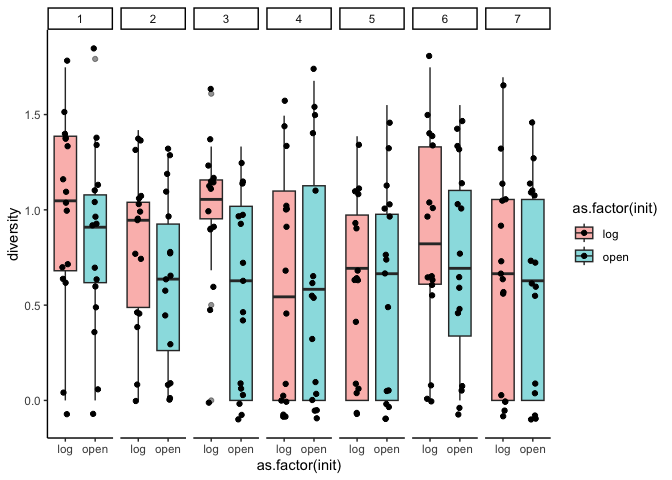

Diversity comparison
================
2023-12-12

### Data wrangling

This dataset does not include unknown data.

``` r
comm <- read.csv("20-22_species_composition_data_no_unk.csv", header = T)
```

Remove the locations surveyed in 2021 and 2022 that were not surveyed in
2020 - aka, cm=0, cm=21, cm = 22, cm = 29.

``` r
comm<-comm[which(comm$cm_location!=21 & comm$cm_location!=0 & comm$cm_location!=22 & comm$cm_location!=29),]

# make a group name for each row

comm$grp<-apply(comm[c(1,3,5,6,7)], 1, paste, collapse=":") # timepoint, block, transect_name, initial state
```

Need to make each row a community using matrify

``` r
commsub<-comm[,c(15,10,13)] 
# group, species_code, and count of each species for each transect. transects are rows.

commsub <-as.data.frame(commsub)
commtry<-labdsv::matrify(commsub) # make it an expanded species matrix 
```

    ## Warning in labdsv::matrify(commsub): NAs introduced by coercion

``` r
commtry$x[which(is.na(commtry$x))] <- 1  # "x" means that there were no individuals in the transect, but we are going to keep track of this as if it were a species
ncol(commtry) # how many species are we working with in our community matrix
```

    ## [1] 87

Store grouping row names as a column, then remove rownames.

``` r
commtry$grps<-rownames(commtry)
rownames(commtry)<-NULL
names(commtry)
```

    ##  [1] "acul"  "aicu"  "arca"  "ardy"  "arsp"  "auel"  "bldr"  "blrd"  "brdi" 
    ## [10] "brdr"  "brpe"  "brru"  "buse"  "caer"  "cagr"  "cahi"  "casp"  "cear" 
    ## [19] "chau"  "chei"  "chps"  "crcl"  "crco"  "cusc"  "cusp"  "dagl"  "dosp" 
    ## [28] "ento"  "erau"  "ercy"  "erra"  "ersp"  "gite"  "gnte"  "gobe"  "gocy" 
    ## [37] "gono"  "goro"  "gosp"  "haod"  "hygl"  "hypi"  "hypo"  "jubu"  "laro" 
    ## [46] "ledu"  "lele"  "loef"  "misp"  "mite"  "momo"  "mopa"  "niro"  "omco" 
    ## [55] "orsp"  "pala"  "peai"  "pedu"  "phsu"  "plde"  "poar"  "poca"  "pocap"
    ## [64] "poce"  "pogn"  "pole"  "pomu"  "pter"  "ptga"  "ptob"  "rhla"  "rhpy" 
    ## [73] "rhsp"  "ry"    "scna"  "sino"  "sool"  "stfi"  "stpi"  "thma"  "trcy" 
    ## [82] "tris"  "tror"  "trpi"  "waac"  "wagr"  "x"     "grps"

Split group info into columns for each variable

``` r
mat<-separate(commtry, 88, c("time","block","transect","init","treatment"), ":")
names(mat) #check
```

    ##  [1] "acul"      "aicu"      "arca"      "ardy"      "arsp"      "auel"     
    ##  [7] "bldr"      "blrd"      "brdi"      "brdr"      "brpe"      "brru"     
    ## [13] "buse"      "caer"      "cagr"      "cahi"      "casp"      "cear"     
    ## [19] "chau"      "chei"      "chps"      "crcl"      "crco"      "cusc"     
    ## [25] "cusp"      "dagl"      "dosp"      "ento"      "erau"      "ercy"     
    ## [31] "erra"      "ersp"      "gite"      "gnte"      "gobe"      "gocy"     
    ## [37] "gono"      "goro"      "gosp"      "haod"      "hygl"      "hypi"     
    ## [43] "hypo"      "jubu"      "laro"      "ledu"      "lele"      "loef"     
    ## [49] "misp"      "mite"      "momo"      "mopa"      "niro"      "omco"     
    ## [55] "orsp"      "pala"      "peai"      "pedu"      "phsu"      "plde"     
    ## [61] "poar"      "poca"      "pocap"     "poce"      "pogn"      "pole"     
    ## [67] "pomu"      "pter"      "ptga"      "ptob"      "rhla"      "rhpy"     
    ## [73] "rhsp"      "ry"        "scna"      "sino"      "sool"      "stfi"     
    ## [79] "stpi"      "thma"      "trcy"      "tris"      "tror"      "trpi"     
    ## [85] "waac"      "wagr"      "x"         "time"      "block"     "transect" 
    ## [91] "init"      "treatment"

Add groupname using time, block, init columns

``` r
mat$grp<-apply(mat[c(88:92)], 1, paste, collapse=":")
names(mat) #check
```

    ##  [1] "acul"      "aicu"      "arca"      "ardy"      "arsp"      "auel"     
    ##  [7] "bldr"      "blrd"      "brdi"      "brdr"      "brpe"      "brru"     
    ## [13] "buse"      "caer"      "cagr"      "cahi"      "casp"      "cear"     
    ## [19] "chau"      "chei"      "chps"      "crcl"      "crco"      "cusc"     
    ## [25] "cusp"      "dagl"      "dosp"      "ento"      "erau"      "ercy"     
    ## [31] "erra"      "ersp"      "gite"      "gnte"      "gobe"      "gocy"     
    ## [37] "gono"      "goro"      "gosp"      "haod"      "hygl"      "hypi"     
    ## [43] "hypo"      "jubu"      "laro"      "ledu"      "lele"      "loef"     
    ## [49] "misp"      "mite"      "momo"      "mopa"      "niro"      "omco"     
    ## [55] "orsp"      "pala"      "peai"      "pedu"      "phsu"      "plde"     
    ## [61] "poar"      "poca"      "pocap"     "poce"      "pogn"      "pole"     
    ## [67] "pomu"      "pter"      "ptga"      "ptob"      "rhla"      "rhpy"     
    ## [73] "rhsp"      "ry"        "scna"      "sino"      "sool"      "stfi"     
    ## [79] "stpi"      "thma"      "trcy"      "tris"      "tror"      "trpi"     
    ## [85] "waac"      "wagr"      "x"         "time"      "block"     "transect" 
    ## [91] "init"      "treatment" "grp"

Another df where the grouping variables are time, block, transect and
initial state. Each row is a transect in a certain year.

``` r
df<-mat[,c(1:87,93)]
df2 = df %>% mutate(across(.cols=1:87,.fns=as.numeric)) # make everything numeric
rownames(df2)<-NULL # remove rownames
```

**Diversity**<br> Next, I look at the diversity of microtransect plants
in log vs open plots in 2020. For the below analysis, I take a
conservative approach and only include known species, because most of
the unknown species were a result of not being able to differentiate
between known species. Diversity is Shannon’s diversity index and
estimated by pooling the species in each treatment type in each block
(N=14). Shannon’s diversity is not different between the two
environments.

### 1. Species diversity analysis at t0 (block level)

Main takeways:

- Shannon diversity index is summarized at block level
- div.mod tells us init does not significantly affect plant diversity
- we should move on to analyzing diversity index on transect levels

``` r
library(lmerTest)

# what does our data look like? 
hist(dat1$diversity, xlab = "Shannon diversity index", ylab = "Frequency", main = "Histogram of Shannon diversity index (block level)") # pretty normal!
```

<!-- -->

``` r
## model, this time I can add a random effect for block. diversity in this case is shannon's diversity of each transect 
div.mod<-lmer(diversity~init+(1|block), data=dat1)

# summary 
summary(div.mod)
```

    ## Linear mixed model fit by REML. t-tests use Satterthwaite's method [
    ## lmerModLmerTest]
    ## Formula: diversity ~ init + (1 | block)
    ##    Data: dat1
    ## 
    ## REML criterion at convergence: 5.4
    ## 
    ## Scaled residuals: 
    ##     Min      1Q  Median      3Q     Max 
    ## -1.2513 -0.5189  0.1363  0.6938  1.0587 
    ## 
    ## Random effects:
    ##  Groups   Name        Variance Std.Dev.
    ##  block    (Intercept) 0.03279  0.1811  
    ##  Residual             0.04123  0.2031  
    ## Number of obs: 14, groups:  block, 7
    ## 
    ## Fixed effects:
    ##             Estimate Std. Error      df t value Pr(>|t|)    
    ## (Intercept)   2.3963     0.1028 10.0315   23.30 4.56e-10 ***
    ## initopen     -0.1932     0.1085  6.0000   -1.78    0.125    
    ## ---
    ## Signif. codes:  0 '***' 0.001 '**' 0.01 '*' 0.05 '.' 0.1 ' ' 1
    ## 
    ## Correlation of Fixed Effects:
    ##          (Intr)
    ## initopen -0.528

``` r
round(summary(div.mod)$coeff, 4)
```

    ##             Estimate Std. Error      df t value Pr(>|t|)
    ## (Intercept)   2.3963     0.1028 10.0315 23.3025   0.0000
    ## initopen     -0.1932     0.1085  6.0000 -1.7799   0.1254

``` r
coef(div.mod)$block
```

    ##   (Intercept)   initopen
    ## 1    2.361466 -0.1931942
    ## 2    2.326170 -0.1931942
    ## 3    2.258722 -0.1931942
    ## 4    2.483212 -0.1931942
    ## 5    2.219835 -0.1931942
    ## 6    2.592973 -0.1931942
    ## 7    2.531820 -0.1931942

``` r
# plot of difference - not significant.  # how is it concluded? #
emmip(div.mod, ~init, CI=T)+theme_bw()+labs(x="Initial condition", y="Shannon Diversity")
```

<!-- -->

``` r
# wait a minute! 
# should we look at the diversity different at the block scale?
# calculating diversity on 'block' level masks variability within a block
# when including block as the random effect (in the intercept), we essentially have 1 data point for each group in each block (also see summary(div.mod))
# calculating plant diversity at transect level also makes the interpretation more intuitive
ggplot(dat1, aes(x = as.factor(init), y = diversity, fill = as.factor(init))) +
  geom_boxplot(position = "dodge", alpha = 0.5) +
  labs(x = "init",
       y = "Diversity") +
  scale_fill_discrete(name = 'init') +
  theme_classic() +
  facet_grid(. ~ block) +
  stat_compare_means(comparisons = list(c("log", "open")), label = "p.format", method="wilcox.test")
```

<!-- -->

Main concluding note:

-0.1932 is the gradient between open microsite and log microsite.
‘initopen’ and ‘ínitlog’ are arranged in alphabetic order, so here it
will mean the diversity level goes from log to open. In terms of the
plant diversity, it is reduced by 0.1932 unit when we go from log to
open areas. We should also look at the r squared value to determine
whether it is a good regression. If you want to compare two models, run
anova of the two model: anova(model1, model2) where model1 has fixed
effect a and b; model2 has only a. if the anova tells us p-value is very
small, it is suggesting that factor b has a significant contribution to
the overall model.

Random slope and random intercept: In the fixed effect estimate, we
expect that diversity in every block has the same respond of dropping by
0.1932 unit from log to open. This is allowing the intercept and slope
of the relation between ind block and diversity to vary within a range.
This is to avoid a false positive. But if we do not have enough sample
groups to assign different gradients, it is hard to do this part.

From here on, analysis on species diversity will be on transect level.

### 2. Species diversity analysis at t0 (transect level)

Calculating shannon diversity for each transect.

``` r
# make numeric
numat = mat %>% mutate(across(.cols=1:87,.fns=as.numeric)) # make everything numeric

# sum species for each group (grouped by init, transect, block, time)
nudat2<-numat%>% 
  group_by(init, transect, block, time) %>% summarise(across(where(is.numeric), sum))

# make a data frame
dat2<-as.data.frame(nudat2) # this df contains transect levels from all years
dat3<-dat2[which(dat2$time=="t0"),] # just t0

#estimate diversity for each row/group. don't include 'x' 

# no groups, just estimate diversity of each row
est2<-dat3[,c(5:90)]
dat3$diversity<-diversity(est2, index='shannon') 
```

##### 2.1 Linear mixed effect regression

Main takeways:

- transect level diversity (Shannon index) is zero inflated
- if we ignore this zero inflation and model the general data with a
  linear mixed effect model
- div.mod2 tells us that init does not significantly affect plant
  diversity

``` r
# what does our data look like? 
hist(dat3$diversity, xlab = "Shannon index", ylab= "Frequency", main = "Histogram of Shannon diversity index (transect level)") # the distribution of the data looks zero-inflated
```

<!-- -->

``` r
shapiro.test(dat3$diversity) # not normal
```

    ## 
    ##  Shapiro-Wilk normality test
    ## 
    ## data:  dat3$diversity
    ## W = 0.91639, p-value = 6.892e-10

``` r
ggplot(dat3, aes(x = diversity, fill = as.factor(init))) +
  geom_density(position = "identity", alpha = 0.5, bins = 30) +
  labs(x = "Diversity",
       y = "Frequency") +
  scale_fill_discrete(name = 'init')
```

<!-- -->

``` r
# including random term for block. diversity in this case is shannon's diversity of each transect 
div.mod2<-lmer(diversity~init+(1|block), data=dat3)

# summary 
summary(div.mod2)
```

    ## Linear mixed model fit by REML. t-tests use Satterthwaite's method [
    ## lmerModLmerTest]
    ## Formula: diversity ~ init + (1 | block)
    ##    Data: dat3
    ## 
    ## REML criterion at convergence: 341.8
    ## 
    ## Scaled residuals: 
    ##      Min       1Q   Median       3Q      Max 
    ## -1.65951 -1.19412  0.04438  0.72324  2.10073 
    ## 
    ## Random effects:
    ##  Groups   Name        Variance Std.Dev.
    ##  block    (Intercept) 0.004436 0.0666  
    ##  Residual             0.260301 0.5102  
    ## Number of obs: 223, groups:  block, 7
    ## 
    ## Fixed effects:
    ##              Estimate Std. Error        df t value Pr(>|t|)    
    ## (Intercept)   0.77770    0.05458  16.27849  14.249 1.29e-10 ***
    ## initopen     -0.12670    0.06833 215.05904  -1.854   0.0651 .  
    ## ---
    ## Signif. codes:  0 '***' 0.001 '**' 0.01 '*' 0.05 '.' 0.1 ' ' 1
    ## 
    ## Correlation of Fixed Effects:
    ##          (Intr)
    ## initopen -0.629

``` r
# plot of difference - not significant.
emmip(div.mod2, ~init, CI=T)+theme_bw()+labs(x="Initial condition", y="Shannon Diversity")
```

<!-- -->

``` r
# test zero inflation - very zero inflated
testZeroInflation(simulateResiduals(div.mod2))
```

<!-- -->

    ## 
    ##  DHARMa zero-inflation test via comparison to expected zeros with
    ##  simulation under H0 = fitted model
    ## 
    ## data:  simulationOutput
    ## ratioObsSim = Inf, p-value < 2.2e-16
    ## alternative hypothesis: two.sided

##### 2.2 Hurdle model

Main takeaways:

- since transect level diversity (Shannon index) is zero inflated
- we will address zero inflation with a hurdle model
- the first part includes modelling probability of zero in a logistic
  regression
- m1 tells us init does not significantly determine the probability of
  non-zero diversity index
- the second part includes modelling the non-zero component
- m2 (assumed an approximal Gaussian distribution) tells us init does
  not significantly affect plant diversity

``` r
# separate into zero and non-zero observations
dat3$non_zero <- ifelse(dat3$diversity > 0, 1, 0)

ggplot(dat3,
       aes(x = as.factor(init), y = diversity, fill = as.factor(init))) + 
  geom_boxplot(position = "dodge", alpha = 0.5) +
  facet_grid(. ~ block) +
  geom_jitter(position = position_jitter(width = 0.1, height = 0.1)) + 
  theme_classic()
```

<!-- -->

``` r
# what does our data look like? 
hist(dat3$diversity, xlab = "Shannon index", ylab= "Frequency", main = "Histogram of Shannon diversity index (transect level)")
```

<!-- -->

``` r
ggplot(dat3, aes(x = diversity, fill = as.factor(non_zero))) + # separating into zero and non-zero components
  geom_histogram(position = "identity", alpha = 0.5, bins = 30) +
  labs(x = "Shannon diversity",
       y = "Frequency") +
  scale_fill_discrete(name = 'non_zero') +
  theme_bw()
```

<!-- -->

``` r
# first part of a hurdle model
# logistic regression to predict the probability of non-zero
m1 <- glmer(non_zero ~ init+(1|block), data = dat3, family = binomial)
summary(m1)
```

    ## Generalized linear mixed model fit by maximum likelihood (Laplace
    ##   Approximation) [glmerMod]
    ##  Family: binomial  ( logit )
    ## Formula: non_zero ~ init + (1 | block)
    ##    Data: dat3
    ## 
    ##      AIC      BIC   logLik deviance df.resid 
    ##    259.8    270.0   -126.9    253.8      220 
    ## 
    ## Scaled residuals: 
    ##     Min      1Q  Median      3Q     Max 
    ## -2.0667 -1.3966  0.5219  0.6096  0.7160 
    ## 
    ## Random effects:
    ##  Groups Name        Variance Std.Dev.
    ##  block  (Intercept) 0.06444  0.2538  
    ## Number of obs: 223, groups:  block, 7
    ## 
    ## Fixed effects:
    ##             Estimate Std. Error z value Pr(>|z|)    
    ## (Intercept)   1.2536     0.2499   5.017 5.26e-07 ***
    ## initopen     -0.3675     0.3093  -1.188    0.235    
    ## ---
    ## Signif. codes:  0 '***' 0.001 '**' 0.01 '*' 0.05 '.' 0.1 ' ' 1
    ## 
    ## Correlation of Fixed Effects:
    ##          (Intr)
    ## initopen -0.678

``` r
# second part models non-zero values
# is the non-zero data normal?
shapiro.test(dat3$diversity[dat3$non_zero == 1]) # distribution of non-zero values is not normal
```

    ## 
    ##  Shapiro-Wilk normality test
    ## 
    ## data:  dat3$diversity[dat3$non_zero == 1]
    ## W = 0.96002, p-value = 0.0001125

``` r
hist(dat3$diversity[dat3$non_zero == 1], xlab="Shannon diversity (non-zero)", main="Histogram of non-zero diversity index") # visually resembles to a normal distribution
```

<!-- -->

``` r
# since the distribution of non-zero diversity indexes resembles to a normal distribution and the data is continuous
# we treat it as a gaussian distribution as this stage
# lmer to model the mean of the non-zero data with block as the random term
m2<- lmer(diversity ~ init+(1|block), data=subset(dat3, non_zero == 1)) # not significant
summary(m2)
```

    ## Linear mixed model fit by REML. t-tests use Satterthwaite's method [
    ## lmerModLmerTest]
    ## Formula: diversity ~ init + (1 | block)
    ##    Data: subset(dat3, non_zero == 1)
    ## 
    ## REML criterion at convergence: 121.4
    ## 
    ## Scaled residuals: 
    ##      Min       1Q   Median       3Q      Max 
    ## -1.73628 -0.90818  0.07998  0.73712  2.54204 
    ## 
    ## Random effects:
    ##  Groups   Name        Variance Std.Dev.
    ##  block    (Intercept) 0.0000   0.0000  
    ##  Residual             0.1168   0.3418  
    ## Number of obs: 165, groups:  block, 7
    ## 
    ## Fixed effects:
    ##              Estimate Std. Error        df t value Pr(>|t|)    
    ## (Intercept)   1.00355    0.03686 163.00000  27.229   <2e-16 ***
    ## initopen     -0.08061    0.05326 163.00000  -1.513    0.132    
    ## ---
    ## Signif. codes:  0 '***' 0.001 '**' 0.01 '*' 0.05 '.' 0.1 ' ' 1
    ## 
    ## Correlation of Fixed Effects:
    ##          (Intr)
    ## initopen -0.692
    ## optimizer (nloptwrap) convergence code: 0 (OK)
    ## boundary (singular) fit: see help('isSingular')

``` r
# plot of difference - not significant.
emmip(m2, ~init, CI=T)+theme_bw()+labs(x="Initial condition", y="Shannon Diversity")
```

<!-- -->

### 3. Species diversity analysis all years (transect level)

This part calculate Shannon diversity of each transect affected solely
by initial log and open treatment from all three years.

``` r
# make numeric
numat = mat %>% mutate(across(.cols=1:87,.fns=as.numeric)) # make everything numeric

# sum species for each group (grouped by init, transect, block, time)
nudat2<-numat%>% 
  group_by(time, block, transect, init, treatment) %>% summarise(across(where(is.numeric), sum))

# make a data frame
dat2<-as.data.frame(nudat2) # this df contains transect levels from all years
dat3 <- dat2[which(dat2$time=="t0" |  dat2$treatment=="open" |  dat2$treatment=="insitu_log"),]

#estimate diversity for each row/group. don't include 'x' 

# no groups, just estimate diversity of each row
est3<-dat3[,c(6:91)]
dat3$diversity<-diversity(est3, index='shannon') 
```

##### 3.1 Lmer of all data

Main takeaways:

- assuming an approximal Gaussian distribution of diversity data
- we use a lmer with block and time as random terms
- plant diversity is significantly higher in log plots than open plots
- now we also need to address zero-inflation, go to the next section

``` r
# what does our data look like? 
hist(dat3$diversity, xlab = "Shannon diversity (transect level)", main = "Histogram of Shannon diversity index (all years, transect level)") # zero-inflated
```

<!-- -->

``` r
shapiro.test(dat3$diversity) # not normal
```

    ## 
    ##  Shapiro-Wilk normality test
    ## 
    ## data:  dat3$diversity
    ## W = 0.93691, p-value = 7.432e-12

``` r
ggplot(dat3, aes(x = diversity, fill = as.factor(init))) +
  geom_density(position = "identity", alpha = 0.5, bins = 30) +
  labs(x = "Shannon diversity",
       y = "Frequency") +
  scale_fill_discrete(name = 'init')
```

<!-- -->

``` r
# if we ignore zero-inflation, 
# and model the general plant diversity (Shannon's diversity index in each transect) across all years with a lmer, 
# with block and time as the random terms (assumes block effect and time effect are fixed)
# plant diversity in log environment is significantly higher in open environment!!
div.mod4<-lmer(diversity~init+(1|block)+(1|time), data=dat3)

# summary 
summary(div.mod4)
```

    ## Linear mixed model fit by REML. t-tests use Satterthwaite's method [
    ## lmerModLmerTest]
    ## Formula: diversity ~ init + (1 | block) + (1 | time)
    ##    Data: dat3
    ## 
    ## REML criterion at convergence: 561.5
    ## 
    ## Scaled residuals: 
    ##     Min      1Q  Median      3Q     Max 
    ## -2.1206 -0.6567  0.1109  0.7308  2.2568 
    ## 
    ## Random effects:
    ##  Groups   Name        Variance Std.Dev.
    ##  block    (Intercept) 0.004727 0.06876 
    ##  time     (Intercept) 0.024043 0.15506 
    ##  Residual             0.233807 0.48354 
    ## Number of obs: 393, groups:  block, 7; time, 3
    ## 
    ## Fixed effects:
    ##              Estimate Std. Error        df t value Pr(>|t|)    
    ## (Intercept)   0.97700    0.10158   2.86414   9.618 0.002884 ** 
    ## initopen     -0.16725    0.04987 384.60293  -3.354 0.000876 ***
    ## ---
    ## Signif. codes:  0 '***' 0.001 '**' 0.01 '*' 0.05 '.' 0.1 ' ' 1
    ## 
    ## Correlation of Fixed Effects:
    ##          (Intr)
    ## initopen -0.297

``` r
# plot of difference - significant.
emmip(div.mod4, ~init, CI=T)+theme_bw()+labs(x="Initial condition", y="Shannon Diversity")
```

<!-- -->

``` r
# test zero inflation - very zero inflated
testZeroInflation(simulateResiduals(div.mod4))
```

<!-- -->

    ## 
    ##  DHARMa zero-inflation test via comparison to expected zeros with
    ##  simulation under H0 = fitted model
    ## 
    ## data:  simulationOutput
    ## ratioObsSim = Inf, p-value < 2.2e-16
    ## alternative hypothesis: two.sided

##### 3.2 Hurdle model

Main takeaways:

- we use a hurdle model to address zero-inflation
- we first use logistic regression to predict the probability of
  non-zero
- open and log environment significantly determines the probability of
  non-zero diversity index
- note, zero in Shannon diversity index does not mean zero plant.
- we then use lmer to model non-zero diversity data with time and block
  as random terms
- we assume approximal Gaussian distribution (1) continuous variable
  and (2) visual inspection suggests so
- in the lmer, we included block and time as random terms
- open and log environment is significant in explaining the plant diversity in transect levels.

``` r
# separate into zero and non-zero observations
dat3$non_zero <- ifelse(dat3$diversity > 0, 1, 0)

# what does our data look like? 
hist(dat3$diversity, xlab = "Shannon diversity", main = "Histogram of Shannon diversity index (all years, transect level)") # zero-inflated
```

<!-- -->

``` r
ggplot(dat3, aes(x = diversity, fill = as.factor(non_zero))) +
  geom_histogram(position = "identity", alpha = 0.5, bins = 30) +
  labs(x = "Diversity",
       y = "Frequency") +
  scale_fill_discrete(name = 'non_zero') +
  theme_bw()
```

<!-- -->

``` r
shapiro.test((dat3$diversity[dat3$non_zero == 1])) # non-zero data is not normal
```

    ## 
    ##  Shapiro-Wilk normality test
    ## 
    ## data:  (dat3$diversity[dat3$non_zero == 1])
    ## W = 0.98023, p-value = 0.0002215

``` r
hist(dat3$diversity[dat3$non_zero ==1], xlab = "Shannon diversity index (non-zero)", main = "Histogram of Shannon diversity index (non-zero, all years, transect level)") # visually it resembles a lot like a Gaussian distribution 
```

<!-- -->

``` r
# long story short I chose Gaussian distribution

# I struggle on the link function
# skip this part if you're not interested in the distribution type decision making 
#####
# how to decide on the link function?
dat3_nonzerodat <- dat3[dat3$non_zero == 1, ]
hist(dat3$diversity, xlab = "Shannon diveristy(non-zero)")
```

<!-- -->

``` r
ggplot(dat3_nonzerodat, aes(x = diversity, fill=as.factor(time))) +
  geom_density(position = "identity", alpha = 0.5, bins = 30)
```

<!-- -->

``` r
# the bimodal distribution seemed to be caused by t0 data

# following plots provide qqplot on different distribution types.
ggplot(dat3_nonzerodat, aes(sample = diversity)) + 
                  geom_qq(distribution = qnorm) + 
                  geom_qq_line(distribution = qnorm) +
                  ggtitle("normal")
```

<!-- -->

``` r
ggplot(dat3_nonzerodat, aes(sample = diversity)) + 
                  geom_qq(distribution = qlnorm) + 
                  geom_qq_line(distribution = qlnorm) +
                  ggtitle("Log-normal")
```

<!-- -->

``` r
ggplot(dat3_nonzerodat, aes(sample = diversity)) + 
                geom_qq(distribution = qpois, dparams = list(lambda=1000)) + 
                geom_qq_line(distribution = qpois, dparams = list(lambda=1000)) +
                ggtitle("Poisson")
```

<!-- -->

``` r
library(MASS)
fit <- fitdistr(dat3_nonzerodat$diversity, densfun = "gamma")
shape_est <- fit$estimate["shape"]
rate_est <- fit$estimate["rate"]

ggplot(dat3_nonzerodat, aes(sample = diversity)) + 
  geom_qq(distribution = qgamma, dparams = list(shape = shape_est, rate = rate_est)) + 
  geom_qq_line(distribution = qgamma, dparams = list(shape = shape_est, rate = rate_est)) +
  ggtitle("Gamma")
```

<!-- -->

``` r
fit <- fitdistr(dat3_nonzerodat$diversity, densfun = "weibull")

# Access the estimated parameters
shape_est <- fit$estimate["shape"]
scale_est <- fit$estimate["scale"]


ggplot(dat3_nonzerodat, aes(sample = diversity)) + 
  geom_qq(distribution = qweibull, dparams = list(shape = shape_est, scale = scale_est)) + 
  geom_qq_line(distribution = qweibull, dparams = list(shape = shape_est, scale = scale_est)) +
  ggtitle("Weibull")
```

<!-- -->

``` r
#####
## back to the hurdle model
# logistic regression to predict the probability of non-zero
# open and log environment does determine the probability of non-zero diversity index
# 0 shannon diversity index =/= zero plants
m4 <- glmer(non_zero ~ init + (1|block) + (1|time), data = dat3, family = binomial)
summary(m4) # significant
```

    ## Generalized linear mixed model fit by maximum likelihood (Laplace
    ##   Approximation) [glmerMod]
    ##  Family: binomial  ( logit )
    ## Formula: non_zero ~ init + (1 | block) + (1 | time)
    ##    Data: dat3
    ## 
    ##      AIC      BIC   logLik deviance df.resid 
    ##    371.1    387.0   -181.6    363.1      389 
    ## 
    ## Scaled residuals: 
    ##     Min      1Q  Median      3Q     Max 
    ## -3.8397  0.2618  0.3840  0.5265  0.8181 
    ## 
    ## Random effects:
    ##  Groups Name        Variance Std.Dev.
    ##  block  (Intercept) 0.1157   0.3401  
    ##  time   (Intercept) 0.3971   0.6301  
    ## Number of obs: 393, groups:  block, 7; time, 3
    ## 
    ## Fixed effects:
    ##             Estimate Std. Error z value Pr(>|z|)    
    ## (Intercept)   2.2440     0.4716   4.758 1.95e-06 ***
    ## initopen     -0.6040     0.2787  -2.168   0.0302 *  
    ## ---
    ## Signif. codes:  0 '***' 0.001 '**' 0.01 '*' 0.05 '.' 0.1 ' ' 1
    ## 
    ## Correlation of Fixed Effects:
    ##          (Intr)
    ## initopen -0.420

``` r
# lmer to predict the mean of the non-zero data.
# we include block and time as random terms
# open and log environment is significant in explaining the plant diversity in transect levels.
# lmer is used here because the distribution of non-zero data looks normal
m5 <- lmer(diversity ~ init + (1|block)+ (1|time), data=subset(dat3, non_zero == 1))
summary(m5)
```

    ## Linear mixed model fit by REML. t-tests use Satterthwaite's method [
    ## lmerModLmerTest]
    ## Formula: diversity ~ init + (1 | block) + (1 | time)
    ##    Data: subset(dat3, non_zero == 1)
    ## 
    ## REML criterion at convergence: 242.5
    ## 
    ## Scaled residuals: 
    ##      Min       1Q   Median       3Q      Max 
    ## -2.12842 -0.89782  0.00211  0.68935  2.70325 
    ## 
    ## Random effects:
    ##  Groups   Name        Variance Std.Dev.
    ##  block    (Intercept) 0.002110 0.04593 
    ##  time     (Intercept) 0.003245 0.05696 
    ##  Residual             0.119527 0.34573 
    ## Number of obs: 319, groups:  block, 7; time, 3
    ## 
    ## Fixed effects:
    ##              Estimate Std. Error        df t value Pr(>|t|)    
    ## (Intercept)   1.07797    0.04800   4.68967   22.46 5.91e-06 ***
    ## initopen     -0.09274    0.03930 312.27917   -2.36   0.0189 *  
    ## ---
    ## Signif. codes:  0 '***' 0.001 '**' 0.01 '*' 0.05 '.' 0.1 ' ' 1
    ## 
    ## Correlation of Fixed Effects:
    ##          (Intr)
    ## initopen -0.469

``` r
anova(m5) # lmer on non-zero diversity values is significant
```

    ## Type III Analysis of Variance Table with Satterthwaite's method
    ##       Sum Sq Mean Sq NumDF  DenDF F value Pr(>F)  
    ## init 0.66558 0.66558     1 312.28  5.5685 0.0189 *
    ## ---
    ## Signif. codes:  0 '***' 0.001 '**' 0.01 '*' 0.05 '.' 0.1 ' ' 1

``` r
# check residual
# Extract residuals
residuals <- resid(m5)
plot(residuals)
abline(0,0)
```

<!-- -->

``` r
plot(m5)
```

<!-- -->

``` r
library(performance)
check_model(m5)
```

<!-- -->

``` r
# https://www.researchgate.net/post/Why-do-the-residuals-need-to-be-normal-when-carrying-out-multi-level-modeling
# I like this explanation of non-normality in residuals. because log-open as a categorical factor is a very coarse predictor. it does not include a lot of information in telling us the diversity.
```
